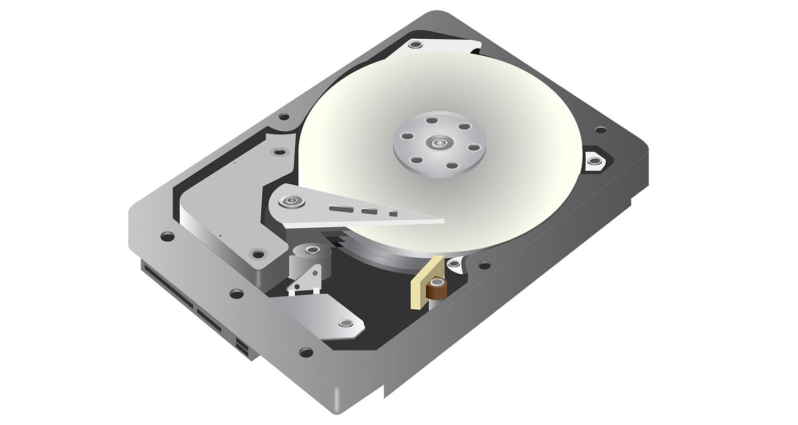

## DB Indexes

### Why Use a Database?

We use a database for one primary reason: persistent storage.

- We need to store data in a durable way, typically on a Hard Disk Drive (HDD) or Solid State Drive (SSD).
- The database software manages this physical storage, offering structure and reliable access to the data.

Understanding the mechanics of an HDD is key to understanding indexing.

- HDDs rely on a mechanical pointer (read/write head) that physically moves across spinning platters to find the data.
- Moving this pointer is a slow operation in computer time.
- The Principle: It makes sense to keep related data as physically close as possible on the disk to minimize the number of required head movements (seeks).

 

### Why Indexes are Essential

Consider a simple `Cities` table:

| City     | Country | Population |
| -------- | ------- | ---------- |
| London   | UK      | 9.7M       |
| New York | US      | 8.4M       |
| Seattle  | US      | 3.7M       |

Now, let's run a query without an index: `SELECT * FROM Cities WHERE Population = '3.7M'`

- The Problem: To find the row, the database must potentially scan every single row in the table from top to bottom.
- Time Complexity: This is an _O_(**n**) operation, where **_n_** is the number of rows. This is unacceptably slow for large tables (millions or billions of rows).

##### The Index Solution

- What is an Index? An index is a separate data structure (like a B-Tree or Hash Map) that is built on top of one or more columns of a table. It organizes the data in a more efficient, searchable way instead of a linear list.
- What It Does: Indexes allow the database to perform effective range queries (e.g., finding all names from 'B' to 'V') and exact lookups much faster, reducing the complexity from _O_(**n**) to typically _O_(_log_ **n**).

##### The Trade-Off

While indexes significantly boost read speed, they introduce a small performance hit to write speed (inserts, updates, and deletes) because the index must also be updated every time the main table changes.

However, this is an effective trade-off because most modern systems are read-heavy, making the gains in query speed far outweigh the slight cost in write speed.

 

### Data Base Index Types
