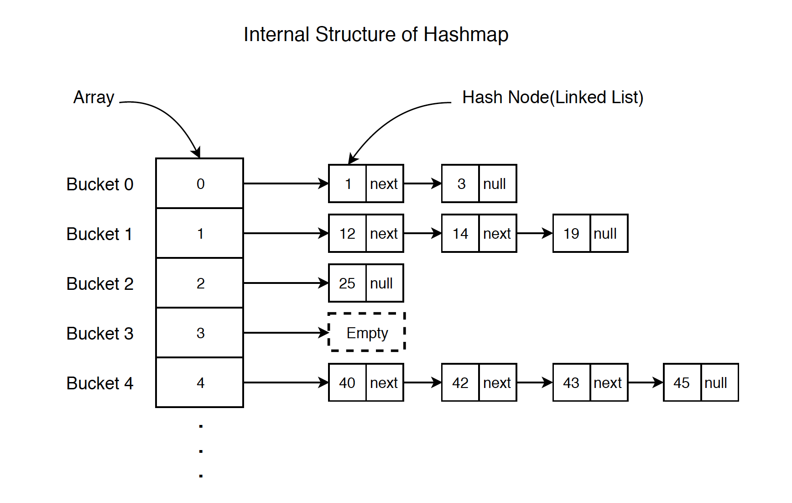
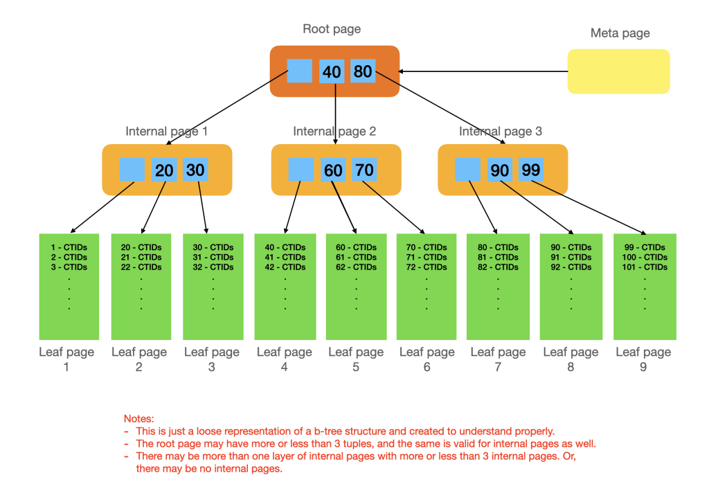
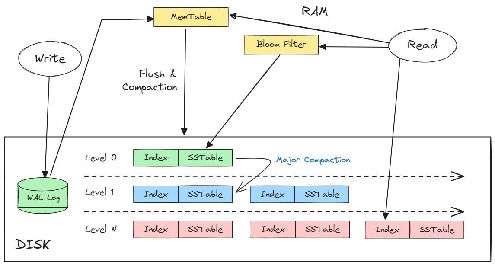

## DB Indexes

### Why Use a Database?

We use a database for one primary reason: persistent storage.

- We need to store data in a durable way, typically on a Hard Disk Drive (HDD) or Solid State Drive (SSD).
- The database software manages this physical storage, offering structure and reliable access to the data.

Understanding the mechanics of an HDD is key to understanding indexing.

- HDDs rely on a mechanical pointer (read/write head) that physically moves across spinning platters to find the data.
- Moving this pointer is a slow operation in computer time.
- The Principle: It makes sense to keep related data as physically close as possible on the disk to minimize the number of required head movements (seeks).

 

### Why Indexes are Essential

Consider a simple `Cities` table:

| City     | Country | Population |
| -------- | ------- | ---------- |
| London   | UK      | 9.7M       |
| New York | US      | 8.4M       |
| Seattle  | US      | 3.7M       |

Now, let's run a query without an index: `SELECT * FROM Cities WHERE Population = '3.7M'`

- The Problem: To find the row, the database must potentially scan every single row in the table from top to bottom.
- Time Complexity: This is an _O_(**n**) operation, where **_n_** is the number of rows. This is unacceptably slow for large tables (millions or billions of rows).

##### The Index Solution

- What is an Index? An index is a separate data structure (like a B-Tree or Hash Map) that is built on top of one or more columns of a table. It organizes the data in a more efficient, searchable way instead of a linear list.
- What It Does: Indexes allow the database to perform effective range queries (e.g., finding all names from 'B' to 'V') and exact lookups much faster, reducing the complexity from _O_(**n**) to typically _O_(_log_ **n**).

##### The Trade-Off

While indexes significantly boost read speed, they introduce a small performance hit to write speed (inserts, updates, and deletes) because the index must also be updated every time the main table changes.

However, this is an effective trade-off because most modern systems are read-heavy, making the gains in query speed far outweigh the slight cost in write speed.

 

### Data Base Index Types

##### Hash Index

A Hash Index is a data structure used in databases to quickly locate data based on a key. It operates by applying a hash function (which converts any input value into a number) and then using the modulo operator to map that hash to a specific location, or bucket, within an array.

`bucket_number = hash(key) % n`, where `n` is number of buckets

The primary benefit is constant-time complexity, O(1), for specific key lookups. If you know the exact key you want (e.g., retrieving the data for the key "London"), the index can calculate its exact address almost instantaneously, regardless of the overall size of the database.

The design of a hash index, which aims for an even and random distribution of keys, creates several serious problems, especially in persistent storage systems:

1. Inefficiency on Disk (Random I/O):

- Since related data is spread randomly across the disk, looking up or accessing multiple entries requires the hard drive (HDD) to perform many random seeks (movement operations).
- This poor locality of reference drastically slows down performance compared to sequential reads, making hash maps generally bad for disk-based storage.

2.  RAM Dependency and Constraints:

- Due to the disk I/O issue, the entire hash index (the key-to-bucket mapping) is often kept in RAM to maintain speed.
- Cost and Size Limit: RAM is expensive, meaning the entire key space must be small enough to fit into memory.
- Durability: RAM is volatile (non-durable). Upon a system crash, the index is lost. To recover, the database must use a Write-Ahead Log (WAL), an append-only record of all changes. The index must be rebuilt by replaying the WAL, which adds significant time to the recovery process.

3. No Support for Range Queries:

- The deliberate randomization of key placement means there is no sequential ordering between the keys in the index.
- Consequently, hash indexes are unsuitable for queries that involve fetching a range of keys (e.g., "find all keys starting with 'A'"), as the data for that range is scattered across all the buckets.

| Feature       | Hash Index Behavior  | Implication                                      |
| ------------- | -------------------- | ------------------------------------------------ |
| Lookup Speed  | O(1)                 | Excellent for exact key retrieval.               |
| Data Locality | Randomly distributed | Slow disk access (high random I/O).              |
| Memory        | Must fit in RAM      | Limits database size; requires WAL for recovery. |
| Query Type    | Point queries only   | Cannot efficiently handle range scans.           |

 

##### B-Tree Index

A B-Tree is a data structure designed to keep indexes fully on disk, meaning we don't need to keep all keys in memory, and the index is inherently durable.

It has a tree-like structure where each node (often called a "page" or "block") contains:

- Ranges of keys stored within that page.
- References (pointers) to other locations on the disk (child pages).

To find a specific entity, the system traverses down the tree. At each page, it determines which child reference to follow until it reaches a leaf node containing the actual data or a pointer to it.

Advantages (Reads)

- Relatively Quick Reads (O(logn)): The lookup time is logarithmic, making it very fast, especially for disk-based systems.
- Self-Balancing: B-Trees are designed to remain balanced. The maximum height difference between any sub-trees is typically one page, ensuring the worst-case lookup time remains consistent and fast.
- Short Tree (Fewer Disk Seeks): Pages are usually quite large (e.g., around 4KB to 16KB). Since a single page read can fetch many keys and pointers, the overall height of the tree stays short. This means the system needs to perform fewer disk seek operations to find the desired data.

Disadvantages (Writes)

Write operations are more complex than reads due to the need to maintain order and balance:

- Ideal Scenario: If we try to write a new value and the node has extra space, we simply insert the key while keeping the keys sorted within that node.
- Overflow Scenario: If the node is full, we must split the child node into two separate nodes and add two new references into the parent node.
- Cascading Split: If the parent node is also full, the splitting process continues, traversing and splitting nodes all the way up to the root. If the root node splits, a new root is created, increasing the tree's height by one.

Handling Crashes During Writes (Atomicity):

If the computer crashes while a complex node-splitting or re-balancing operation is in progress, the index could be corrupted. Depending on the B-Tree implementation, this is mitigated by:

- Copy-on-Write: Creating a complete copy of the node or section being modified, making changes there, and then atomically switching the pointers (though this uses more memory).
- Write-Ahead Log (WAL): Using the WAL to record the operations, allowing the database to rebuild or fix the tree upon restart to ensure data consistency.

Overall Conclusion

Overall, the B-Tree is slower than a Hash Index for a single exact lookup (O(logn) vs. O(1)). However, it is still quick and provides critical advantages:

- Supports Larger Data Sets: We don't need to keep the entire key set in memory.
- Enables Range Queries: Since keys are stored in a sorted order (left-to-right traversal gives sorted order), it fully supports efficient range queries (e.g., finding all keys between 'A' and 'Z').

| Characteristic    | Description                                                                               | Key Implication                                                                     |
| ----------------- | ----------------------------------------------------------------------------------------- | ----------------------------------------------------------------------------------- |
| Structure         | Tree-like structure where nodes (pages) contain sorted keys and pointers to child pages   | Self-balancing design ensures consistent performance                                |
| Storage Locationi | Primarily disk-based (durable)                                                            | Can handle larger datasets than RAM-limited indexes                                 |
| Read Performance  | O(logn) (Logarithmic Time)                                                                | Very fast due to a short tree height (fewer disk seeks)                             |
| Write Complexity  | Higher due to the need for node splitting and rebalancing to maintain order and structure | Requires sophisticated handling (WAL or Copy-on-Write) for atomicity/crash recovery |
| Key Ordering      | Sorted keys within and between pages                                                      | Enables efficient range queries (e.g., SELECT WHERE key BETWEEN X AND Y)            |
| Data Locality     | Good (pages store large, contiguous blocks of related data)                               | Minimizes random I/O, optimizing disk access                                        |

 

##### LSM Tree + SSTable Index

Log-Structured Merge-Tree (LSM-Tree)

The LSM-Tree (Log-Structured Merge-Tree) and SSTable index is based on organizing data into levels, combining an in-memory component with immutable, sorted files on disk.

The system is composed of two main parts:

- LSM-Tree (In-Memory Component): This is a mutable, sorted data structure (often a self-balancing binary search tree or memtable) that holds the most recent writes backboned by WAL.
- SSTable (Sorted String Table): When the in-memory component becomes sufficiently large, it is flushed to disk as a new, immutable, sorted file called an SSTable.

When a read request comes in, the system prioritizes the most recent data:

- Check LSM-Tree: The system first checks the in-memory LSM-Tree, which has an access complexity of O(logn).
- Check SSTables: If the key is not found in the in-memory component, the system proceeds to check the SSTables on disk. It always starts with the most recent SSTable and works backward to ensure it does not accidentally retrieve a stale value.

The overall read complexity is O(logn) for the in-memory structure plus a binary search on the SSTables, which is possible because SSTables are guaranteed to be sorted.

Handling Updates and Deletes

- Deletions: There is no actual deletion of data on the spot. Instead, a special marker called a "tombstone" is written to the LSM-Tree and subsequently flushed to the SSTables (similar to how Kafka marks messages for later removal).
- Updates: Every time a key is updated, a new key-value pair is simply written to storage.

To improve read performance and reduce disk I/O, two common optimizations are used:

- Sparse Index: Instead of indexing every key in an SSTable, a small, secondary index is created by taking only certain keys and recording their precise disk location. This allows the system to quickly locate the start of the relevant data block and perform the binary search much faster.
- Bloom Filter: This is a probabilistic data structure stored in memory. It provides the ability to definitively state that a key is NOT in a given SSTable. It has two possible responses:
  - "Key is NOT in the table." (Highly accurate, no false negatives).
  - "Key MAY BE in the table." (Possibility of false positives, which triggers an unnecessary disk read). This optimization helps avoid expensive disk I/O when the key is missing.

Because every update and delete (as a tombstone) results in a new write to the storage system, the LSM-Tree can quickly consume large amounts of storage even if the user is only interested in the latest value.

To eliminate this storage bloat and remove stale data, a background process called compaction runs:

- Compaction involves merging two or more SSTables together.
- When a key exists in multiple SSTables being merged, the new, merged SSTable will only keep the value from the most recent SSTable, discarding all older copies and any tombstone markers.

| Characteristic   | Description                                                                                          | Key Implication                                                                             |
| ---------------- | ---------------------------------------------------------------------------------------------------- | ------------------------------------------------------------------------------------------- |
| Structure        | Composed of a small, mutable in-memory structure (Memtable) and multiple, immutable SSTables on disk | Optimized for high write throughput (sequential disk writes)                                |
| Storage Location | SSTables are disk-based but generated from memory, making the system highly durable                  | Enables handling of massive datasets without being limited by RAM size                      |
| Read Performance | O(logn) (Logarithmic Time), requiring checks across the Memtable and multiple SSTables               | Reads are fast, but typically slower than B-Trees for a single point lookup                 |
| Write Complexity | Low—writes are always sequential appends to the in-memory structure and disk files                   | Extremely high ingestion rate and low write amplification (initially)                       |
| Key Ordering     | SSTables are guaranteed to be sorted                                                                 | Enables range queries and efficient block reads using a Sparse Index                        |
| Data Redundancy  | High, as updates and deletes are new records/tombstones, leaving old versions                        | Requires a background Compaction process to merge SSTables and remove stale data/tombstones |
| Optimizations    | Bloom Filters reduce disk I/O by preventing reads for missing keys                                   | Significantly improves read speed by avoiding unnecessary disk seeks                        |

  

### Summary

| Feature             | Hash Index                                                  | B-Tree                                               | LSM-Tree (SSTables)                                                   |
| ------------------- | ----------------------------------------------------------- | ---------------------------------------------------- | --------------------------------------------------------------------- |
| Primary Goal        | Fastest single key lookup                                   | Balanced reads/writes, durability, and range queries | Fastest writes/ingestion and high scalability                         |
| Read Complexity     | O(1) (Constant Time)                                        | O(logn) (Logarithmic Time)                           | O(logn) (Requires checking multiple components)                       |
| Write Complexity    | Quick, but WAL is required for durability                   | Slower due to complex node splitting/rebalancing     | Fastest due to sequential appends to disk                             |
| Range Queries       | No (data is random)                                         | Yes (data is sorted)                                 | Yes (SSTables are sorted)                                             |
| Storage Location    | Keys often must be in RAM                                   | Fully disk-based (durable)                           | Disk-based (SSTables) but flushes from RAM (Memtable)                 |
| Data Locality (I/O) | Poor (High Random I/O)                                      | Good (Low disk seeks, optimized for disk pages)      | Excellent Writes (Sequential), but reads can involve more disk checks |
| Common Use          | Caching/key-value lookups where range queries aren't needed | Relational Databases (e.g., MySQL, PostgreSQL)       | NoSQL Databases (e.g., Cassandra, LevelDB, RocksDB)                   |
