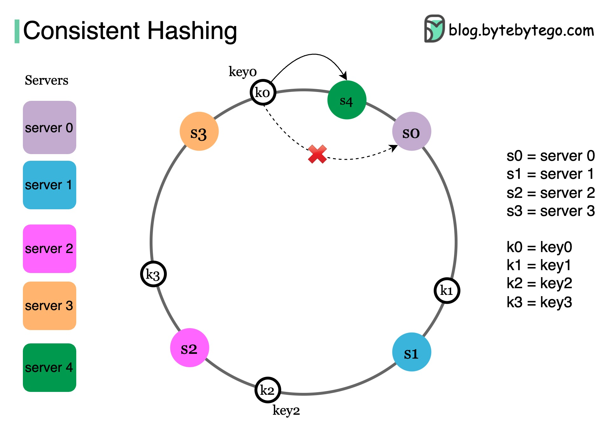

## Consistent Hashing - Rebalancing Partitions

When scaling a sharded database, adding or removing nodes often triggers a massive rebalancing process. If you use a simple hash function like hash(key) % N (where N is the number of nodes), changing N causes almost every key to map to a different node, forcing nearly all your data to move across the network.

### Consistent Hashing

Consistent hashing ensures that when the number of nodes changes, only a small fraction of keys (1/n) needs to be moved.

**How the Algorithm Works**

- The Hash Ring: Imagine the entire range of hash values (e.g., _from 0 to 231 − 1_) is wrapped into a circle or "ring"
- Node Placement: Both the data keys and the nodes themselves are hashed and placed onto this ring.
- Clockwise Assignment: To find which node stores a specific key, you locate the key on the ring and move clockwise until you hit the first node.

**Handling Node Changes**

- Node Removal: If a node fails or is removed, only the keys that were assigned to it "fall" clockwise to the next available node.
- Node Addition: If a new node is added, it only "steals" a small portion of keys from its immediate clockwise neighbor.
- Result: Minimal data movement across the network, preserving availability during scaling

### Improving Distribution: Virtual Nodes

A basic ring can still lead to data skew (uneven load) if nodes are positioned awkwardly or have different hardware capacities.

- The Concept: Instead of placing a node once, we place it multiple times on the ring using different hash functions (or "vnodes").
- The "K" Factor: If we assign a value k to a node, it represents the number of virtual positions it holds on the ring.
- Benefit: This makes the distribution much more granular. If a node is twice as powerful as others, you can give it a higher k value so it handles a larger share of the load.

 

---

 

### Fixed Number of Partitions

An alternative to the "ring" approach is to decouple the data partitions from the physical nodes.

**How it Works**

Instead of keys mapping directly to nodes, they map to a fixed number of logical partitions (e.g., 1024 partitions). These partitions are then distributed among the available nodes.

- Example: If you have 12 partitions and 3 nodes, each node handles 4 partitions.
- Scaling Up: If you add a 4th node, the system moves 1 partition from each existing node to the new one (now everyone has 3).

**The "Goldilocks" Challenge (Sizing Partitions)**

Choosing the right number of partitions is critical:

- Too Few: If you only have 10 partitions and your data grows to exabytes, each partition becomes too massive to move or recover quickly. You also cannot scale beyond 10 nodes.
- Too Many: Each partition has overhead (metadata, open files, index structures). Thousands of tiny partitions can overwhelm the storage engine and CPU.
- Example: Systems like Elasticsearch or Cassandra often require you to pick a partition count upfront, while others like MongoDB can split partitions dynamically as they grow.

 

### Summary Comparison

| Strategy           | Rebalancing Effort              | Load Distribution  | Complexity |
| ------------------ | ------------------------------- | ------------------ | ---------- |
| Modulo Hashing     | Extreme (Moves everything)      | Good               | Very Low   |
| Consistent Hashing | Low (Moves neighbors)           | Good (with Vnodes) | Medium     |
| Fixed Partitions   | Moderate (Moves specific units) | Excellent          | Low/Medium |
