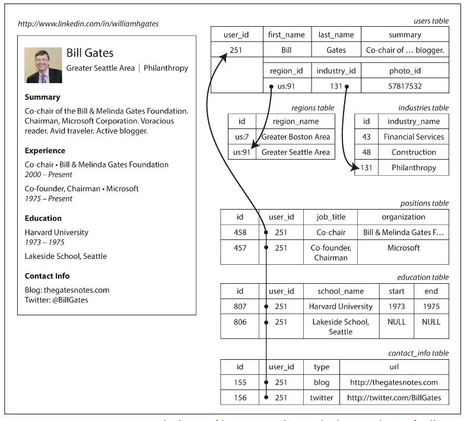
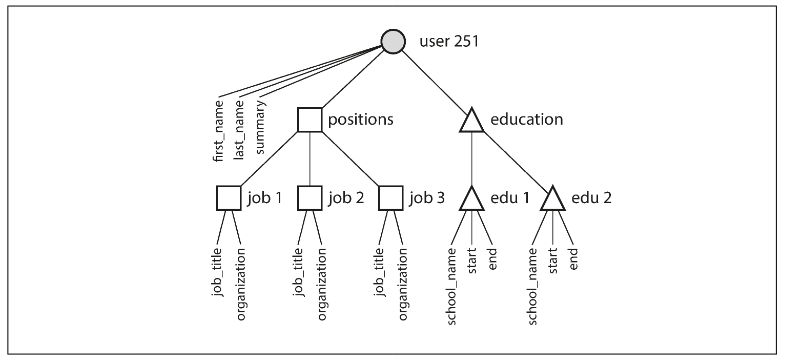

# Chapter 2.1 Data Models and Query Languages: Relational Model Versus Document Model

Most applications are built by layering one data model on top of another. For each layer, the key question is: how is it represented in terms of the next-lower layer.

Building software is hard enough, even when working with just one data model and without worrying about its inner workings. But since the data model has such a profound effect on what the software above it can and can’t do, it’s important to choose one that is appropriate to the application.

<br>

---

<br>

### Relational Model Versus Document Model

The best-known data model today is probably that of SQL: data is organized into relations (called tables in SQL), where each relation is an unordered collection of tuples (rows in SQL).

<br>

#### The Birth of NoSQL

There are several driving forces behind the adoption of NoSQL databases, including:

- A need for greater scalability thian relational databases can easily achieve, including very large datasets or very high write throughput
- A widespread preference for free and open source software over commercial database products
- Specialized query operations that are not well supported by the relational model
- Frustration with the restrictiveness of relational schemas, and a desire for a more dynamic and expressive data model

<br>

#### Different representation

For fields that appear only once per user (e.g., first_name, last_name), a single users table column is used.

However, since users typically have multiple positions, education periods, and pieces of contact information, there is a one-to-many relationship that can be handled in several ways:

- Traditional SQL (Normalized): Store multi-valued data in separate tables (positions, education, contact_info), using a foreign key reference back to the users table.
- Modern SQL Features: Use structured datatypes, XML, or JSON datatypes (supported by Oracle, DB2, PostgreSQL, MySQL, etc.) to store multi-valued data within a single row, allowing for querying and indexing inside the structured data.
- Application-Handled Encoding: Encode the multi-valued data as JSON or XML and store it in a simple text column. In this case, the application is responsible for interpreting the structure, and the database cannot typically query the internal values.



For a data structure like a CV, which is mostly a self-contained document, a JSON representation can be quite appropriate. JSON has the appeal of being much simpler than XML. Document-oriented databases like MongoDB, RethinkDB, CouchDB, and Espresso support this data model.

```
{
  "user_id": 251,
  "first_name": "Bill",
  "last_name": "Gates",
  "summary": "Co-chair of the Bill & Melinda Gates... Active blogger.",
  "region_id": "us:91",
  "industry_id": 131,
  "photo_url": "/p/7/000/253/05b/308dd6e.jpg",
  "positions": [
    {"job_title": "Co-chair", "organization": "Bill & Melinda Gates Foundation"},
    {"job_title": "Co-founder, Chairman", "organization": "Microsoft"}
  ],
  "education": [
    {"school_name": "Harvard University", "start": 1973, "end": 1975},
    {"school_name": "Lakeside School, Seattle", "start": null, "end": null}
  ],
  "contact_info": {
    "blog": "http://thegatesnotes.com",
    "twitter": "http://twitter.com/BillGates"
  }
}
```

The JSON model offers advantages over the traditional multi-table relational schema for data with inherent tree structures (one-to-many relationships, like a user profile with multiple jobs).

- Impedance Mismatch: JSON storage can reduce the impedance mismatch between application code and the storage layer.
- Locality & Querying: JSON provides better locality because all related data is stored in one document/row.
  - Retrieving a profile requires only one query.
  - The relational approach requires either multiple queries or a complex multi-way join to fetch data scattered across tables.
- Tree Structure: JSON explicitly represents the data's inherent tree structure.



<br>

#### Many-to-One and Many-to-Many Relationships

Storing data like region or industry as IDs (referencing a standardized list) rather than plain text strings offers significant advantages:

- Consistency: Ensures uniform spelling and style across all records.
- Clarity: Avoids ambiguity (e.g., duplicate city names).
- Maintainability: Easier to update, localize, and manage (e.g., name changes or translations) because the human-meaningful data is stored in only one place.
- Searchability: Enables richer search functionality (e.g., inferring that "Seattle" is in "Washington").

The choice between an ID and a text string is a question of duplication:

- Using an ID (Normalization): The human-meaningful information (like "Philanthropy") is stored once (in a lookup table), and records refer to it using a meaningless ID. If the name changes, only one record needs updating, preventing inconsistencies.
- Storing Text Directly (Denormalization): The human-meaningful information is duplicated in every record that uses it, incurring write overhead and risking inconsistencies when updates occur.

Normalization, which relies on many-to-one relationships (e.g., many people → one region), fits naturally into the Relational Model (**SQL**) where joins are easy.

Document Databases (**NoSQL**): Many-to-one relationships do not fit neatly into the document model because support for joins is often weak. If the database lacks join support, the application must emulate the join by making multiple queries or storing lookup data in memory, shifting work from the database to the application layer.

As applications grow, data often becomes more interconnected, requiring relationships that move beyond simple one-to-many tree structures, which further exposes the limitations of a join-free document model:

- Entities and References: Turning simple strings (e.g., organization name, school name) into references to entities allows those entities (schools, companies) to have their own linked profiles, logos, and features.
- Cross-User References (Recommendations): Features like user recommendations require a reference from the recommendation back to the author's profile. If the author updates their photo, the recommendation must reflect that change, necessitating a live reference (ID) rather than duplicated data

<br>

#### Relational Versus Document Databases

The main arguments in favor of the document data model are schema flexibility, better performance due to locality, and that for some applications it is closer to the data structures used by the application. The relational model counters by providing better support for joins, and many-to-one and many-to-many relationships.

##### Which data model leads to simpler application code?

The data model that leads to the simplest application code depends entirely on the relationships between data items in your application.

Document Model Advantage

- When to use: It's a good choice if your data has a document-like structure (a tree of one-to-many relationships where the entire structure is usually loaded together).
- Why it's simpler: Using a document model avoids the cumbersome schemas and complicated application code that result from shredding (splitting the document into multiple relational tables).

Document Model Limitations

- Poor Join Support: Document databases generally have poor support for joins. This is acceptable if your application doesn't need many-to-many relationships (e.g., simple analytics logging).
- Complexity with Joins: If your application does require many-to-many relationships, the document model becomes less appealing. You would have to:
  - Denormalize: The application must then do extra work to keep the denormalized data consistent.
  - Emulate Joins: Make multiple requests to the database, which moves complexity into the application and is usually slower.

In these cases, the document model can lead to more complex application code and worse performance, so SQL databases are better fit.

<br>

#### Schema flexibility in the document model

Document Databases (Schema-on-Read)

- Approach: Often described as schemaless (though an implicit schema is assumed by the application code).
- Enforcement: The structure is interpreted only when the data is read (schema-on-read). This is similar to dynamic (runtime) type checking in programming languages.
- Schema Change: Changing the data format (e.g., splitting a full_name field) is easier. You simply start writing new documents in the new format, and the application code handles reading both old and new documents.
- Advantage: Highly beneficial for heterogeneous data (items with different structures), such as:
  - Collections containing many different object types.
  - Data whose structure is determined by uncontrolled external systems.

Relational Databases (Schema-on-Write)

- Approach: Uses an explicit schema defined by the database.
- Enforcement: The database ensures all data conforms to the schema when it is written (schema-on-write). This is similar to static (compile-time) type checking.
- Schema Change: Changing the format usually involves a data migration (like ALTER TABLE or UPDATE statements).
  - ALTER TABLE is often fast (milliseconds) but can be slow (hours of downtime) in certain systems (like MySQL for large tables).
  - UPDATE statements on large tables are generally slow on any database because every row must be rewritten.
- Advantage: Provides a useful mechanism for documenting and enforcing a consistent structure when all records are expected to have the same format.

<br>

#### Data locality for queries

The primary performance distinction discussed here is data locality—how related pieces of data are stored physically.

Document Model Locality:

- Storage: A document is typically stored as a single continuous string (JSON, XML, or binary variants like BSON).
- Performance Advantage: This single-string storage offers a performance advantage if your application often needs to access the entire document (e.g., for rendering a web page). Retrieving the document requires fewer index lookups and disk seeks compared to retrieving data split across multiple relational tables.
- Performance Limitations:
  - Wastefulness: The database usually needs to load the entire document, even if you only need a small portion. This is wasteful for very large documents.
  - Updates: Updates to a document usually require the entire document to be rewritten (unless the modification doesn't change the encoded size).
- Recommendation: It's generally advised to keep documents fairly small and avoid updates that significantly increase the document's size to mitigate these limitations.i

The concept of grouping related data for locality is not exclusive to the document model:

- Spanner (Relational): Allows tables to be interleaved (nested) within a parent table to achieve the same locality properties.
- Oracle (Relational): Offers multi-table index cluster tables for similar grouping.
- Bigtable Model (Column-Family): The column-family concept (used in Cassandra and HBase) also serves a similar purpose of managing data locality.
