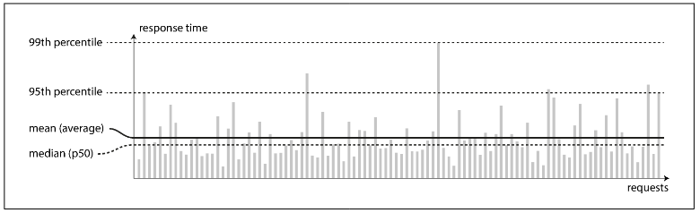

# Chapter 1 Foundations of Data Systems: Reliable, Scalable, and Maintainable Applications

- **Reliability**: The system should continue to work correctly (performing the correct function at the desired level of performance) even in the face of adversity (hardware or software faults, and even human error).

- **Scalability**: As the system grows (in data volume, traffic volume, or complexity), there should be reasonable ways of dealing with that growth.

- **Maintainability**: Over time, many different people will work on the system (engineering and operations, both maintaining current behavior and adapting the system to new use cases), and they should all be able to work on it productively.

 

---

 

### Reliability

The things that can go wrong are called **faults**, and systems that anticipate faults and can cope with them are called **fault-tolerant** or **resilient**.

_Note: A fault is not the same as a failure. A fault is usually defined as one component of the system deviating from its spec, whereas a failure is when the system as a whole stops providing the required service to the user._

**Hardware Faults**

Hardware faults include events like hard disk crashes, faulty RAM, power blackouts, or accidental cable unplugging.

There is a growing trend toward systems that can tolerate the loss of entire machines using software fault-tolerance instead of, or in addition to, hardware redundancy.

These fault-tolerant systems offer significant operational benefits:

- They avoid the planned downtime required by single-server systems for tasks like OS security patching.
- They allow patching to be done one node at a time without interrupting the service of the entire system.

 

**Software Errors**

Unlike hardware faults, which are typically random and independent (e.g., one disk failure), **systematic faults** are correlated across multiple nodes, making them harder to anticipate and resulting in more widespread system failures.

These faults are often caused by dormant software bugs that surface under unusual conditions, exposing a faulty assumption the software made about its environment. Examples include:

- A software bug that crashes all instances of an application server (e.g., the leap second bug of 2012).
- A runaway process that consumes a shared resource (CPU, memory, etc.).
- A dependent service becoming slow, unresponsive, or returning corrupted data.
- **Cascading failures** where a fault in one component triggers subsequent faults.

Since there is no single solution, addressing systematic faults requires multiple strategies:

- Careful analysis of system assumptions and interactions.
- Thorough testing and process isolation.
- Designing processes to crash and restart gracefully.
- Extensive monitoring and analysis of system behavior in production.
- Self-checking mechanisms to constantly verify system invariants (e.g., input equals output) and alert on discrepancies.

 

**Human Errors**

Human errors by developers and operators are a primary cause of system outages. One study of large internet services found that configuration errors by operators were the leading cause of outages, significantly outweighing hardware faults.

To make systems reliable despite human fallibility, the best approach is to combine several strategies:

- Minimize Opportunities for Error: Design systems with well-thought-out abstractions, APIs, and admin interfaces that make it easy to perform correct actions while discouraging mistakes.
- Decouple Risky Actions: Separate high-error areas from failure points. Provide safe, non-production sandbox environments where people can test and experiment with real data without impacting users.
- Test Thoroughly: Use automated testing at all levels (unit, integration, and manual) to cover normal operation and rare corner cases.
- Allow Quick Recovery: Minimize the impact of errors by enabling fast rollback of configuration changes and new code (e.g., via gradual rollout).
- Implement Detailed Monitoring (**Telemetry**): Set up clear monitoring for performance metrics and error rates. This provides early warning signs and is invaluable for diagnosing issues when they occur.
- Good Management and Training: An essential, though complex, aspect of improving reliability.

 

---

 

### Scalability

**Scalability** is the term we use to describe a system’s ability to cope with increased load. Note, however, that it is not a one-dimensional label that we can attach to a system: it is meaningless to say “X is scalable” or “Y doesn’t scale.” Rather, discussing scalability means considering questions like “If the system grows in a particular way, what are our options for coping with the growth?” and “How can we add computing resources to handle the additional load?”

 

**Describing Load**

System load must be defined using **load parameters** (measures of the system's current load) before discussing growth. The appropriate parameters vary based on the system's architecture—they could be:

- Requests per second (web server).
- Read/write ratio (database).
- Active users (chat room).
- Cache hit rate, or other metrics.

The most critical factor may be the average case or a few extreme cases that define the system's bottleneck.

Twitter's operations illustrate how load parameters are used:

- Post tweet (Writes): Average load was 4.6k requests/sec, with peaks over 12k requests/sec.
- Home timeline (Reads): Load was 300k requests/sec.

Twitter's main scaling challenge wasn't the 12k/sec write volume, but the **fan-out**—the high number of followers each user has, which significantly increases the load when generating home timelines.

Implementing the "Post Tweet" (write) and "Home Timeline" (read) operations involves two main approaches, driven by the challenge of fan-out (a key load parameter defined by the distribution of followers).

- Read-Focused (Approach 1): Posting a tweet is a simple write. Generating the Home Timeline requires looking up all followed users' tweets and merging them upon request.
  - Initial Twitter: Used this but struggled to handle the high volume of timeline reads.
- Write-Focused (Approach 2 - Caching): When a user posts a tweet, it is immediately written (fanned out) to a cache (mailbox) for every follower. Reading the Home Timeline is then fast and cheap.
  - Current Twitter (Mostly): Switched to this because reads (300k/sec) are much higher than writes (4.6k/sec average).
  - Downside: A single tweet on average results in 75 writes (totaling 345k writes/sec), but a celebrity with 30M followers can cause 30M writes for one post, making timely delivery a challenge.

Twitter now uses a hybrid approach combining both methods for better performance:

- Most Users: Tweets are fanned out immediately using Approach 2.
- Users with huge fan-out (Celebrities): Their tweets are excluded from fan-out and are instead fetched separately and merged with the home timeline at read time (Approach 1).

 

**Describing Performance**

Once system load is defined, scalability is analyzed by asking two questions:

- How is performance affected if load increases but resources remain constant?
- How much must resources increase to keep performance constant when load increases?

Answering these requires measuring performance, which differs for batch versus online systems:

- **Throughput**: The number of records processed per second or total job time in batch systems (e.g., Hadoop).
- **Response Time**: The time from client request to response in online systems.

Latency vs. Response Time

- Response Time: What the client observes; includes service time, network delays, and queueing delays.
- **Latency**: The duration a request is waiting (latent) to be handled.

Response time is not a single number but a distribution of values due to variations caused by factors like context switches, network retransmissions, garbage collection pauses, or page faults.

The arithmetic mean (average) is a poor measure of "typical" performance as it hides how many users experienced a delay. **Percentiles** are better:

- **Median (p50)**: The response time threshold where 50% of requests are faster. This is the best metric for the typical wait time.
- **High Percentiles (p95, p99, p99.9)**: Used to measure **tail latencies**—how slow the outliers are. For example, the 99th percentile (p99) is the threshold where 99% of requests are faster.

High percentiles are critical because they affect user experience. Amazon, for instance, focuses on the 99.9th percentile because the slowest requests often belong to their most valuable (high-data) customers. Even small increases in response time (e.g., 100 ms) can significantly reduce sales and customer satisfaction.

Percentiles are used in **Service Level Agreements (SLAs)** to define performance and availability expectations (e.g., median response time <200 ms and p99 <1 s). Failure to meet these metrics may trigger refunds.

Queueing often dominates high-percentile response times (tail latencies). A small number of slow requests can cause **head-of-line blocking**, holding up faster requests behind them. Because of this, response times should be measured on the client side.

When testing system scalability, the load generator must send requests independently of the response time to accurately simulate real-world queueing behavior.

 

**Approaches for Coping with Load**

Scalability addresses how to maintain good performance when load parameters increase. As load grows by an order of magnitude, the underlying architecture often needs to be rethought.

Architectures typically employ a mix of two scaling approaches:

- **Scaling Up (Vertical Scaling)**: Moving to a single, more powerful machine. While often simpler, high-end machines become very expensive.
- **Scaling Out (Horizontal Scaling)**: Distributing the load across multiple smaller machines (known as a **shared-nothing architecture**). This is necessary for highly intensive workloads.

Systems can manage load either **elastically** (automatically adding resources in response to load) or manually. Elastic systems suit unpredictable load, while manually scaled systems are simpler and may be more operationally predictable.

While distributing stateless services is straightforward, scaling stateful data systems (like databases) from a single node to a distributed setup is complex. Historically, databases scaled up until cost or high-availability requirements forced distribution, though this common wisdom may change as distributed system tools improve.

A scalable architecture is highly specific to the application's needs—there is no generic solution.

 

---

 

### Maintainability

We can and should design software in such a way that it will hopefully minimize pain during maintenance, and thus avoid creating legacy software ourselves. To this end, we will pay particular attention to three design principles for software systems:

- **Operability**: Make it easy for operations teams to keep the system running smoothly.
- **Simplicity**: Make it easy for new engineers to understand the system, by removing as much complexity as possible from the system. _Note: this is not the same as simplicity of the user interface._
- **Evolvability**: Make it easy for engineers to make changes to the system in the future, adapting it for unanticipated use cases as requirements change. Also known as extensibility, modifiability, or plasticity.

As previously with reliability and scalability, there are no easy solutions for achieving these goals. Rather, we will try to think about systems with operability, simplicity, and evolvability in mind.

 

**Operability: Making Life Easy for Operations**

Operations teams are vital to keeping a software system running smoothly. A good operations team typically is responsible for the following, and more:

- Monitoring the health of the system and quickly restoring service if it goes into a bad state
- Tracking down the cause of problems, such as system failures or degraded performance
- Keeping software and platforms up to date, including security patches
- Keeping tabs on how different systems affect each other, so that a problematic change can be avoided before it causes damage
- Anticipating future problems and solving them before they occur (e.g., capacity planning)
- Establishing good practices and tools for deployment, configuration management, and more
- Performing complex maintenance tasks, such as moving an application from one platform to another
- Maintaining the security of the system as configuration changes are made
- Defining processes that make operations predictable and help keep the production environment stable
- Preserving the organization’s knowledge about the system, even as individual people come and go

Good operability means making routine tasks easy, allowing the operations team to focus their efforts on high-value activities. Data systems can do various things to make routine tasks easy, including:

- Providing visibility into the runtime behavior and internals of the system, with good monitoring
- Providing good support for automation and integration with standard tools
- Avoiding dependency on individual machines (allowing machines to be taken down for maintenance while the system as a whole continues running uninterrupted)
- Providing good documentation and an easy-to-understand operational model (“If I do X, Y will happen”)
- Providing good default behavior, but also giving administrators the freedom to override defaults when needed
- Self-healing where appropriate, but also giving administrators manual control over the system state when needed
- Exhibiting predictable behavior, minimizing surprises

 

**Simplicity: Managing Complexity**

As software projects grow, they often suffer from complexity, which makes them difficult to understand and slows down maintenance (sometimes called a "big ball of mud").

Complexity is caused by factors like:

- Explosion of the state space.
- Tight coupling and tangled dependencies between modules.
- Inconsistent naming.
- Performance hacks and special-casing.

This complexity leads to budget and schedule overruns and significantly increases the risk of introducing bugs. Simplicity is therefore a key goal, as it greatly improves software maintainability.

Simplicity doesn't mean reducing functionality; it means removing **accidental complexity**—the complexity that arises from the implementation rather than being inherent to the user's problem.

The primary tool for reducing accidental complexity is **abstraction**:

- Abstractions hide a large amount of implementation detail behind a clean, simple interface.
- Good abstractions are reusable, which is efficient and leads to higher-quality software.

Examples of Abstraction:

- High-level programming languages abstract away machine code, CPU registers, and system calls.
- SQL abstracts away complex on-disk data structures, concurrent client requests, and crash recovery.

Finding good abstractions, especially in complex fields like distributed systems, is challenging but crucial for managing complexity.

 

**Evolvability: Making Change Easy**

It's highly unlikely that a system's requirements will remain static; they are constantly changing due to new facts, emerging use cases, shifting business priorities, user requests, regulatory changes, and system growth.

The ease with which a data system can be modified to adapt to changing requirements is tied to its simplicity and the quality of its abstractions.

For a large data system, which may comprise several different applications or services, the concept of agility is referred to as **evolvability**. This term emphasizes the ability of the overall system architecture to accommodate frequent and substantial change.

 
