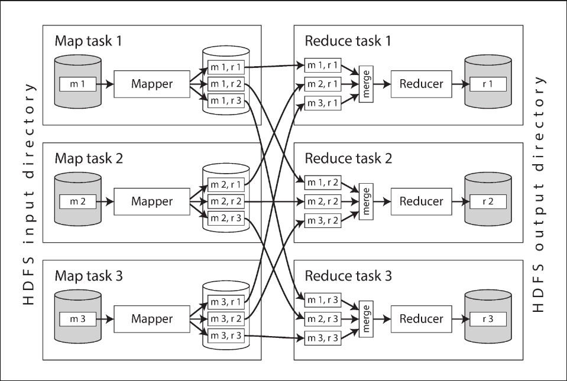
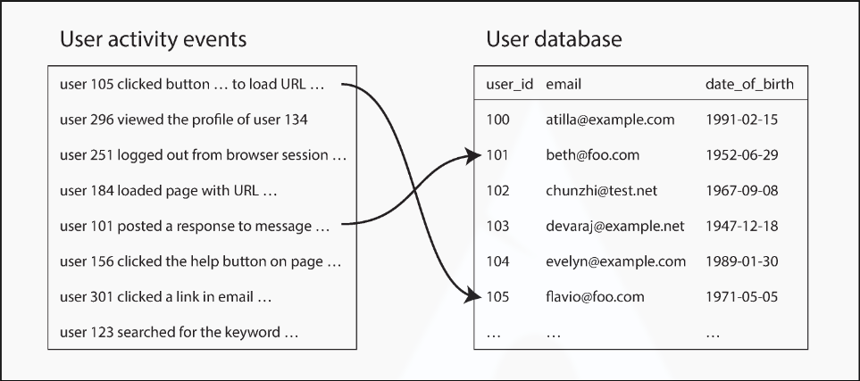
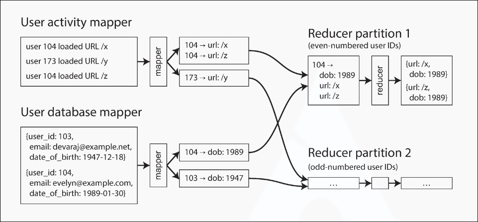

# Chapter 10.2 Batch Processing: MapReduce and Distributed Filesystems

MapReduce is like Unix tools but distributed across potentially thousands of machines — a blunt, brute-force, but surprisingly effective tool. A single MapReduce job is comparable to a single Unix process: it takes one or more inputs and produces one or more outputs. Like most Unix tools, it does not modify the input and has no side effects other than producing output files, which are written once in a sequential fashion.

While Unix tools use `stdin` and `stdout`, MapReduce jobs read and write files on a **distributed filesystem**. In Hadoop's implementation, that filesystem is called **HDFS** (Hadoop Distributed File System), an open source reimplementation of the Google File System (GFS). Other distributed filesystems exist (GlusterFS, Quantcast File System), and object storage services (Amazon S3, Azure Blob Storage, OpenStack Swift) are similar in many ways.

HDFS is based on the **shared-nothing** principle, in contrast to the shared-disk approach of NAS and SAN architectures. Shared-disk storage relies on a centralized storage appliance with custom hardware, while shared-nothing requires only computers connected by a conventional datacenter network.

HDFS consists of a daemon process running on each machine, exposing a network service for file access. A central server called the **NameNode** keeps track of which file blocks are stored on which machine, conceptually creating one big filesystem across all machines. To tolerate failures, file blocks are replicated on multiple machines — either as full copies or using an **erasure coding** scheme such as Reed–Solomon codes, which allows recovery with lower storage overhead than full replication. These techniques are similar to RAID but operate over a conventional network without special hardware.

 

---

 

### MapReduce Job Execution

MapReduce is a programming framework for processing large datasets in a distributed filesystem like HDFS. The pattern is very similar to the Unix log analysis example from the previous section:

1. Read a set of input files and break them into records (e.g., each line in a log file).
2. Call the **mapper** function to extract a key and value from each input record (analogous to `awk '{print $7}'` extracting the URL).
3. Sort all key-value pairs by key (analogous to the first `sort` command).
4. Call the **reducer** function to iterate over the sorted key-value pairs, combining values for the same key (analogous to `uniq -c`).

Steps 2 (map) and 4 (reduce) are where you write custom data processing code. Step 1 is handled by the input format parser. Step 3 is implicit in MapReduce — the mapper output is always sorted before it reaches the reducer.

To create a MapReduce job, you implement two callback functions:

- **Mapper**: Called once for every input record. It extracts the key and value and may generate any number of key-value pairs (including none). It keeps no state between records — each is handled independently.
- **Reducer**: Receives all values belonging to the same key (collected by the framework) via an iterator, and produces output records (e.g., the count of occurrences of the same URL).

If you need a second sorting stage (e.g., ranking URLs by request count), you write a second MapReduce job using the first job's output as input. The mapper prepares data into a form suitable for sorting; the reducer processes the sorted data.

**Distributed Execution of MapReduce**

The key difference from Unix pipelines is that MapReduce parallelizes computation across many machines without requiring explicit parallelism in user code. The mapper and reducer only operate on one record at a time and don't need to know where their input comes from or output goes — the framework handles data movement between machines.

The parallelization is based on partitioning: the input to a job is typically an HDFS directory, and each file or file block is a separate partition processed by a separate map task. The MapReduce scheduler tries to run each mapper on a machine that stores a replica of the input file — a principle known as **putting the computation near the data**, which reduces network load and increases locality.

The framework copies the application code (e.g., JAR files) to the assigned machines, starts the map task, and begins reading the input file, passing one record at a time to the mapper callback.

The reduce side is also partitioned. While the number of map tasks is determined by input file blocks, the number of reduce tasks is configured by the job author. To ensure all key-value pairs with the same key reach the same reducer, the framework uses a hash of the key to determine the target reduce task.

Sorting is performed in stages. Each map task partitions its output by reducer (based on key hash) and writes each partition to a sorted file on the mapper's local disk, using a technique similar to SSTables. When a mapper finishes, the scheduler notifies reducers to start fetching. Reducers connect to mappers and download their sorted partitions. This process of partitioning, sorting, and copying data from mappers to reducers is known as the **shuffle**.

The reduce task merges the files from mappers, preserving sort order so that records with the same key from different mappers become adjacent. The reducer is called with a key and an iterator over all records with that key, can apply arbitrary logic, and writes output records to the distributed filesystem (with replicas on other machines).

**MapReduce Workflows**

A single MapReduce job is limited in scope — it could determine page views per URL, but not the most popular URLs (which requires a second round of sorting). Therefore, MapReduce jobs are commonly chained into **workflows**, where the output of one job becomes the input to the next.

The Hadoop MapReduce framework has no built-in workflow support — chaining is done implicitly by directory name: the first job writes output to a designated HDFS directory, and the second job reads from that same directory. Chained jobs are therefore less like Unix pipelines (which stream data directly between processes) and more like a sequence of commands where each writes to a temporary file that the next reads from.

A batch job's output is only considered valid when the job completes successfully (partial output from failed jobs is discarded). One job in a workflow can only start when all prior jobs that produce its input have completed. Various workflow schedulers handle these dependencies, including Oozie, Azkaban, Luigi, Airflow, and Pinball. Workflows of 50 to 100 MapReduce jobs are common when building recommendation systems. Higher-level tools such as Pig, Hive, Cascading, Crunch, and FlumeJava also set up multi-stage workflows that are automatically wired together.

 

---

 

### Reduce-Side Joins and Grouping

In many datasets, records have associations with other records: a foreign key in a relational model, a document reference in a document model, or an edge in a graph model. A **join** resolves these associations by accessing records on both sides. Denormalization can reduce the need for joins but generally cannot eliminate it entirely. -> [ref](../chapter2/notes_2.md)

Unlike a database that uses indexes for targeted lookups, MapReduce reads the entire content of its input files — essentially a **full table scan**. For analytic queries that aggregate over large numbers of records, scanning the full input is reasonable, especially when parallelized across many machines. In batch processing, joins resolve all occurrences of an association across the entire dataset simultaneously, not for a single record.

**Example: Analysis of User Activity Events**

A typical batch join involves a log of user activity events (clickstream data) joined against a user database — a classic star schema where the event log is the fact table and the user database is a dimension. -> [ref](../chapter3/notes_2.md#stars-and-snowflakes-schemas-for-analytics)

An analytics task may need to correlate activity with profile information (e.g., determining which pages are popular with which age groups). Since activity events contain only the user ID, they must be joined with the user profile database. Querying a remote database per event would be too slow (limited by round-trip time) and nondeterministic (remote data may change). A better approach is to copy the user database (via ETL) into the same distributed filesystem as the activity events, then use MapReduce to bring all relevant records together locally.

**Sort-Merge Joins**

In a sort-merge join, one set of mappers extracts the user ID as key from activity events, while another set extracts the user ID from the user database. The framework partitions mapper output by key and sorts the key-value pairs, so all activity events and the user record with the same user ID become adjacent in the reducer input.

The MapReduce job can arrange records so the reducer always sees the user database record first, followed by activity events in timestamp order — a technique known as **secondary sort**. The reducer stores the user profile in a local variable, then iterates over activity events for that user ID, outputting joined results (e.g., viewed-url and viewer-age-in-years).

Since the reducer processes all records for a given user ID in one go, it only needs one user record in memory and never makes network requests. This is the **sort-merge join**: mapper output is sorted by key, and reducers merge sorted lists from both sides of the join.

**Bringing Related Data Together**

In a sort-merge join, mappers and the sorting process ensure all data needed for a join is brought to a single reducer call. The reducer can be simple, single-threaded code with high throughput and low memory overhead.

Conceptually, mappers “send messages” to reducers — the key acts as a destination address, and all key-value pairs with the same key are delivered to the same reducer. This separates physical network communication from application logic. Unlike database queries embedded deep in application code, MapReduce handles all network communication and transparently retries failed tasks, shielding the application from partial failures.

**GROUP BY**

Besides joins, another common use of “bringing related data to the same place” is grouping records by key (as in SQL’s `GROUP BY`). All records with the same key form a group, and the next step is typically an aggregation:

- Counting records in each group (`COUNT(*)`)
- Summing values in a field (`SUM(fieldname)`)
- Picking the top _k_ records by some ranking function

Implementation is straightforward: mappers emit key-value pairs using the desired grouping key, and the partitioning/sorting process delivers all records with the same key to the same reducer. Grouping and joining look quite similar when built on MapReduce.

A common application of grouping is **sessionization** — collating all activity events for a particular user session to determine the sequence of actions taken (e.g., for A/B testing or marketing analysis). Since activity events are scattered across multiple web servers’ log files, sessionization uses a session cookie or user ID as the grouping key to bring all events for one user together in a single partition.

**Handling Skew**

The pattern of “bringing all records with the same key to the same place” breaks down when a single key has a disproportionate amount of data. In a social network, most users have a few hundred connections, but celebrities may have millions of followers. Such records are known as **linchpin objects** or **hot keys**. Collecting all activity for a hot key in a single reducer creates significant skew — one reducer processes far more records than the others, and since a MapReduce job only completes when all reducers finish, subsequent jobs must wait for the slowest one. -> [ref](../chapter6/notes_1.md#skewed-workloads-and-relieving-hot-spots)

Several algorithms compensate for hot keys in joins:

- **Pig’s skewed join**: Runs a sampling job to detect hot keys. Records for a hot key are sent to one of several randomly chosen reducers (instead of deterministically by hash). The other join input is replicated to all reducers handling that key — parallelizing the work at the cost of replication.
- **Crunch’s sharded join**: Similar to Pig’s approach, but requires hot keys to be specified explicitly rather than detected via sampling.
- **Hive’s skewed join**: Hot keys are declared in table metadata, and their records are stored in separate files. Joins on hot keys use a map-side join instead of a reduce-side join.

For grouping with hot keys, a **two-stage aggregation** approach works well: the first MapReduce stage sends records to random reducers, each producing a partial aggregate per key. The second stage combines all partial aggregates into a single final value per key.

 

---

 

### Map-Side Joins

Reduce-side joins are flexible — they make no assumptions about the input data, since mappers prepare everything for joining. However, the sorting, copying to reducers, and merging of reducer inputs can be expensive, with data potentially written to disk multiple times.

If you can make certain assumptions about the input data, **map-side joins** are faster. They use a cut-down MapReduce job with no reducers and no sorting. Each mapper simply reads one input file block and writes one output file — that is all.

**Broadcast Hash Joins**

The simplest map-side join applies when a large dataset is joined with a small dataset that fits entirely in memory. Each mapper loads the small input (e.g., user database) into an in-memory hash table, then scans over the large input (e.g., activity events), looking up each record’s key in the hash table.

There can still be several map tasks — one per file block of the large input — each loading the entire small input into memory. This is called a **broadcast hash join**: “broadcast” because the small input is sent to all partitions of the large input, and “hash” because of the hash table lookup. Supported by Pig (“replicated join”), Hive (“MapJoin”), Cascading, Crunch, and query engines like Impala.

An alternative to an in-memory hash table is storing the small input as a read-only index on local disk. Frequently used parts remain in the OS page cache, providing near-memory-speed lookups without requiring the dataset to fit in RAM.

**Partitioned Hash Joins**

If both inputs are partitioned the same way (same key, same hash function, same number of partitions), the hash join can be applied to each partition independently. For example, if activity events and the user database are both partitioned by the last digit of user ID (10 partitions each), mapper 3 loads only users ending in 3 into its hash table and scans only the corresponding activity events.

Each mapper only reads one partition from each input, so the hash table is much smaller than in a broadcast join. This only works when both inputs share identical partitioning — a reasonable assumption if they were produced by prior MapReduce jobs. Known as **bucketed map joins** in Hive.

**Map-Side Merge Joins**

If the inputs are not only partitioned the same way but also **sorted by the same key**, the mapper can perform a merge operation — reading both input files incrementally in ascending key order and matching records with the same key. This does not require the inputs to fit in memory.

If a map-side merge join is possible, it likely means prior MapReduce jobs already produced the partitioned and sorted form. The join could have been done in the reduce stage of that prior job, but a separate map-only job makes sense when the sorted datasets are reused for other purposes.

**MapReduce Workflows with Map-Side Joins**

The choice of join strategy affects downstream jobs. A reduce-side join produces output partitioned and sorted by the join key, while a map-side join produces output partitioned and sorted the same way as the large input.

Map-side joins require knowledge of the physical layout of datasets in the distributed filesystem — not just encoding format and directory name, but also the number of partitions and the keys by which data is partitioned and sorted. In the Hadoop ecosystem, this metadata is typically maintained in HCatalog and the Hive metastore.

 

---

 

### The Output of Batch Workflows

Batch processing is closer to analytics than to transaction processing — it scans over large portions of an input dataset. However, unlike an analytic SQL query that produces a report (metrics over time, top-10 rankings, breakdowns by category), the output of a batch process is often some other kind of structure.

**Building Search Indexes**

Google’s original use of MapReduce was building search engine indexes (a workflow of 5 to 10 jobs). A full-text search index like Lucene is essentially a **term dictionary** where you look up a keyword and find the list of all document IDs containing it (the **postings list**). -> [ref](../chapter3/notes_1.md)

Batch processing is very effective for building these indexes: mappers partition the document set, each reducer builds the index for its partition, and index files are written to the distributed filesystem. Building such document-partitioned indexes parallelizes well, and since search queries are read-only, the index files are immutable once created. -> [ref](../chapter6/notes_2.md)

When the indexed documents change, two approaches exist:

- **Full rebuild**: Periodically rerun the entire indexing workflow and replace old index files wholesale. Computationally expensive if few documents changed, but very easy to reason about: documents in, indexes out.
- **Incremental**: Add, remove, or update documents by writing new segment files and asynchronously merging/compacting in the background (as Lucene does).

**Key-Value Stores as Batch Process Output**

Another common use for batch processing is building machine learning systems (classifiers, recommendation systems). The output is often a database — e.g., queryable by user ID for friend suggestions, or by product ID for related products. These databases must be accessible from the web application, which is typically separate from the Hadoop infrastructure.

Writing directly to a database from mappers or reducers is a bad idea:

- Network requests per record are orders of magnitude slower than normal batch throughput.
- Parallel tasks writing to the same database can overwhelm it, degrading query performance.
- MapReduce provides an all-or-nothing guarantee for job output, but writing to an external system produces visible side effects that break this guarantee — partial results from incomplete jobs may become visible.

A much better solution is to build a brand-new database inside the batch job and write it as immutable files to the job’s output directory in the distributed filesystem. These files can then be bulk-loaded into servers that handle read-only queries. Various key-value stores support this approach, including Voldemort, Terrapin, ElephantDB, and HBase bulk loading.

This is a natural fit for MapReduce: extracting a key and sorting by it is already most of the work needed to build an index. Since these stores are read-only (written once, then immutable), the data structures are simple — no WAL is needed.

During loading (e.g., in Voldemort), the server continues serving from old data files while new files are copied to local disk. Once copying completes, the server atomically switches to the new files. If anything goes wrong, it switches back to the old (still immutable) files.

**Philosophy of Batch Process Outputs**

MapReduce follows the same Unix philosophy: inputs are immutable, previous output is completely replaced, and there are no side effects. By treating inputs as immutable and avoiding side effects, batch jobs achieve good performance and become much easier to maintain:

- **Rollback**: If a bug produces wrong output, roll back the code and rerun the job. Or keep old output in a different directory and switch back. Unlike read-write databases, rolling back code also rolls back the data.
- **Fast iteration**: Easy rollback means feature development proceeds more quickly — minimizing irreversibility.
- **Automatic retry**: If a task fails due to a transient issue, the framework reschedules it on the same input. Safe only because inputs are immutable and failed task outputs are discarded.
- **Reusable input**: The same files can serve as input for multiple jobs, including monitoring jobs that validate output characteristics.
- **Separation of logic and wiring**: Like Unix tools, MapReduce jobs separate processing logic from I/O configuration, enabling code reuse across teams.

These Unix design principles work well for Hadoop, with one key difference: Unix tools assume untyped text files and require extensive parsing, while Hadoop eliminates this overhead by using structured file formats like Avro and Parquet, which provide efficient schema-based encoding with schema evolution. -> [ref](../chapter4/notes_1.md)

 

---

 

### Comparing Hadoop to Distributed Databases

Hadoop resembles a distributed Unix: HDFS is the filesystem and MapReduce is a quirky process that always sorts between the map and reduce phases. The join and grouping algorithms discussed earlier were not new — **massively parallel processing (MPP)** databases such as Gamma, Teradata, and Tandem NonStop SQL had implemented them over a decade before the MapReduce paper was published.

The key difference: MPP databases focus on parallel execution of analytic SQL queries on a cluster, while MapReduce plus a distributed filesystem provides something closer to a general-purpose operating system capable of running arbitrary programs.

**Diversity of Storage**

Databases require data to be structured according to a particular model (relational, document, etc.), whereas files in a distributed filesystem are just byte sequences — they can hold database records, text, images, videos, sensor readings, sparse matrices, feature vectors, or genome sequences.

Hadoop opened up the possibility of dumping data into HDFS first and figuring out how to process it later. By contrast, MPP databases require careful up-front modeling of data and query patterns before import. In practice, making data available quickly — even in a raw, difficult-to-use format — is often more valuable than deciding on the ideal data model up front.

This is similar to data warehousing: bringing data from various parts of a large organization together in one place enables joins across previously disparate datasets. The careful schema design required by MPP databases slows down centralized data collection; collecting raw data first and worrying about schema later speeds things up — a concept known as a **data lake** (or “enterprise data hub”).

This shifts the burden of interpretation from producer to consumer — a **schema-on-read** approach. When producers and consumers are different teams with different priorities, this is an advantage. There may not be one ideal data model; raw data allows several transformations for different purposes (the “sushi principle”: raw data is better). -> [ref](../chapter2/notes_1.md)

Hadoop has therefore been widely used for ETL: data from transaction processing systems is dumped into the distributed filesystem in raw form, then MapReduce jobs clean, transform, and import it into an MPP data warehouse for analytics. Data modeling still happens, but in a separate step decoupled from data collection — possible because a distributed filesystem supports data in any format.

**Diversity of Processing Models**

MPP databases are monolithic, tightly integrated systems that handle storage layout, query planning, scheduling, and execution. Because all components are tuned together, they achieve excellent performance on their target queries. SQL provides expressive, code-free semantics accessible to business analysts via tools like Tableau.

However, not all processing can be expressed as SQL. Machine learning, recommendation systems, full-text search indexes with relevance ranking, and image analysis all require a more general data processing model. These workloads are often application-specific (feature engineering, natural language models, fraud-detection risk functions) and inevitably require writing code, not just queries.

MapReduce gave engineers the ability to run their own code over large datasets. You can build a SQL engine on top of HDFS and MapReduce — this is exactly what Hive did — but you can also write batch processes that do not lend themselves to SQL at all.

Over time, MapReduce proved too limiting for some workloads, and various other processing models were developed on top of Hadoop. Due to the openness of the Hadoop platform, implementing a whole range of approaches was feasible — something not possible within a monolithic MPP database. Crucially, all these processing models run on a single shared-use cluster accessing the same distributed filesystem. There is no need to import data into several specialized systems; the platform supports diverse workloads without moving data around, making it easier to derive value and experiment with new models.

The Hadoop ecosystem includes both random-access OLTP databases such as HBase and MPP-style analytic databases such as Impala. Neither uses MapReduce, but both use HDFS for storage — very different approaches to data access that coexist in the same system. -> [ref](../chapter3/notes_1.md)

**Designing for Frequent Faults**

Two more differences between MapReduce and MPP databases stand out: fault handling and use of memory vs. disk.

If a node crashes during a query, most MPP databases abort the entire query and either let the user resubmit it or automatically rerun it. Since queries typically run for seconds or minutes, this is acceptable — the retry cost is low. MPP databases also prefer to keep data in memory (e.g., hash joins) to avoid disk reads.

MapReduce takes the opposite approach: it tolerates failure of individual map or reduce tasks by retrying them independently, without affecting the job as a whole. It eagerly writes data to disk, partly for fault tolerance, partly assuming the dataset is too large for memory. This is more appropriate for large, long-running jobs where at least one task failure is likely — rerunning the entire job for a single failure would be wasteful. Even if per-task recovery adds overhead to fault-free processing, it is a reasonable trade-off when task failures are frequent enough.

But are these assumptions realistic? In most clusters, machine failures occur but are rare enough that most jobs complete without encountering one.

The answer lies in the environment MapReduce was originally designed for. Google runs mixed-use datacenters where online production services and offline batch jobs share the same machines. Every task has a resource allocation (CPU, RAM, disk) enforced via containers and a priority level — higher-priority tasks cost more, and if they need resources, lower-priority tasks on the same machine are **preempted** (terminated to free resources).

This architecture allows low-priority computing resources to be overcommitted, since the system can reclaim them as needed. Overcommitting improves machine utilization compared to segregating production and non-production workloads. However, MapReduce jobs run at low priority and risk preemption at any time — batch jobs effectively “pick up the scraps under the table,” using whatever resources remain after high-priority processes take what they need.

At Google, a MapReduce task running for one hour has roughly a 5% chance of being preempted — over an order of magnitude higher than hardware failure rates. For a job with 100 tasks each running 10 minutes, there is a greater than 50% chance that at least one task will be preempted before completion.

This is the real reason MapReduce tolerates frequent unexpected task termination: not because hardware is unreliable, but because the freedom to arbitrarily preempt processes enables better resource utilization across the cluster.

_Note: Among open source schedulers, preemption is less widely used. YARN’s CapacityScheduler supports it for balancing queue resource allocation, but general priority preemption is not broadly supported. In environments where tasks are rarely preempted, MapReduce’s design trade-offs make less sense._
