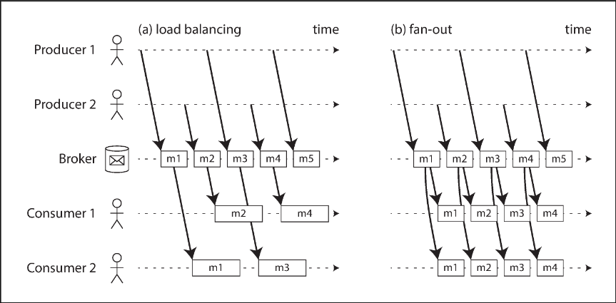
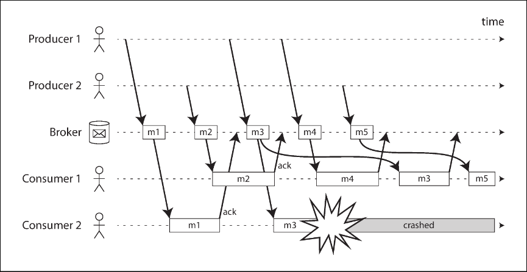
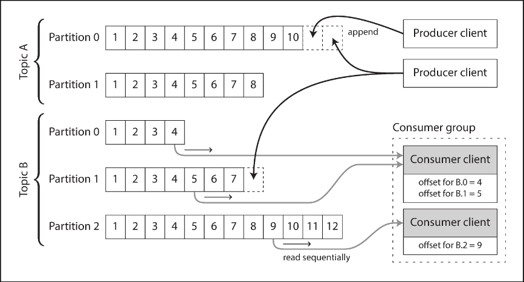

# Chapter 11.1 Stream Processing: Transmitting Event Streams

Unlike batch processing, where inputs are bounded files, stream processing deals with an **event**—a small, self-contained, immutable object containing the details of something that happened at a specific point in time. An event typically includes a timestamp indicating when it occurred.

Events can originate from user actions (e.g., page views, purchases) or machine measurements (e.g., temperature sensors, CPU metrics). They are encoded as text strings, JSON, or binary formats, allowing them to be stored in databases or transmitted over a network.

An event is generated by a **producer** (publisher or sender) and processed by multiple **consumers** (subscribers or recipients). Related events are grouped together into a **topic** or **stream**.

While producers could write events to a database for consumers to poll, frequent polling becomes expensive and inefficient for continual, low-latency processing. Instead, consumers need to be notified when new events appear. Since traditional databases lack robust notification mechanisms, specialized tools are used.

 

---

 

### Messaging Systems

A **messaging system** notifies consumers about new events. While a direct channel like a TCP connection or Unix pipe connects exactly one sender to one recipient, a messaging system supports a publish/subscribe model, allowing multiple producers and consumers on the same topic.

Messaging systems differentiate themselves based on two key questions:

1. What happens if producers send messages faster than consumers can process them? The system can drop messages, buffer them in a queue, or apply **backpressure** (blocking the producer). If buffered, queue growth can lead to memory exhaustion or disk spilling, which impacts performance.
2. What happens if nodes crash or temporarily go offline? Durability can be achieved by writing to disk or replicating messages, which incurs a performance cost. If occasional message loss is acceptable (e.g., periodic sensor metrics), higher throughput can be achieved. However, applications requiring strict accuracy (e.g., counting events) demand reliable delivery.

**Direct messaging from producers to consumers**

Several messaging systems use direct network communication without intermediary nodes:

- UDP multicast for low-latency financial feeds (application-level protocols recover lost packets).
- Brokerless messaging libraries like ZeroMQ and nanomsg over TCP or IP multicast.
- StatsD and Brubeck using unreliable UDP messaging for collecting metrics.
- Webhooks, where producers make direct HTTP/RPC requests to a registered consumer callback URL.

Direct messaging requires application code to handle message loss. It generally assumes producers and consumers are constantly online, struggling if a consumer is unreachable or if a producer crashes before retrying a failed delivery.

**Message brokers**

A **message broker** (message queue) is a server optimized for handling message streams. Producers write messages to the broker, and consumers read from it.

- **Durability and Connection Management**: The broker centralizes data, tolerating transient clients and taking responsibility for durability (in-memory or on-disk).
- **Asynchronous Consumption**: Producers do not wait for consumers to process messages; they only wait for the broker's confirmation. Slow consumers are accommodated via unbounded queueing.

**Message brokers compared to databases**

While some brokers participate in two-phase commit protocols, they differ significantly from databases:

- Brokers automatically delete messages after successful delivery and are unsuitable for long-term storage.
- Brokers assume a small working set (short queues). Throughput degrades if large queues spill to disk.
- Brokers notify clients when data changes, whereas databases require querying point-in-time snapshots.
- Brokers filter data via topic subscriptions, while databases use secondary indexes for arbitrary queries.

**Multiple consumers**

When multiple consumers read from the same topic, two main patterns are used:

- **Load balancing**: Each message is arbitrarily assigned to one consumer, parallelizing the processing of expensive messages.
- **Fan-out**: Each message is broadcast to all consumers, allowing independent systems to process the same stream.

These patterns can be combined, such as having multiple consumer groups where each group receives all messages via fan-out, but nodes within a group use load balancing.

**Acknowledgments and redelivery**

To prevent message loss if a consumer crashes during processing, brokers use **acknowledgments**: a client explicitly tells the broker when it has finished processing a message so it can be removed from the queue.

If a client disconnects without acknowledging, the broker redelivers the message to another consumer. When combined with load balancing, this redelivery inevitably leads to message reordering. For example, if consumer 2 crashes while processing message m3 and consumer 1 is processing m4, m3 will be redelivered to consumer 1, resulting in processing order m4, m3.

To avoid reordering, you must use a separate queue per consumer (disabling load balancing). Reordering is problematic only if there are causal dependencies between messages.

 

---

 

### Partitioned Logs

Sending a packet over a network or making a request to a network service is normally a transient operation. Traditional message brokers durably write messages to disk but quickly delete them after delivery, built around a transient messaging mindset.

Databases and filesystems take the opposite approach: data is permanently recorded until explicitly deleted. This difference in mindset impacts how derived data is created. In batch processing, inputs are read-only, allowing repeated runs without damaging the data. In AMQP/JMS-style messaging, receiving a message is destructive (the acknowledgment deletes it), so you cannot repeatedly run a consumer and expect the same result. Adding a new consumer only receives messages sent _after_ it was registered.

To combine the durable storage of databases with the low-latency notifications of messaging, we use **log-based message brokers**.

**Using logs for message storage**

A **log** is an append-only sequence of records on disk. A producer sends a message by appending it to the end of the log, and a consumer receives messages by reading the log sequentially. If a consumer reaches the end, it waits for a notification that a new message has been appended.

To scale to higher throughput, the log can be partitioned. Different partitions can be hosted on different machines, allowing independent reading and writing. A **topic** is defined as a group of partitions that all carry messages of the same type.

Within each partition, the broker assigns a monotonically increasing sequence number, or **offset**, to every message. Since a partition is append-only, messages within it are totally ordered, though there is no ordering guarantee across different partitions. Apache Kafka, Amazon Kinesis Streams, and Twitter's DistributedLog are examples of this approach.

**Logs compared to traditional messaging**

The log-based approach trivially supports fan-out messaging, as multiple consumers can read the log independently without deleting messages. To achieve load balancing, the broker assigns entire partitions to nodes in the consumer group, rather than assigning individual messages.

Each client sequentially consumes all messages in its assigned partitions. This coarse-grained load balancing has downsides:

- The maximum number of nodes sharing the work is limited by the number of log partitions in that topic.
- If a single message is slow to process, it holds up subsequent messages in that partition (head-of-line blocking).

In situations where messages are expensive to process and ordering is not critical, JMS/AMQP-style brokers are preferable. Where high throughput, fast processing, and message ordering are important, log-based approaches excel.

**Consumer offsets**

Consuming sequentially makes it easy to track processed messages: all messages with an offset less than the consumer's current offset have been processed. The broker periodically records these consumer offsets instead of tracking individual acknowledgments, reducing bookkeeping overhead and increasing throughput via batching.

This offset is similar to the log sequence number in single-leader database replication. If a consumer fails, another node takes over its assigned partitions and resumes from the last recorded offset. If the failed consumer processed messages but didn't record the new offset, those messages will be processed a second time.

**Disk space usage**

To prevent running out of disk space, the log is divided into segments. Old segments are periodically deleted or moved to archive storage.

Effectively, the log implements a bounded-size buffer that discards old messages when full, also known as a **circular buffer** or **ring buffer**. Because it is on disk, it can be quite large (e.g., retaining days or weeks of messages). Regardless of retention length, the throughput remains constant because every message is written to disk anyway. This contrasts with traditional brokers that only write to disk when memory queues grow too large, causing performance degradation.

**When consumers cannot keep up with producers**

If a consumer falls so far behind that the required messages are older than what is retained on disk, it will miss those messages. The broker effectively drops old messages that exceed the buffer size.

Operators can monitor how far a consumer is behind the head of the log and intervene before messages are missed. Importantly, a slow or failing consumer only affects itself; it does not disrupt service for other consumers or consume unnecessary broker memory, unlike traditional brokers where unconsumed queues can deplete resources.

**Replaying old messages**

In AMQP/JMS brokers, processing is destructive. In a log-based broker, consuming is a read-only operation that does not change the log. The only side effect is moving the consumer offset forward.

Because the offset is under the consumer's control, it can easily be manipulated. You can start a new consumer with yesterday's offset and write the output to a new location to reprocess old messages. This repeatable transformation process makes log-based messaging similar to batch processing, allowing for easy experimentation and recovery from errors.
