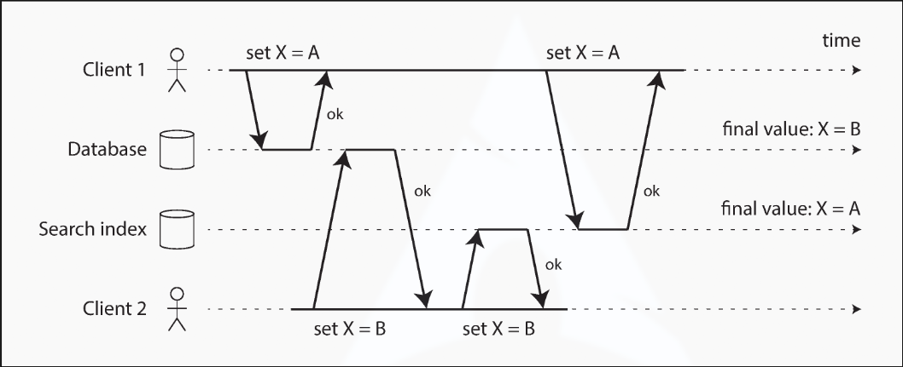
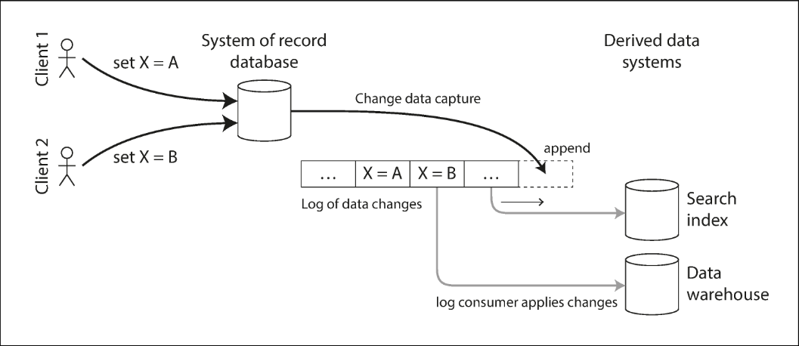
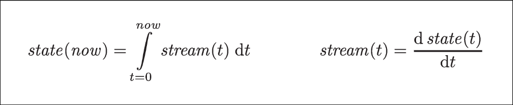

# Chapter 11.2 Stream Processing: Databases and Streams

We have drawn some comparisons between message brokers and databases. Even though they have traditionally been considered separate categories of tools, log-based message brokers have been successful in taking ideas from databases and applying them to messaging. We can also go in reverse: take ideas from messaging and streams, and apply them to databases.

An **event** is a record of something that happened at some point in time. The thing that happened may be a user action, a sensor reading, or a write to a database. The fact that something was written to a database is an event that can be captured, stored, and processed. This suggests that the connection between databases and streams runs deeper than just the physical storage of logs on disk.

In fact, a **replication log** is a stream of database write events, produced by the leader as it processes transactions. The followers apply that stream of writes to their own copy of the database and thus end up with an accurate copy of the same data.

We also came across the **state machine replication** principle, which states: if every event represents a write to the database, and every replica processes the same events in the same order, then the replicas will all end up in the same final state. _Note: Processing an event is assumed to be a deterministic operation._ It’s just another case of event streams!

In this section, we will first look at a problem that arises in heterogeneous data systems, and then explore how we can solve it by bringing ideas from event streams to databases.

 

---

 

### Keeping Systems in Sync

There is no single system that can satisfy all data storage, querying, and processing needs. Most nontrivial applications need to combine several different technologies: an OLTP database to serve user requests, a cache to speed up common requests, a full-text index to handle search queries, and a data warehouse for analytics. Each of these has its own copy of the data, stored in its own representation that is optimized for its own purposes.

As the same or related data appears in several different places, they need to be kept in sync. If an item is updated in the database, it also needs to be updated in the cache, search indexes, and data warehouse. With data warehouses, this synchronization is usually performed by **ETL** processes (a batch process). Similarly, search indexes and recommendation systems might be created using batch processes.

If periodic full database dumps are too slow, an alternative is **dual writes**, in which the application code explicitly writes to each of the systems when data changes.

However, dual writes have serious problems:

- **Race conditions:** Illustrated below, two clients may concurrently update an item. The requests can be interleaved such that the database ends up with one value and the search index ends up with another. The two systems are permanently inconsistent with each other, and without concurrency detection mechanisms like version vectors, you will not even notice that concurrent writes occurred.
- **Fault-tolerance:** One of the writes may fail while the other succeeds. Ensuring that they either both succeed or both fail is a case of the atomic commit problem, which is expensive to solve.

If you only have one replicated database with a single leader, that leader determines the order of writes, and the state machine replication approach works among replicas of the database. However, with multiple systems (e.g., a database and a search index), there isn't a single leader, and conflicts can occur.

The situation would be better if there really was only one leader (e.g., the database) and we could make the search index a follower of the database.

 

---

 

### Change Data Capture (CDC)

The problem with most databases’ replication logs is that they have long been considered an internal implementation detail, not a public API. Clients are supposed to query the database through its data model, not parse the replication logs. For decades, many databases did not have a documented way of getting the log of changes, making it difficult to replicate changes to a different storage technology such as a search index, cache, or data warehouse.

More recently, there has been growing interest in **change data capture (CDC)**, which is the process of observing all data changes written to a database and extracting them in a form in which they can be replicated to other systems. CDC is especially interesting if changes are made available as a stream, immediately as they are written.

For example, you can capture changes in a database and continually apply them to a search index. If the log of changes is applied in the same order, the data in the search index will match the data in the database. The search index and any other derived data systems are just consumers of the change stream, as illustrated below:

**Implementing change data capture**

Change data capture makes one database the leader (the one from which changes are captured), and turns the others into followers. A log-based message broker is well suited for transporting change events from the source database, since it preserves the ordering of messages.

- **Database triggers:** Can be used to implement CDC by registering triggers that observe all changes to data tables and add corresponding entries to a changelog table. _Note: They tend to be fragile and have significant performance overheads._
- **Parsing the replication log:** A more robust approach, although it also comes with challenges, such as handling schema changes.

Like message brokers, CDC is usually asynchronous: the system of record database does not wait for the change to be applied to consumers before committing it. This has the operational advantage that adding a slow consumer does not affect the system of record, but it has the downside that all the issues of replication lag apply.

**Initial snapshot**

If you have the log of all changes ever made to a database, you can reconstruct the entire state of the database by replaying the log. However, keeping all changes forever would require too much disk space, and replaying it would take too long, so the log needs to be truncated.

Building a new full-text index requires a full copy of the entire database. If you don’t have the entire log history, you need to start with a consistent snapshot. The snapshot must correspond to a known position or offset in the change log, so you know at which point to start applying changes after the snapshot has been processed. Some CDC tools integrate this snapshot facility, while others leave it as a manual operation.

**Log compaction**

If you can only keep a limited amount of log history, you need to go through the snapshot process every time you want to add a new derived data system. However, **log compaction** provides a good alternative.

The principle is simple: the storage engine periodically looks for log records with the same key, throws away any duplicates, and keeps only the most recent update for each key. This compaction and merging process runs in the background.

- **Tombstones:** An update with a special null value indicates that a key was deleted, causing it to be removed during log compaction.

As long as a key is not overwritten or deleted, it stays in the log forever. The disk space required for a compacted log depends only on the current contents of the database, not the number of writes that have ever occurred.

The same idea works for log-based message brokers and CDC. If the CDC system is set up such that every change has a primary key, and every update for a key replaces the previous value, then it’s sufficient to keep just the most recent write for a particular key.

Whenever you want to rebuild a derived data system, you can start a new consumer from offset 0 of the log-compacted topic, and sequentially scan over all messages in the log. The log is guaranteed to contain the most recent value for every key, meaning you can obtain a full copy of the database contents without taking another snapshot.

**API support for change streams**

Increasingly, databases are beginning to support change streams as a first-class interface, rather than typical retrofitted CDC efforts.

- **VoltDB:** Allows transactions to continuously export data from a database in the form of a stream. The database represents an output stream as a table into which transactions can insert tuples, but which cannot be queried. The stream consists of the log of tuples that committed transactions have written to this special table, in the order they were committed.
- **Kafka Connect:** An effort to integrate CDC tools for a wide range of database systems with Kafka. Once the stream of change events is in Kafka, it can be used to update derived data systems such as search indexes.

 

---

 

### Event Sourcing

There are some parallels between the ideas we’ve discussed here and **event sourcing**, a technique developed in the domain-driven design (DDD) community.

Similarly to change data capture, event sourcing involves storing all changes to the application state as a log of change events. The biggest difference is that event sourcing applies the idea at a different level of abstraction:

- **Change data capture:** The application uses the database in a mutable way, updating and deleting records at will. The log of changes is extracted from the database at a low level (e.g., by parsing the replication log), which ensures the order of writes matches the order in which they were written. The application writing to the database does not need to be aware that CDC is occurring.
- **Event sourcing:** The application logic is explicitly built on the basis of immutable events that are written to an event log. The event store is append-only, and updates or deletes are discouraged or prohibited. Events are designed to reflect things that happened at the application level, rather than low-level state changes.

Event sourcing is a powerful technique for data modeling. From an application point of view, it is more meaningful to record the user’s actions as immutable events rather than recording the effect of those actions on a mutable database. Event sourcing makes it easier to evolve applications over time, helps with debugging, and guards against application bugs.

For example, storing the event “student cancelled their course enrollment” clearly expresses the intent of a single action in a neutral fashion. In contrast, the side effects “one entry was deleted from the enrollments table, and one cancellation reason was added to the student feedback table” embed a lot of assumptions about how the data will later be used. If a new feature is introduced (e.g., “offer the place to the next person on the waiting list”), the event sourcing approach allows that new side effect to be easily chained off the existing event.

Specialized databases such as Event Store have been developed to support applications using event sourcing, but the approach is independent of any particular tool. A conventional database or a log-based message broker can also be used.

**Deriving current state from the event log**

An event log by itself is not very useful because users generally expect to see the current state of a system, not the history of modifications. For example, on a shopping website, users expect to see the current contents of their cart, not an append-only list of all the changes they have ever made.

Thus, applications using event sourcing need to take the log of events and transform it into application state suitable for showing to a user. This transformation can use arbitrary logic, but it should be deterministic so that you can run it again and derive the same application state from the event log.

Like with CDC, replaying the event log allows you to reconstruct the current state of the system. However, log compaction needs to be handled differently:

- **CDC:** An event for updating a record typically contains the entire new version of the record. The current value for a primary key is determined by the most recent event, so log compaction can discard previous events for the same key.
- **Event sourcing:** Events are modeled at a higher level, expressing the intent of a user action rather than the mechanics of the state update. Later events typically do not override prior events, so you need the full history of events to reconstruct the final state. Log compaction is not possible in the same way.

Applications using event sourcing typically have a mechanism for storing snapshots of the current state derived from the log of events so they don’t need to repeatedly reprocess the full log. _Note: This is only a performance optimization; the intention is that the system can store all raw events forever and reprocess the full log whenever required._

**Commands and events**

The event sourcing philosophy carefully distinguishes between **commands** and **events**.

When a request from a user first arrives, it is initially a **command**. At this point, it may still fail (e.g., because some integrity condition is violated). The application must first validate that it can execute the command. If the validation is successful and the command is accepted, it becomes an **event**, which is durable and immutable.

At the point when the event is generated, it becomes a fact. Even if the customer later decides to change or cancel the reservation, the fact remains true that they formerly held a reservation, and the change or cancellation is a separate event added later.

A consumer of the event stream is not allowed to reject an event: by the time the consumer sees it, it is already an immutable part of the log, and it may have already been seen by other consumers. Thus, any validation of a command needs to happen synchronously, before it becomes an event (e.g., by using a serializable transaction that atomically validates the command and publishes the event).

Alternatively, the user request could be split into two events: first a tentative reservation, and then a separate confirmation event once the reservation has been validated. This split allows validation to take place in an asynchronous process.

 

---

 

### State, Streams, and Immutability

Batch processing benefits from the immutability of its input files, meaning you can run experimental processing jobs on existing inputs without fear of damaging them. This principle of immutability is also what makes event sourcing and change data capture so powerful.

We normally think of databases as storing the current state of the application—optimized for reads and querying. The nature of state is that it changes, so databases support updating and deleting data as well as inserting it.

Whenever you have state that changes, that state is the result of events that mutated it over time. No matter how the state changes, there was always a sequence of events that caused those changes. Even as things are done and undone, the fact remains true that those events occurred. The key idea is that mutable state and an append-only log of immutable events do not contradict each other: they are two sides of the same coin. The log of all changes (the **changelog**) represents the evolution of state over time.

If you are mathematically inclined, you might say that the application state is what you get when you integrate an event stream over time, and a change stream is what you get when you differentiate the state by time, as shown below:

If you store the changelog durably, that simply has the effect of making the state reproducible. If you consider the log of events to be your system of record, and any mutable state as being derived from it, it becomes easier to reason about the flow of data through a system. Log compaction is one way of bridging the distinction between log and database state by retaining only the latest version of each record.

**Advantages of immutable events**

Immutability in databases is an old idea. For example, accountants have been using immutability for centuries in financial bookkeeping. When a transaction occurs, it is recorded in an append-only ledger. If a mistake is made, accountants don’t erase or change the incorrect transaction—instead, they add another transaction that compensates for the mistake. The incorrect transaction remains in the ledger forever because it might be important for auditing reasons.

Although such auditability is particularly important in financial systems, it is beneficial for many other systems. If you accidentally deploy buggy code that writes bad data to a database, recovery is much harder if the code destructively overwrites data. With an append-only log of immutable events, it is much easier to diagnose what happened and recover.

Immutable events also capture more information than just the current state. For example, a customer may add an item to their cart and then remove it again. The second event cancels out the first for order fulfillment, but it may be useful for analytics purposes to know that the customer considered a particular item. This information is recorded in an event log but would be lost in a database that deletes items.

**Deriving several views from the same event log**

By separating mutable state from the immutable event log, you can derive several different read-oriented representations from the same log of events. Having an explicit translation step from an event log to a database makes it easier to evolve your application over time: you can build a separate read-optimized view for a new feature and run it alongside the existing systems without having to modify them. Running old and new systems side by side is often easier than performing a complicated schema migration.

Storing data is normally quite straightforward if you don’t have to worry about how it is going to be queried and accessed. For this reason, you gain a lot of flexibility by separating the form in which data is written from the form it is read, and by allowing several different read views. This idea is sometimes known as **command query responsibility segregation (CQRS)**.

The traditional approach to database and schema design is based on the fallacy that data must be written in the same form as it will be queried. Debates about normalization and denormalization become largely irrelevant if you can translate data from a write-optimized event log to read-optimized application state.

**Concurrency control**

The biggest downside of event sourcing and change data capture is that the consumers of the event log are usually asynchronous. There is a possibility that a user may write to the log, then read from a log-derived view and find that their write has not yet been reflected.

One solution would be to perform updates of the read view synchronously with appending the event to the log. This requires a transaction to combine the writes into an atomic unit.

On the other hand, deriving the current state from an event log simplifies some aspects of concurrency control. With event sourcing, you can design an event such that it is a self-contained description of a user action. The user action then requires only a single write in one place—appending the event to the log—which is easy to make atomic.

If the event log and the application state are partitioned in the same way, then a straightforward single-threaded log consumer needs no concurrency control for writes. By construction, it only processes a single event at a time. The log removes the nondeterminism of concurrency by defining a serial order of events in a partition.

**Limitations of immutability**

Many systems that don’t use an event-sourced model nevertheless rely on immutability: various databases internally use immutable data structures or multi-version data to support point-in-time snapshots, and version control systems rely on immutable data to preserve version history.

To what extent is it feasible to keep an immutable history of all changes forever? The answer depends on the amount of churn in the dataset. Some workloads mostly add data and rarely update or delete; they are easy to make immutable. Other workloads have a high rate of updates and deletes on a comparatively small dataset; in these cases, the immutable history may grow prohibitively large.

Besides performance reasons, there may also be circumstances in which you need data to be deleted for administrative reasons (e.g., privacy regulations, data protection legislation, or accidental leaks). In these circumstances, you actually want to rewrite history and pretend that the data was never written in the first place.

Truly deleting data is surprisingly hard since copies can live in many places (storage engines, filesystems, SSDs, backups). Deletion is more a matter of “making it harder to retrieve the data” than actually “making it impossible to retrieve the data.”
