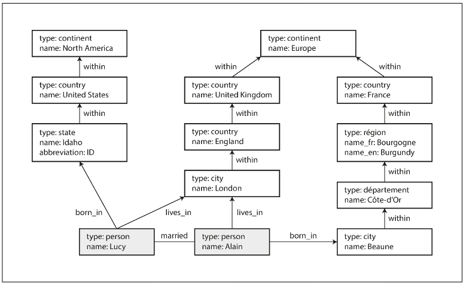

# Chapter 2.3 Relational Model Versus Document Model: Graph-Like Data Models

The document model is suitable for data with mostly one-to-many (tree-structured) or no relationships. When many-to-many relationships become common and complex, it's more natural to use a **graph model**.

A graph consists of:

- **Vertices** (or nodes / entities)
- **Edges** (or relationships / arcs)

Graphs can model diverse data, often heterogeneously:

- Social Graphs: People (vertices) and their connections (edges).
- Web Graph: Web pages (vertices) and HTML links (edges).
- Road Networks: Junctions (vertices) and roads (edges).

**Graph Algorithms and Models**

- Algorithms: Well-known algorithms operate on graphs, such as finding the shortest path (e.g., in navigation) or PageRank (for web page popularity).
- Models: Key graph models include:
  - **Property Graph Model** (used by Neo4j, Titan)
  - **Triple-Store Model** (used by Datomic, AllegroGraph)
- Query Languages: Data in graphs can be queried using declarative languages like Cypher, SPARQL, and Datalog, as well as imperative languages like Gremlin.

<br>

---

<br>

### Property Graphs

In the property graph model, each vertex consists of a unique identifier, sets of outgoing and incoming edges, and a collection of properties (key-value pairs).

Each edge consists of a unique identifier, the vertex at which the edge starts (tail), the vertex at which the edge ends (head), a label, and properties (key-value pairs).



Representing a property graph using a relational schema:

```
CREATE TABLE vertices (
    vertex_id integer PRIMARY KEY,
    properties json
);

CREATE TABLE edges (
    edge_id integer PRIMARY KEY,
    tail_vertex integer REFERENCES vertices (vertex_id),
    head_vertex integer REFERENCES vertices (vertex_id),
    label text,
    properties json
);

CREATE INDEX edges_tails ON edges (tail_vertex);
CREATE INDEX edges_heads ON edges (head_vertex);
```

Important aspects of this model are:

1. Any vertex can have an edge connecting it with any other vertex. There is no schema that restricts associations.
2. Given any vertex, you can efficiently find both its incoming and its outgoing edges, and thus traverse the graph both forward and backward.
3. By using different labels, you can store several different kinds of information in a single graph while maintaining a clean data model.

Graph data models offer great flexibility compared to traditional relational schemas:

- Handling Complexity: Graphs can easily express structures that are difficult in relational models, such as varying regional structures or historical/political quirks.
- Evolvability: Graphs are excellent for accommodating changes and new features (e.g., adding vertices for food allergens and linking them to people and foods).

<br>

---

<br>

### The Cypher Query Language

**Cypher** is a declarative query language for property graphs, created for the Neo4j graph database.

Cypher query to insert data:

```
CREATE
  (NAmerica:Location {name:'North America', type:'continent'}),
  (USA:Location {name:'United States', type:'country' }),
  (Idaho:Location {name:'Idaho', type:'state' }),
  (Lucy:Person {name:'Lucy' }),
  (Idaho) -[:WITHIN]-> (USA) -[:WITHIN]-> (NAmerica),
  (Lucy) -[:BORN_IN]-> (Idaho)
```

Query to find names of people who emigrated from the US to Europe:

```
MATCH
  (person) -[:BORN_IN]-> () -[:WITHIN*0..]-> (us:Location {name:'United States'}),
  (person) -[:LIVES_IN]-> () -[:WITHIN*0..]-> (eu:Location {name:'Europe'})
RETURN person.name
```

The query can be read as follows:

- Find any vertex (person) that meets both conditions:
  1. person has a BORN_IN edge to a vertex that belongs to a chain of WITHIN edges ending in "United States".
  2. person also has a LIVES_IN edge that belongs to a chain of WITHIN edges ending in "Europe".
- Return the name property for each such vertex.

When executing a complex graph query, the system has multiple strategies:

1. Scanning Forward (Person-Centric): Scan all people and check their edges.
2. Working Backward (Location-Centric): Find the key location nodes (US/Europe) using an index and traverse backward to find people.

**Declarative Advantage**: As this is a declarative query, the system automatically selects the most efficient execution strategy.

<br>

---

<br>

### Graph Queries in SQL

While graph data can be stored in a relational structure, querying it with SQL presents challenges for variable-length traversal paths.

**The Difficulty in SQL**

- In typical relational queries, the number of joins is known in advance.
- In graph queries, you often need to traverse a variable number of edges (e.g., city WITHIN state WITHIN country). Specialized languages use syntax like `[:WITHIN*0..]` to handle this concisely.

**SQL Solution: Recursive Common Table Expressions (CTE)**

Since SQL:1999, variable-length path traversal can be implemented using **Recursive CTEs** (WITH RECURSIVE syntax).

```
WITH RECURSIVE
in_usa(vertex_id) AS (
    SELECT vertex_id FROM vertices WHERE properties->>'name' = 'United States'
  UNION
    SELECT edges.tail_vertex FROM edges
      JOIN in_usa ON edges.head_vertex = in_usa.vertex_id
      WHERE edges.label = 'within'
),
...
SELECT vertices.properties->>'name'
FROM vertices
JOIN born_in_usa ON vertices.vertex_id = born_in_usa.vertex_id
JOIN lives_in_europe ON vertices.vertex_id = lives_in_europe.vertex_id;
```

Although technically possible in SQL, this syntax is often clumsy and less intuitive compared to specialized graph query languages like Cypher.

<br>

---

<br>

### Triple-Stores and SPARQL

The **triple-store model** is largely equivalent to the property graph model, differing mainly in terminology. All data is stored as simple three-part statements called triples: **(subject, predicate, object)**.

Example: (Jim, likes, bananas)

- **Subject**: Always equivalent to a vertex in the graph.
- **Object**: Can be a primitive value (property) or another vertex (edge).

**Turtle** is a subset of Notation3 (N3) used to write triples concisely. Vertices are often represented using local identifiers like `_:idaho`. To avoid repeating the subject, semicolons (;) allow listing multiple statements about the same subject.

```
@prefix : <urn:example:>.
_:lucy a :Person; :name "Lucy"; :bornIn _:idaho.
_:idaho a :Location; :name "Idaho"; :type "state"; :within _:usa.
_:usa a :Location; :name "United States"; :type "country"; :within _:namerica.
_:namerica a :Location; :name "North America"; :type "continent".
```

**SPARQL** (SPARQL Protocol and RDF Query Language) is a declarative query language for triple-stores. It predates Cypher and uses similar pattern-matching concepts.

```
PREFIX : <urn:example:>

SELECT ?personName WHERE {
  ?person :name ?personName.
  ?person :bornIn / :within* / :name "United States".
  ?person :livesIn / :within* / :name "Europe".
}
```

The structure is very similar to Cypher, where variables start with a question mark.

<br>
