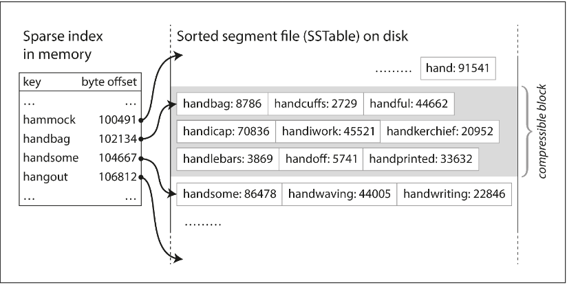

# Chapter 3.1 Storage and Retrieval: Data Structures That Power Your Database

The most basic key-value store functions by appending every new write to the end of a text file (a log).

- db_set (Writes): Extremely efficient. Because it only appends to the end of a file, it avoids the complexity of overwriting data.
- db*get (Reads): Extremely inefficient. To find the latest value for a key, the database must scan the entire file from start to finish. This results in \*\*O(\_n*)\*\* complexity, meaning search time grows linearly with the amount of data.

```
#!/bin/bash

db_set () {
  echo "$1,$2" >> database
}

db_get () {
  grep "^$1," database | sed -e "s/^$1,//" | tail -n 1
}
```

To solve the performance issues of reads, databases use indexes. An index is "side-metadata" that acts as a signpost to help locate specific data without scanning the whole file.

Key Characteristics of Indexes:

- Derived Data: An index is a separate structure built from the primary data. Removing it doesn't delete your data; it only slows down your queries.
- Manual Selection: Because indexes aren't "free," developers must manually choose which fields to index based on the application's specific query patterns.

Storage systems face a fundamental balancing act regarding performance:

| Operation | Without Index (Log-structured)        | With Index                                      |
| --------- | ------------------------------------- | ----------------------------------------------- |
| Writes    | Fast: Simple append operation.        | Slower: Must update both the log and the index. |
| Reads     | Slow: Requires a full file scan O(n). | Fast: Uses the index to jump to the data.       |

<br>

---

<br>

### Hash Indexes (In-Memory)

The simplest indexing strategy for key-value stores is to keep a hash map in RAM.

- How it works: Each key in the hash map points to a byte offset in the data file on disk.
- Writes: When you append data to the log, you update the hash map with the new offset.
- Reads: To find a value, you look up the key in the hash map, jump to the specific offset on disk (a "disk seek"), and read the value.
- Constraint: This approach requires all keys to fit in RAM. However, the values can be much larger than RAM because they stay on disk until needed.


Since an append-only log grows indefinitely, the database must reclaim space. This is handled through Segmentation and Compaction.

The log is broken into segments of a fixed size. When a segment reaches its limit, it is closed ("frozen"), and a new segment is started for subsequent writes.

Because many writes might update the same key, we only care about the latest version. Compaction processes these frozen segments by discarding old values and keeping only the most recent entry for each unique key.

During compaction, multiple segments can be merged into a single, smaller segment.

- Background Processing: Merging happens in a background thread, so it doesn't block incoming reads or writes.
- Switching: Once a new merged segment is ready, the system swaps the old segments for the new one and deletes the old files.


When the database is split into multiple segments, the lookup process changes slightly:

- Check the in-memory hash map of the most recent (active) segment.
- If the key isn't there, check the hash map of the next-most-recent segment.
- Continue until the key is found.

Because the merging process keeps the total number of segments low, these lookups remain very fast.

Transforming this simple idea into a robust database requires handling several real-world edge cases:

- Binary File Format: Instead of CSV, binary formats are used. They encode the length of a string followed by the raw bytes, making it faster to parse and removing the need for escaping characters.
- Deleting Records (Tombstones): Since the log is append-only, you can't "erase" data. Instead, you append a tombstone (a special deletion record). During the merging process, the tombstone tells the engine to discard all previous values for that key.
- Crash Recovery: Because hash maps are in RAM, they are lost during a crash. To avoid a slow full-file scan upon restart, systems like Bitcask store snapshots of the hash maps on disk for fast loading.
- Partial Writes: If a crash occurs mid-write, the log might contain corrupted data. Checksums are used to detect and ignore these broken records.
- Concurrency: To keep things simple, there is usually only one writer thread (since writes are sequential). However, because segments are immutable, multiple threads can read them simultaneously.

It might seem wasteful not to overwrite data in place, but append-only designs offer three major advantages:

- Speed: Sequential writes are significantly faster than random writes on both magnetic hard drives and SSDs.
- Safety: Crash recovery is simpler because you don't risk "splicing" old and new data together during an overwrite.
- Fragmentation: Merging segments prevents the data file from becoming fragmented over time.

However, the hash table index also has limitations:

- RAM Constraint: The index (every key) must fit in memory. Storing a hash map on disk is inefficient due to random I/O and collision complexity.
- No Range Queries: Because hash maps are unordered, you cannot efficiently scan a range of keys (e.g., key001 to key100); you must look up each key individually.

<br>

---

<br>

### SSTables and LSM-Trees

In an SSTable (Sorted String Table), we improve upon standard log-structured storage by requiring that key-value pairs be sorted by key. This change allows the database to handle much larger datasets more efficiently.

Merging SSTable segments is highly efficient, even when the files are much larger than the available memory. The process is modeled after the mergesort algorithm:

- The Process: You read multiple input segments side-by-side, looking at the first (lowest) key in each. You copy the lowest available key to the new output file and repeat.
- Handling Duplicates: Because segments are created at different times, one segment is always "more recent" than another. If the same key appears in multiple segments, the value from the most recent segment is kept, and the older values are discarded.
- Result: You produce a single, new merged segment file that remains perfectly sorted.


Unlike a hash index, which requires an entry for every key in memory, SSTables allow for a sparse index.

- Jumping and Scanning: If you are looking for the key handiwork but only know the offsets for handbag and handsome, you know handiwork must be between them. You jump to the handbag offset and scan forward until you find your target.
- Memory Savings: You only need to store an offset for every few kilobytes of the segment file. Since a few kilobytes can be scanned almost instantly, you save a massive amount of RAM while maintaining fast lookups.

Because read requests often scan through a small range of keys anyway, the storage engine can group several records into a block and compress it before writing it to disk.

- Index Pointers: Each entry in your sparse in-memory index then points to the start of one of these compressed blocks.
- Benefits: This significantly reduces disk space usage and, more importantly, reduces the I/O bandwidth required to read data from the disk.



While maintaining a sorted structure on disk is possible, it is much easier to do in memory. By using well-known tree data structures like red-black trees or AVL trees, we can insert keys in any order and still read them back in sorted order.

How the Storage Engine Works:

- Writing to the Memtable: When a write arrives, it is added to an in-memory balanced tree, commonly referred to as a memtable.
- Flushing to Disk: When the memtable exceeds a certain size (typically a few megabytes), it is written to disk as an SSTable file. This is highly efficient because the tree is already sorted. This new file becomes the most recent segment of the database. While this flush happens, writes continue into a new memtable instance.
- Serving Reads: To find a key, the engine first checks the memtable. If not found, it searches the most recent on-disk SSTable segment, then the next-older segment, and so on.
- Compaction: Periodically, a background process merges and compacts segment files, combining them and discarding any overwritten or deleted values.

This scheme has one major vulnerability: if the database crashes, the data currently in the memtable (which hasn't been written to disk yet) is lost.

To solve this, we maintain a Write-Ahead Log (WAL):

- Every write is immediately appended to this separate, unsorted log on disk.
- Its only purpose is to restore the memtable after a crash.
- Once a memtable is successfully flushed to an SSTable, its corresponding log can be safely discarded.

The storage algorithm previously described is the foundational mechanism for several high-performance database libraries and distributed systems:

- Storage Libraries: LevelDB and RocksDB are primary examples of engines designed to be embedded into other applications. For instance, LevelDB is often used as a backend for the Riak database.
- Distributed Databases: Both Cassandra and HBase use similar engines. Their designs were heavily influenced by Google’s Bigtable paper, which popularized the terms "SSTable" and "memtable."

The formal name for this indexing structure is the Log-Structured Merge-Tree (or LSM-Tree).

- Origins: It was first described by Patrick O’Neil and others, building on earlier concepts from log-structured filesystems.
- LSM Storage Engines: Today, any storage engine based on the principle of merging and compacting sorted files is generally referred to as an LSM storage engine.

The principle of sorted, merged files extends beyond simple key-value lookups into complex search engines like Lucene (the core of Elasticsearch and Solr).

- Term Dictionaries: Lucene uses a similar method to store its term dictionary.
- Key-Value Mapping: In this context, the key is a specific word (term), and the value is a list of IDs for documents containing that word (a postings list).
- Background Merging: Just like in a standard LSM engine, Lucene maintains these mappings in sorted, SSTable-like files that are merged in the background to maintain efficiency.

One weakness of the LSM-tree is that looking up a nonexistent key can be slow. The engine must check the memtable and then every single SSTable segment on disk—from newest to oldest—before confirming the key is missing.

- The Solution: Storage engines use Bloom filters, a memory-efficient data structure that approximates the contents of a set.
- How it works: A Bloom filter can tell you definitively if a key is not in a segment. This allows the engine to skip unnecessary disk reads for keys that don't exist, significantly speeding up "miss" queries.

There are different ways to determine when and how SSTables are merged. The strategy chosen affects write throughput, read speed, and disk space usage:

- Size-Tiered Compaction: Newer, smaller SSTables are merged into older, larger ones. This is the default strategy for HBase.
- Leveled Compaction: The key range is split into many small SSTables, and data is moved between numbered "levels." This approach (used by LevelDB and RocksDB) makes compaction more incremental and is more efficient with disk space.
- Hybrid Support: Cassandra is flexible and supports both strategies depending on the use case.

Despite the complexities of compaction and filtering, the LSM-tree remains a dominant architecture for several reasons:

- Scalability: It works effectively even when the dataset is significantly larger than the available RAM.
- Range Queries: Because the data is stored in sorted order, scanning a range of keys (e.g., all sensors between "Sensor_A" and "Sensor_Z") is extremely efficient.
- High Write Throughput: Because writes are handled by sequential appends to the WAL and sorted merges, the engine can handle a massive volume of incoming data compared to engines that perform random-access writes.

<br>

---

<br>

### B-Trees
