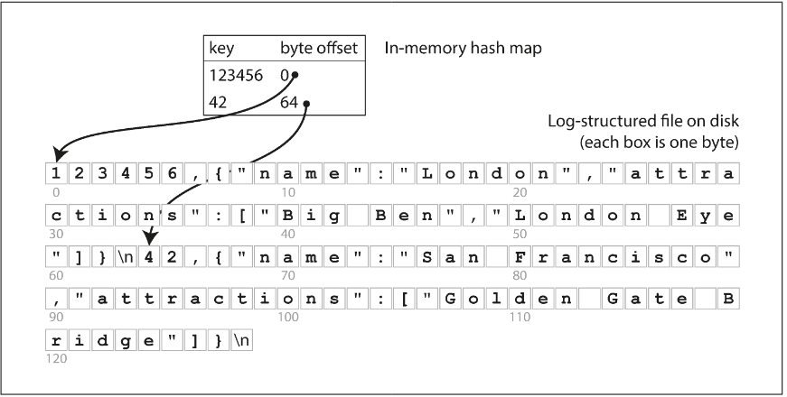
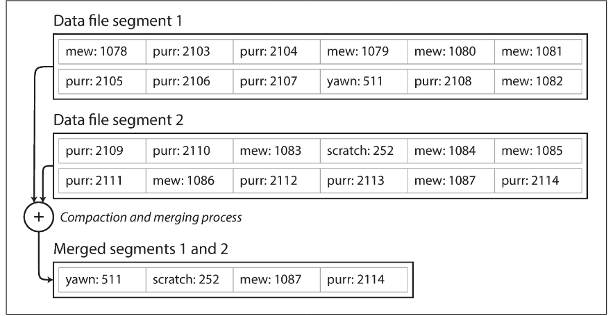
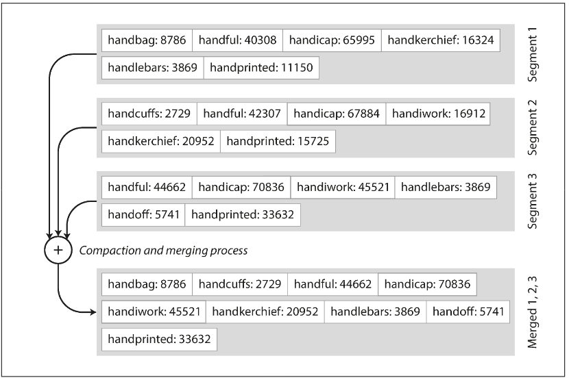
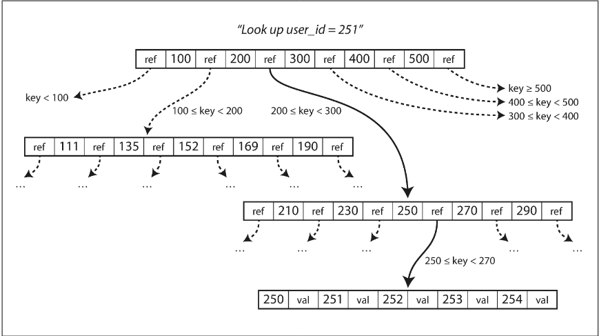
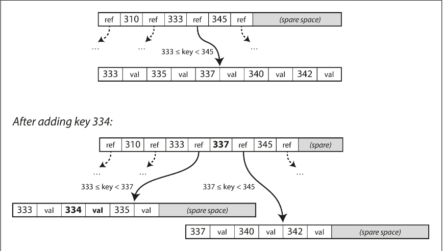

# Chapter 3.1 Storage and Retrieval: Data Structures That Power Your Database

The most basic key-value store functions by appending every new write to the end of a text file (a log).

- db_set (Writes): Extremely efficient. Because it only appends to the end of a file, it avoids the complexity of overwriting data.
- db*get (Reads): Extremely inefficient. To find the latest value for a key, the database must scan the entire file from start to finish. This results in \*\*O(\_n*)\*\* complexity, meaning search time grows linearly with the amount of data.

```
#!/bin/bash

db_set () {
  echo "$1,$2" >> database
}

db_get () {
  grep "^$1," database | sed -e "s/^$1,//" | tail -n 1
}
```

To solve the performance issues of reads, databases use indexes. An index is "side-metadata" that acts as a signpost to help locate specific data without scanning the whole file.

Key Characteristics of Indexes:

- Derived Data: An index is a separate structure built from the primary data. Removing it doesn't delete your data; it only slows down your queries.
- Manual Selection: Because indexes aren't "free," developers must manually choose which fields to index based on the application's specific query patterns.

Storage systems face a fundamental balancing act regarding performance:

| Operation | Without Index (Log-structured)        | With Index                                      |
| --------- | ------------------------------------- | ----------------------------------------------- |
| Writes    | Fast: Simple append operation.        | Slower: Must update both the log and the index. |
| Reads     | Slow: Requires a full file scan O(n). | Fast: Uses the index to jump to the data.       |

<br>

---

<br>

### Hash Indexes (In-Memory)

The simplest indexing strategy for key-value stores is to keep a hash map in RAM.

- How it works: Each key in the hash map points to a byte offset in the data file on disk.
- Writes: When you append data to the log, you update the hash map with the new offset.
- Reads: To find a value, you look up the key in the hash map, jump to the specific offset on disk (a "disk seek"), and read the value.
- Constraint: This approach requires all keys to fit in RAM. However, the values can be much larger than RAM because they stay on disk until needed.



Since an append-only log grows indefinitely, the database must reclaim space. This is handled through Segmentation and Compaction.

The log is broken into segments of a fixed size. When a segment reaches its limit, it is closed ("frozen"), and a new segment is started for subsequent writes.

Because many writes might update the same key, we only care about the latest version. Compaction processes these frozen segments by discarding old values and keeping only the most recent entry for each unique key.

During compaction, multiple segments can be merged into a single, smaller segment.

- Background Processing: Merging happens in a background thread, so it doesn't block incoming reads or writes.
- Switching: Once a new merged segment is ready, the system swaps the old segments for the new one and deletes the old files.



When the database is split into multiple segments, the lookup process changes slightly:

- Check the in-memory hash map of the most recent (active) segment.
- If the key isn't there, check the hash map of the next-most-recent segment.
- Continue until the key is found.

Because the merging process keeps the total number of segments low, these lookups remain very fast.

Transforming this simple idea into a robust database requires handling several real-world edge cases:

- Binary File Format: Instead of CSV, binary formats are used. They encode the length of a string followed by the raw bytes, making it faster to parse and removing the need for escaping characters.
- Deleting Records (Tombstones): Since the log is append-only, you can't "erase" data. Instead, you append a tombstone (a special deletion record). During the merging process, the tombstone tells the engine to discard all previous values for that key.
- Crash Recovery: Because hash maps are in RAM, they are lost during a crash. To avoid a slow full-file scan upon restart, systems like Bitcask store snapshots of the hash maps on disk for fast loading.
- Partial Writes: If a crash occurs mid-write, the log might contain corrupted data. Checksums are used to detect and ignore these broken records.
- Concurrency: To keep things simple, there is usually only one writer thread (since writes are sequential). However, because segments are immutable, multiple threads can read them simultaneously.

It might seem wasteful not to overwrite data in place, but append-only designs offer three major advantages:

- Speed: Sequential writes are significantly faster than random writes on both magnetic hard drives and SSDs.
- Safety: Crash recovery is simpler because you don't risk "splicing" old and new data together during an overwrite.
- Fragmentation: Merging segments prevents the data file from becoming fragmented over time.

However, the hash table index also has limitations:

- RAM Constraint: The index (every key) must fit in memory. Storing a hash map on disk is inefficient due to random I/O and collision complexity.
- No Range Queries: Because hash maps are unordered, you cannot efficiently scan a range of keys (e.g., key001 to key100); you must look up each key individually.

<br>

---

<br>

### SSTables and LSM-Trees

In an SSTable (Sorted String Table), we improve upon standard log-structured storage by requiring that key-value pairs be sorted by key. This change allows the database to handle much larger datasets more efficiently.

Merging SSTable segments is highly efficient, even when the files are much larger than the available memory. The process is modeled after the mergesort algorithm:

- The Process: You read multiple input segments side-by-side, looking at the first (lowest) key in each. You copy the lowest available key to the new output file and repeat.
- Handling Duplicates: Because segments are created at different times, one segment is always "more recent" than another. If the same key appears in multiple segments, the value from the most recent segment is kept, and the older values are discarded.
- Result: You produce a single, new merged segment file that remains perfectly sorted.



Unlike a hash index, which requires an entry for every key in memory, SSTables allow for a sparse index.

- Jumping and Scanning: If you are looking for the key handiwork but only know the offsets for handbag and handsome, you know handiwork must be between them. You jump to the handbag offset and scan forward until you find your target.
- Memory Savings: You only need to store an offset for every few kilobytes of the segment file. Since a few kilobytes can be scanned almost instantly, you save a massive amount of RAM while maintaining fast lookups.

Because read requests often scan through a small range of keys anyway, the storage engine can group several records into a block and compress it before writing it to disk.

- Index Pointers: Each entry in your sparse in-memory index then points to the start of one of these compressed blocks.
- Benefits: This significantly reduces disk space usage and, more importantly, reduces the I/O bandwidth required to read data from the disk.


While maintaining a sorted structure on disk is possible, it is much easier to do in memory. By using well-known tree data structures like red-black trees or AVL trees, we can insert keys in any order and still read them back in sorted order.

How the Storage Engine Works:

- Writing to the Memtable: When a write arrives, it is added to an in-memory balanced tree, commonly referred to as a memtable.
- Flushing to Disk: When the memtable exceeds a certain size (typically a few megabytes), it is written to disk as an SSTable file. This is highly efficient because the tree is already sorted. This new file becomes the most recent segment of the database. While this flush happens, writes continue into a new memtable instance.
- Serving Reads: To find a key, the engine first checks the memtable. If not found, it searches the most recent on-disk SSTable segment, then the next-older segment, and so on.
- Compaction: Periodically, a background process merges and compacts segment files, combining them and discarding any overwritten or deleted values.

This scheme has one major vulnerability: if the database crashes, the data currently in the memtable (which hasn't been written to disk yet) is lost.

To solve this, we maintain a Write-Ahead Log (WAL):

- Every write is immediately appended to this separate, unsorted log on disk.
- Its only purpose is to restore the memtable after a crash.
- Once a memtable is successfully flushed to an SSTable, its corresponding log can be safely discarded.

The storage algorithm previously described is the foundational mechanism for several high-performance database libraries and distributed systems:

- Storage Libraries: LevelDB and RocksDB are primary examples of engines designed to be embedded into other applications. For instance, LevelDB is often used as a backend for the Riak database.
- Distributed Databases: Both Cassandra and HBase use similar engines. Their designs were heavily influenced by Google’s Bigtable paper, which popularized the terms "SSTable" and "memtable."

The formal name for this indexing structure is the Log-Structured Merge-Tree (or LSM-Tree).

- Origins: It was first described by Patrick O’Neil and others, building on earlier concepts from log-structured filesystems.
- LSM Storage Engines: Today, any storage engine based on the principle of merging and compacting sorted files is generally referred to as an LSM storage engine.

The principle of sorted, merged files extends beyond simple key-value lookups into complex search engines like Lucene (the core of Elasticsearch and Solr).

- Term Dictionaries: Lucene uses a similar method to store its term dictionary.
- Key-Value Mapping: In this context, the key is a specific word (term), and the value is a list of IDs for documents containing that word (a postings list).
- Background Merging: Just like in a standard LSM engine, Lucene maintains these mappings in sorted, SSTable-like files that are merged in the background to maintain efficiency.

One weakness of the LSM-tree is that looking up a nonexistent key can be slow. The engine must check the memtable and then every single SSTable segment on disk—from newest to oldest—before confirming the key is missing.

- The Solution: Storage engines use Bloom filters, a memory-efficient data structure that approximates the contents of a set.
- How it works: A Bloom filter can tell you definitively if a key is not in a segment. This allows the engine to skip unnecessary disk reads for keys that don't exist, significantly speeding up "miss" queries.

There are different ways to determine when and how SSTables are merged. The strategy chosen affects write throughput, read speed, and disk space usage:

- Size-Tiered Compaction: Newer, smaller SSTables are merged into older, larger ones. This is the default strategy for HBase.
- Leveled Compaction: The key range is split into many small SSTables, and data is moved between numbered "levels." This approach (used by LevelDB and RocksDB) makes compaction more incremental and is more efficient with disk space.
- Hybrid Support: Cassandra is flexible and supports both strategies depending on the use case.

Despite the complexities of compaction and filtering, the LSM-tree remains a dominant architecture for several reasons:

- Scalability: It works effectively even when the dataset is significantly larger than the available RAM.
- Range Queries: Because the data is stored in sorted order, scanning a range of keys (e.g., all sensors between "Sensor_A" and "Sensor_Z") is extremely efficient.
- High Write Throughput: Because writes are handled by sequential appends to the WAL and sorted merges, the engine can handle a massive volume of incoming data compared to engines that perform random-access writes.

<br>

---

<br>

### B-Trees

While log-structured indexes are gaining acceptance, the B-tree remains the most ubiquitous indexing structure in both relational and non-relational databases. Introduced in 1970, B-trees keep key-value pairs sorted for efficient lookups and range queries, but they utilize a design philosophy centered on fixed-size blocks or pages (traditionally 4 KB). This design mirrors the architecture of disk hardware, which also organizes data into fixed blocks.

Each page is identified by a disk address, allowing pages to reference one another to construct a tree. The process begins at a single root page, which contains keys and references to child pages. Each child is responsible for a specific continuous range of keys, and the keys between the references act as boundaries.

To find a value, you follow the references that encompass your target key through sub-ranges until you reach a leaf page. This leaf either contains the value inline or a reference to where the value can be found. The number of child references per page is known as the branching factor—typically several hundred—which keeps the tree shallow and efficient.

B-trees are updated by overwriting pages directly on disk rather than appending to a log:

- Updates: The system locates the leaf page, changes the value, and writes the page back to disk.
- Insertions: New keys are added to the page covering their range.
- Splitting: If a page is too full for a new key, it is split into two half-full pages, and the parent is updated to account for the new boundary.

This algorithm ensures the tree remains balanced with a depth of O(logn). Most databases require only three or four levels; for example, a four-level tree with a branching factor of 500 can store up to 256 TB, meaning you only need to follow a few references to find any specific key.





The fundamental write operation of a B-tree involves overwriting a page on disk with new data. Unlike log-structured indexes (like LSM-trees) which only append to files, B-trees modify data in place, assuming the page's physical location remains constant so that references to it stay valid. On a hardware level, this involves moving a disk head to a specific sector on a spinning platter or, in the case of SSDs, performing a complex erase-and-rewrite cycle on storage blocks.

Updating pages in place introduces significant risks, particularly during operations like page splits, which require writing multiple pages simultaneously (the two new children and the updated parent). If a crash occurs mid-operation, the index can become corrupted. To prevent this, B-trees use a Write-Ahead Log (WAL)—an append-only file where every modification is recorded before being applied to the tree. Upon recovery from a crash, the WAL is used to restore the tree to a consistent state.

Furthermore, because data is modified in place, B-trees require strict concurrency control. Lightweight locks, known as latches, protect the tree’s data structures to ensure that a thread doesn't read the tree while it is in an inconsistent, mid-update state.

Over decades of use, several key optimizations have been developed to improve B-tree performance:

- Copy-on-Write: Instead of overwriting and using a WAL, some databases write modified pages to a new location and update parent references accordingly. This naturally supports snapshot isolation.
- Key Compression: Storing abbreviated keys within internal pages saves space, increasing the branching factor and reducing the overall depth of the tree.
- Sequential Layout: To avoid expensive disk seeks during range queries, implementations attempt to place leaf pages in sequential order on disk, though this becomes harder to maintain as the tree grows.
- Sibling Pointers: Adding references between neighboring leaf pages allows for easier ordered scans without having to backtrack to parent pages.
- Hybrid Models: Variants like fractal trees incorporate log-structured ideas to reduce the number of disk seeks required for writes.

<br>

---

<br>

### Comparing B-Trees and LSM-Trees

When comparing storage engines, the choice between B-trees and LSM-trees (Log-Structured Merge-trees) involves a trade-off between write efficiency, storage overhead, and performance predictability.

**_Write amplification_** is the effect when one write to the database resulting in multiple writes to the disk over the course of the database’s lifetime.

**The Advantages of LSM-trees**

LSM-trees are often preferred for write-heavy workloads due to their efficiency in handling data ingestion:

- Lower Write Amplification: B-trees must write data at least twice (to the WAL and the page itself) and often write entire 4 KB pages even for tiny changes. LSM-trees also rewrite data during compaction, but they often achieve lower write amplification and utilize sequential writes, which are significantly faster than the random writes required by B-trees.
- Better Compression: Because B-trees are page-oriented, they suffer from fragmentation and leave unused space within pages. LSM-trees periodically rewrite data into compact SSTables, removing fragmentation and resulting in much smaller files on disk.
- SSD Longevity: By reducing write amplification and data footprints, LSM-trees help preserve the lifespan of SSDs, which have a finite number of overwrite cycles.

**The Downsides of LSM-trees**

Despite their write performance, log-structured storage introduces complexities that B-trees largely avoid:

- Performance Variability: The background process of compaction can interfere with active requests. While average latency remains low, high-percentile response times (p99) can spike if a query is delayed by an expensive compaction operation. B-trees tend to provide more predictable performance.
- Compaction Lag: At very high write throughput, the disk's bandwidth is split between new writes and background compaction. If compaction cannot keep up, the number of segments on disk grows, consuming space and slowing down reads. Unlike B-trees, these engines often don't throttle incoming writes, requiring careful monitoring.
- Transaction Complexity: In a B-tree, each key exists in exactly one location, making it easy to attach locks directly to the tree for strong transactional isolation. In contrast, an LSM-tree may store multiple copies of the same key in different segments, complicating range locks and isolation.

**Summary Comparison**

| Feature            | B-Trees                                     | LSM-Trees                           |
| ------------------ | ------------------------------------------- | ----------------------------------- |
| Primary Strength   | Predictable read performance & Transactions | High write throughput & Compression |
| Write Pattern      | Random overwrites (in-place)                | Sequential appends                  |
| Storage Efficiency | Lower (fragmentation)                       | Higher (compacted SSTables)         |
| Key Location       | Exactly one place                           | Multiple segments until merged      |

B-trees remain deeply ingrained in database architecture due to their consistency, while LSM-trees are the rising choice for modern, high-volume data stores. Ultimately, the "better" engine depends on empirical testing against your specific workload.

<br>

---

<br>

### Other Indexing Structures

##### Secondary Indexes

A secondary index is essential for performing efficient joins and filtering by non-unique fields (such as a user_id). Unlike primary keys, the keys in a secondary index are not unique. This is typically handled in one of two ways:

- Postings Lists: Each key in the index maps to a list of matching row identifiers.
- Key Modification: A unique row identifier is appended to each key to ensure uniqueness within the index structure.

Both B-trees and log-structured indexes can effectively function as secondary indexes using these methods.

##### The Value in the Index: Heap Files vs. Clustering

The "value" stored in an index can either be the actual data or a reference to it. Where that data lives significantly impacts performance:

- Heap Files: This is the most common approach. The index stores a pointer to a location in a "heap file," where data is stored in no particular order. This avoids data duplication when multiple secondary indexes exist, as they all point to the same single source of truth.
- Clustered Indexes: To avoid the performance penalty of a "hop" from the index to a heap file, a clustered index stores the actual row data directly within the index. For example, in MySQL's InnoDB, the primary key is always a clustered index.
- Covering Indexes: A middle ground where only some columns are stored in the index. This allows the database to answer specific queries entirely from the index (covering the query) without ever touching the underlying table or heap file.

While clustered and covering indexes significantly speed up read operations by reducing disk I/O, they come with distinct costs:

- Storage Overhead: Duplicating data across indexes increases the total disk footprint.
- Write Penalty: Every write must update not just the primary storage but also any index containing that duplicated data.
- Consistency Complexity: The database must implement strict transactional guarantees to ensure that the data in the index remains perfectly synchronized with the master record, preventing applications from seeing inconsistent results.

##### Multi-column indexes

While standard indexes map a single key to a value, real-world queries often involve multiple attributes simultaneously. This necessitates specialized structures designed to handle more than one dimension of data.

The most common approach is the concatenated index, which combines several fields into a single key by appending them in a specific order.

Think of it like a traditional phone book sorted by (lastname, firstname). This index is highly effective for:

- Queries specifying a last name.
- Queries specifying both last name and first name.

However, because of the fixed sort order, this index is virtually useless if you only have a first name, as those entries are scattered throughout the entire structure.

For more complex requirements—particularly geospatial data—concatenated indexes fall short. A query for restaurants within a specific latitude and longitude range requires a two-dimensional range query. A standard B-tree can efficiently narrow down one dimension (e.g., latitude), but it must then scan all results in that range to filter for the second dimension (longitude).

To solve this, databases use specialized approaches:

- Space-filling curves: These translate 2D or 3D coordinates into a single number that can be indexed by a standard B-tree.
- R-trees: Specialized spatial indexes that group objects into bounding boxes, allowing for efficient multi-dimensional searches. PostGIS commonly uses this structure for geographic data.

Multi-dimensional indexing is not limited to maps. It can be applied to any set of attributes queried together:

- E-commerce: A 3D index on (red, green, blue) to find products by color range.
- Weather Data: A 2D index on (date, temperature) to find specific weather events without scanning an entire year’s worth of records or every instance of a specific temperature

##### Full-text search and fuzzy indexes

While standard indexes are designed for exact values and ranges, they cannot handle fuzzy querying, such as searching for misspelled words or linguistic variations. These requirements demand specialized techniques and data structures.

Full-text search engines go beyond simple key-value matching by incorporating linguistic analysis. They allow for:

- Synonym Expansion: Searching for one term and finding related meanings.
- Stemming and Lemmatization: Ignoring grammatical variations (e.g., searching "running" also finds "run").
- Proximity Search: Finding documents where specific words appear near each other.

To manage typos, engines like Apache Lucene support searches based on edit distance (the number of character insertions, deletions, or replacements required to turn one word into another).

Lucene optimizes this using a structure similar to an SSTable. While traditional databases might use a sparse in-memory index to locate keys on disk, Lucene uses a finite state automaton (similar to a trie) over the characters in the keys. This automaton can be transformed into a Levenshtein automaton, which allows the engine to efficiently navigate a dictionary and find all terms within a specific edit distance of a query without scanning the entire index.

Advanced fuzzy search techniques move toward information retrieval and machine learning. These methods focus on document classification and semantic similarity rather than just character-level matching, allowing systems to understand the intent and context behind a query rather than just its literal spelling.

##### Keeping everything in memory

While most database designs are shaped by the physical limitations of disks, the falling cost of RAM has popularized in-memory databases. These systems move data from "awkward" disk layouts directly into memory, leveraging the fact that many modern datasets can fit entirely within a single machine's or a cluster's RAM.

The distinction between an in-memory database and a simple cache (like Memcached) lies in durability. Even though reads are served entirely from RAM, durable in-memory databases ensure data survival through several methods:

- Logging and Snapshots: Writing an append-only log of changes or periodic snapshots to disk.
- Specialized Hardware: Using battery-powered RAM or non-volatile memory.
- Replication: Copying the memory state to other machines across the network.

When these systems restart, they reload their state from the disk-based log or a replica. The disk serves only as a backup; the operational "source of truth" for queries remains the RAM.

Surprisingly, the speed of in-memory databases doesn't just come from avoiding disk reads. A disk-based database with a large enough cache (buffer pool) often has the data in RAM anyway. Instead, in-memory databases are faster because they avoid the overhead of encoding:

- No Page Translation: They don't need to translate complex in-memory pointers and structures into fixed-size 4 KB disk pages.
- Simpler Concurrency: Managing locks and latches in memory is often more efficient than managing them for disk-resident data.

In-memory systems like Redis provide data models—such as sets, sorted sets, and priority queues—that are difficult and computationally expensive to implement with traditional disk-based indexes. Because everything is in RAM, the implementation of these complex types is comparatively simple.

For datasets that eventually outgrow available RAM, some research explores an "anti-caching" approach. Instead of the OS managing memory at a coarse page level, the database itself identifies and evicts the least recently used records to disk. This allows the system to handle datasets larger than memory while maintaining the efficiency of an in-memory architecture for the "hot" data, though usually, the indexes themselves must still fit entirely in RAM
