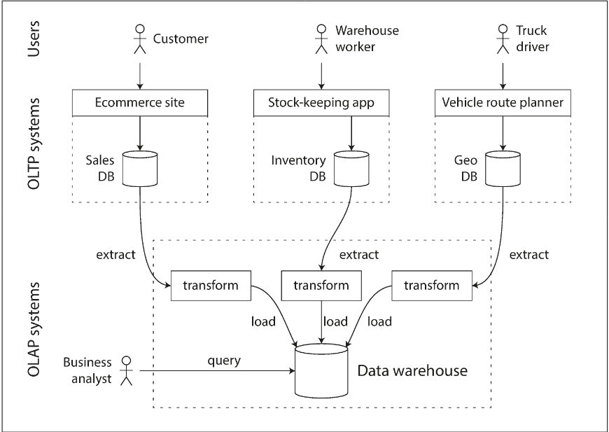
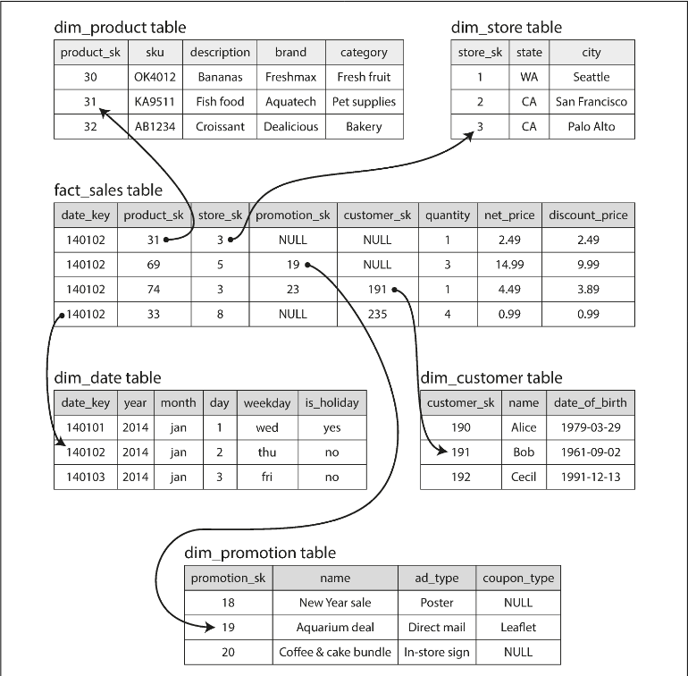

# Chapter 3.2 Storage and Retrieval: Transaction Processing or Analytics?

Historically, "transaction" referred to financial events, but in system design, it signifies a logical unit of reads and writes. Modern applications use two distinct patterns for handling this data: _OLTP_ and _OLAP_

_OLTP: Online Transaction Processing_

- Purpose: Handles interactive, user-facing applications (e.g., blog comments, e-commerce orders, gaming actions).
- Access Pattern: Looks up a small number of records using an index based on a key.
- Behavior: Frequent insertions or updates based on user input.
- Requirement: Low latency and high availability for end-users.

_OLAP: Online Analytic Processing_

- Purpose: Powers data analytics and Business Intelligence (BI) for decision-making.
- Access Pattern: Scans huge volumes of records but often only reads a few specific columns.
- Behavior: Performs aggregations (SUM, AVG, COUNT) rather than returning raw data.
- Example Queries: Calculating monthly revenue per store or correlation between product purchases.

_Comparison: OLTP vs. OLAP_

| Property             | OLTP                                              | OLAP                                      |
| -------------------- | ------------------------------------------------- | ----------------------------------------- |
| Main read pattern    | Small number of records per query, fetched by key | Aggregate over large number of records    |
| Main write pattern   | Random-access, low-latency writes from user input | Bulk import (ETL) or event stream         |
| Primarily used by    | End user/customer, via web application            | Internal analyst, for decision support    |
| What data represents | Latest state of data (current point in time)      | History of events that happened over time |
| Dataset size         | Gigabytes to terabytes                            | Terabytes to petabytes                    |

While SQL can handle both patterns, running resource-heavy analytic queries on a live production database can degrade performance for users. To solve this, companies use a _Data Warehouse_: a separate database specifically optimized for OLAP tasks.

 

---

 

### Data Warehousing

Large enterprises typically maintain dozens of autonomous OLTP systems (e.g., inventory, retail, payroll). A Data Warehouse acts as a centralized repository containing a read-only copy of the data from all these disparate systems.

_Why Separate OLTP and Data Warehousing?_

- Performance Isolation: OLTP systems require high availability and low latency. Analytic queries are "expensive" (scanning large datasets) and could crash or slow down production transactions.
- Specialized Optimization: OLTP databases use indexing structures optimized for small, fast writes/reads. Data warehouses use storage engines optimized for massive scans and aggregations.
- Autonomy: Data originates from many different departments; the warehouse provides a unified view without interfering with individual team operations.

Getting data from various sources into the warehouse involves Extract–Transform–Load (ETL):

- Extract: Pull data from various OLTP databases (via periodic dumps or streams).
- Transform: Clean the data and convert it into a schema optimized for analysis.
- Load: Insert the processed data into the warehouse.

While both systems often use SQL, their internal engines are diverging to meet specific needs:

- Data Model: Almost always relational, as SQL is ideal for "slicing and dicing" data via business intelligence tools.
- The Scale Factor: Small companies rarely need warehouses; they can often analyze data directly in their SQL database or spreadsheets. Large companies require the "heavy lifting" of a warehouse due to data volume and complexity.
- Vendor Landscape:
  - Commercial: Teradata, Vertica, SAP HANA, and Amazon Redshift.
  - Open Source (SQL-on-Hadoop): Apache Hive, Spark SQL, Presto, and Impala.

 

---

 

### Stars and Snowflakes: Schemas for Analytics

In contrast to the diverse data models in OLTP, data warehouses primarily use a formulaic approach known as dimensional modeling or the Star Schema.

_The Fact Table_

At the heart of a dimensional model is the fact table.

- Definition: Each row represents a specific event (e.g., a customer purchase, a page view, or a click).
- Granularity: Facts are captured as individual events to allow for maximum analytical flexibility.
- Scale: Because they record every event, fact tables can grow massive, reaching petabytes in size for large enterprises.

_Dimension Tables_

Dimensions represent the who, what, where, when, how, and why of an event.

- Examples: dim_product (SKU, brand, category), dim_store (location, size, services), and even dim_date (holidays, fiscal quarters).
- Structure: These tables are often very wide, containing extensive metadata for "slicing and dicing" data.

_Schema Variations_

_1. Star Schema_

The name comes from the visual layout: a central fact table surrounded by dimension tables, like the rays of a star.

_2. Snowflake Schema_

A variation where dimensions are further broken down into subdimensions (normalized).

- Example: Instead of storing "Brand" as a string in dim_product, it links to a separate dim_brand table.
- Comparison: Snowflake schemas are more normalized, but Star schemas are generally preferred because they are simpler for analysts to navigate.
