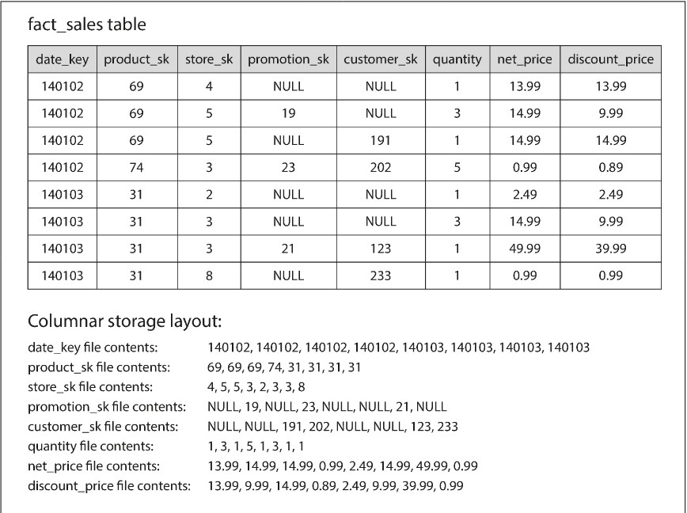
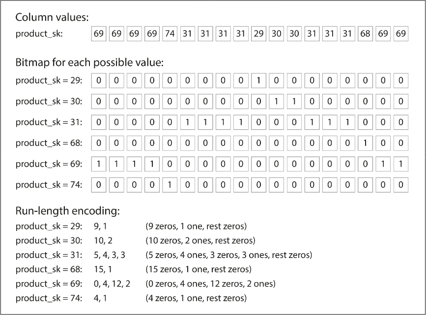
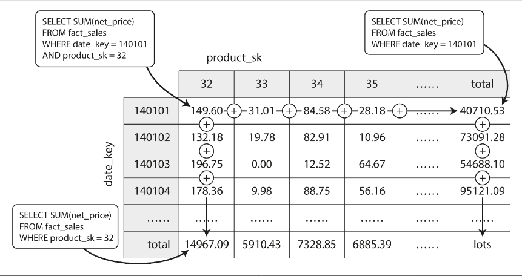

# Chapter 3.3 Storage and Retrieval: Column-Oriented Storage

Efficiently querying fact tables containing trillions of rows and petabytes of data requires specialized storage strategies, as typical analytical queries only access a small fraction of available columns.

_Row-Oriented vs. Column-Oriented Storage_

- Row-Oriented (OLTP): Stores all values of a single row contiguously.
  - The Issue: Even with indexes, the engine must load entire rows (e.g., 100+ columns) into memory just to extract 3 or 4 fields. This creates massive I/O overhead.
- Column-Oriented (OLAP): Stores all values from each column together in separate files.
  - The Benefit: Queries only read and parse the specific columns requested (e.g., date_key, quantity), significantly reducing disk I/O and processing time.

**Key Requirement**: Column-oriented storage relies on a consistent row order across all column files. To reconstruct "Row 23," the system fetches the 23rd entry from every individual column file.

The following query demonstrates how only a few columns are typically targeted, despite the table's width:

```
SELECT
  dim_date.weekday, dim_product.category,
  SUM(fact_sales.quantity) AS quantity_sold
FROM fact_sales
  JOIN dim_date ON fact_sales.date_key = dim_date.date_key
  JOIN dim_product ON fact_sales.product_sk = dim_product.product_sk
WHERE
  dim_date.year = 2013 AND
  dim_product.category IN ('Fresh fruit', 'Candy')
GROUP BY
  dim_date.weekday, dim_product.category;
```

This illustrates how data is physically arranged on disk in a columnar format versus traditional row-based formats:



<br>

---

<br>

### Column Compression

Column-oriented storage significantly improves disk throughput because repetitive data sequences are highly compressible

**Bitmap Encoding** is a core technique used when the number of distinct values (cardinality) is small relative to the total number of rows.

- Mechanism: A separate bitmap is created for each distinct value. Each bit represents a row: 1 if the row contains the value, 0 if it does not.
- Sparsity & Run-Length Encoding (RLE): If a column has many distinct values, bitmaps become "sparse" (mostly zeros). These are further compressed using Run-Length Encoding to make the storage remarkably compact



Bitmap indexes are ideal for common analytical filter queries:

- `OR` Operations: Used for `IN` queries (e.g., `product_sk IN (30, 68, 69)`).
- `AND` Operations: Used for multiple conditions (e.g., `product_sk = 31 AND store_sk = 3`).
- Efficiency: Because all column files maintain the same row order, the k-th bit in any bitmap always refers to the same row, allowing for very fast bitwise math.

Beyond disk I/O, analytical databases optimize for the bottleneck between main memory and CPU cache.

- Vectorized Processing: The engine loads a "chunk" of compressed column data into the CPU's L1 cache. It then iterates through the data in a tight loop without expensive function calls.
- Hardware Efficiency: This approach minimizes branch mispredictions and takes advantage of SIMD (Single-Instruction-Multi-Data) instructions, allowing the CPU to process multiple data points with a single command.
- Cache Impact: High compression ratios allow more rows to fit into the L1 cache at once, further accelerating processing.

<br>

---

<br>

### Sort Order in Column Storage

Sort Order in Column Storage

While rows can simply be stored in insertion order, imposing a specific sort order acts as a powerful indexing mechanism.

_Rules of Sorting_

- Whole-Row Sorting: Columns cannot be sorted independently. To maintain row integrity, the k-th entry across all files must always belong to the same record.
- Multi-Column Sorting: Similar to a primary key, you can define a primary sort key, a secondary sort key, etc.
- Example: Sorting by `date_key` first, then `product_sk`. This groups all sales of a specific product on a specific day together.

_Advantages of Sorting_

- Query Optimization: If the primary sort key is `date_key`, a query for a specific date range becomes a fast sequential scan of a small portion of the column files rather than a full table scan.
- Enhanced Compression: Sorting creates long runs of repeated values in the primary sort column. This makes Run-Length Encoding (RLE) extremely efficient, potentially shrinking billions of rows to a few kilobytes.
- Note: Compression is most effective on the primary sort key. Subsequent sort keys have more "jitter" and shorter runs.

_Multiple Sort Orders_

Since data is typically replicated for high availability (fault tolerance), systems like Vertica store different replicas using different sort orders.

- Optimization: The query optimizer selects the replica that best matches the query's filter patterns.
- vs. Row-Oriented Indexes: Unlike row-oriented secondary indexes (which use pointers to a "heap"), a columnar store simply stores the actual data values in multiple sorted versions. There are no pointers—just redundant, differently ordered data.

<br>

---

<br>

### Aggregation: Data Cubes and Materialized Views

While column stores excel at ad hoc queries, materialized aggregates offer a way to bypass re-calculating expensive functions like `SUM` or `COUNT` for frequently accessed data.

_Materialized Views_

- Definition: Unlike a virtual view (which is just a query shortcut), a materialized view is an actual physical copy of query results stored on disk.
- Trade-off: Because it is a denormalized copy, it must be updated whenever the underlying raw data changes.
  - OLTP: Rarely used because updates slow down write-intensive workloads.
  - OLAP (Data Warehouses): Very effective for read-heavy workloads where precomputed results save massive amounts of processing time.

_Data Cubes (OLAP Cubes)_

A data cube is a specific type of materialized view that represents a multi-dimensional grid of aggregates.

- Structure: Aggregates are grouped by dimensions (e.g., Date, Product, Store).
- Hierarchical Summary: You can "roll up" or "drill down." For example, a 2D cube for Date and Product allows you to see:
  - Total sales for a specific product on a specific date (the cell).
  - Total sales for a product across all dates (the row sum).
  - Total sales for a date across all products (the column sum).
- The "Hypercube": In reality, facts have many dimensions (Date, Product, Store, Promotion, Customer). While a 5D cube is hard to visualize, the principle of pre-aggregating every combination remains the same.
- Strategy: Most modern data warehouses maintain the raw data (in column stores) for flexibility and use data cubes only to accelerate specific, high-traffic queries.


