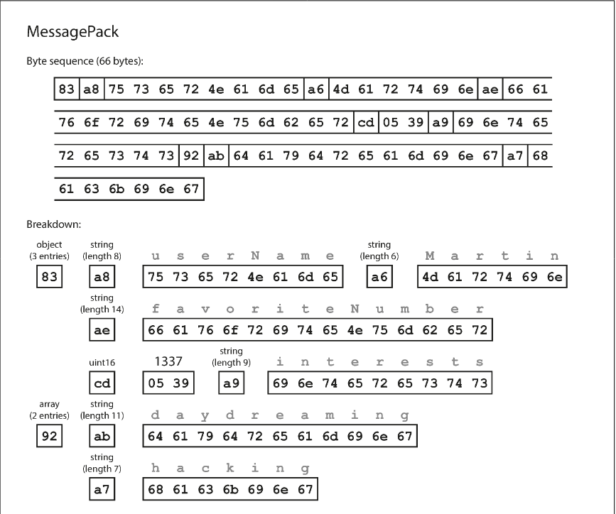

# Chapter 4.1 Encoding and Evolution: Formats for Encoding Data

Programs manage data using two primary representations, necessitating a translation process between them. There are two forms of data representation:

- In-Memory: Data is stored in structures like objects, structs, lists, or trees. These are optimized for CPU efficiency and direct access via pointers.
- Byte Sequence: For storage or network transmission, data must be a self-contained sequence of bytes (e.g., JSON). Pointers are irrelevant here, as they have no meaning outside the local process memory.

The shift between these two states is fundamental to distributed systems:

- Encoding (Serialization/Marshalling): Converting in-memory data structures into a byte sequence.
- Decoding (Deserialization/Unmarshalling): Reconstructing the byte sequence back into in-memory data structures.

<br>

---

<br>

### Language-Specific Formats

Many programming languages include built-in support for encoding objects (e.g., Java's java.io.Serializable, Python’s pickle, Ruby’s Marshal). While convenient for quick implementation, they present several significant drawbacks:

- Language Locking: Encodings are often tied to a specific language, making it difficult to read data in different languages and hindering integration with other systems.
- Security Risks: To restore objects, the decoding process must instantiate arbitrary classes. Attackers can exploit this to execute remote code by providing malicious byte sequences.
- Compatibility Issues: Versioning is often neglected, leading to difficulties with forward and backward compatibility as data schemas evolve.
- Poor Efficiency: These formats frequently prioritize convenience over performance, often resulting in high CPU usage and bloated encoded sizes (e.g., Java serialization).

Built-in language encodings should generally be avoided for anything beyond very transient, short-term purposes.

<br>

---

<br>

### JSON, XML, and Binary Variants

JSON, XML, and CSV are standardized, language-independent formats widely used for data interchange. While popular, they have several technical limitations:

- Textual Format Ambiguity: JSON, XML, and CSV are human-readable but struggle with data types. XML and CSV cannot distinguish between numbers and numeric strings without a schema.
- Number Precision Issues: JSON does not distinguish between integers and floating-point numbers. Large integers (greater than 253) can lose precision in environments like JavaScript (e.g., Twitter provides tweet IDs as both numbers and strings to avoid this).
- Binary Data Constraints: None of these formats natively support binary strings. Developers often use Base64 encoding as a workaround, which increases data size by approximately 33%.
- Schema Complexity: While XML and JSON support schemas, they are complex to implement. Without them, applications must hardcode logic to correctly interpret types.
- CSV Limitations: CSV lacks a formal schema, making it difficult to handle changes in columns or rows. Escaping characters like commas or newlines is inconsistently handled across different parsers.

Despite these flaws, these formats remain the primary choice for data interchange between different organizations, where reaching an agreement on the format is more important than technical efficiency.

For internal data where human-readability is less critical, binary encodings offer a more compact and faster alternative to textual formats.

- Purpose and Impact: While the gains for small datasets are negligible, binary formats significantly reduce storage and latency when processing data at the scale of terabytes.
- Data Model: Most binary encodings for JSON (e.g., MessagePack, BSON, Smile) and XML (e.g., WBXML) maintain the original data model. Because they don't use a strict schema, they must still include all object field names (e.g., "userName") within the encoded data.
- Comparison to Textual JSON:
  - Textual JSON (with whitespace removed) is relatively bulky.
  - Binary variants extend data types (e.g., distinguishing integers from floats) but often provide only modest space savings.

```
{
  "userName": "Martin",
  "favoriteNumber": 1337,
  "interests": ["daydreaming", "hacking"]
}

```

**Example: MessagePack**

MessagePack is a popular binary encoding for JSON. Using a sample document, the encoding process works as follows:

- Type Indicators: The first byte (e.g., `0x83`) identifies the data type (an object) and its size (3 fields).
- Length Prefixes: Instead of using quotes or delimiters, strings are preceded by a byte indicating their length (e.g., `0xa8` for an 8-byte string), followed by the raw ASCII bytes.
- Space Efficiency: In the provided example, the binary version is 66 bytes compared to 81 bytes for textual JSON.



Whether this small reduction in size is worth the loss of human-readability depends on the specific performance requirements of the system.
