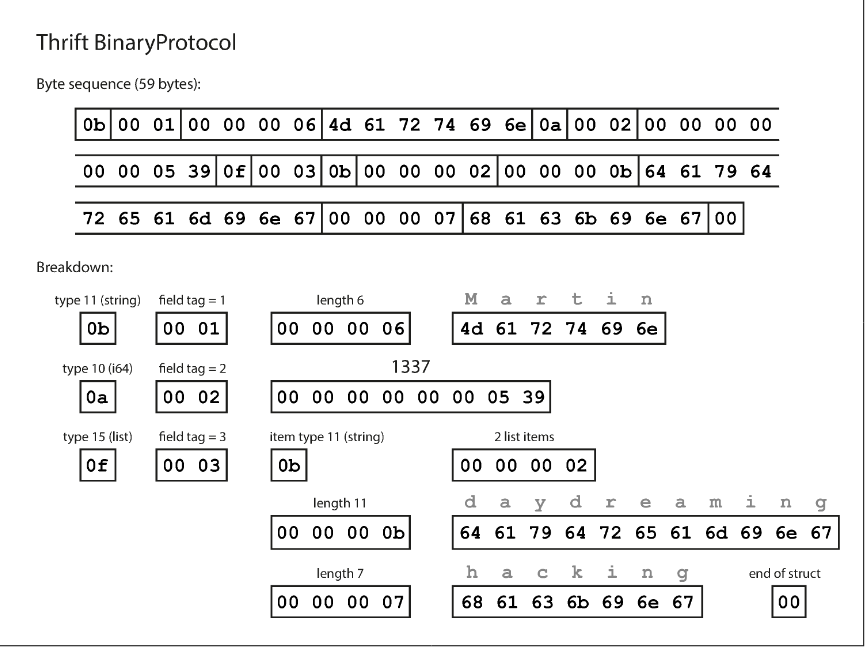
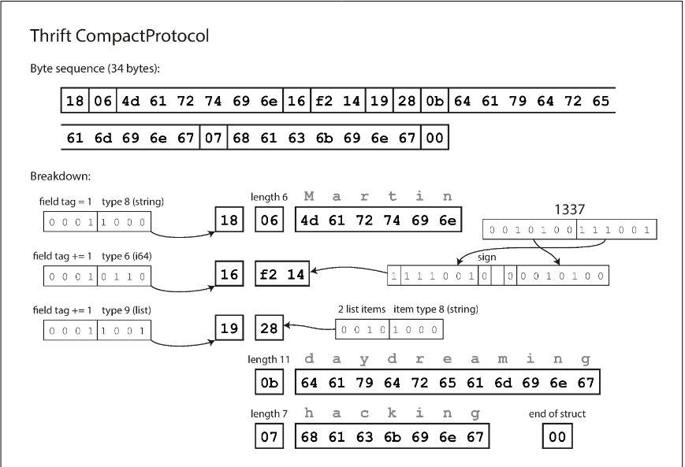
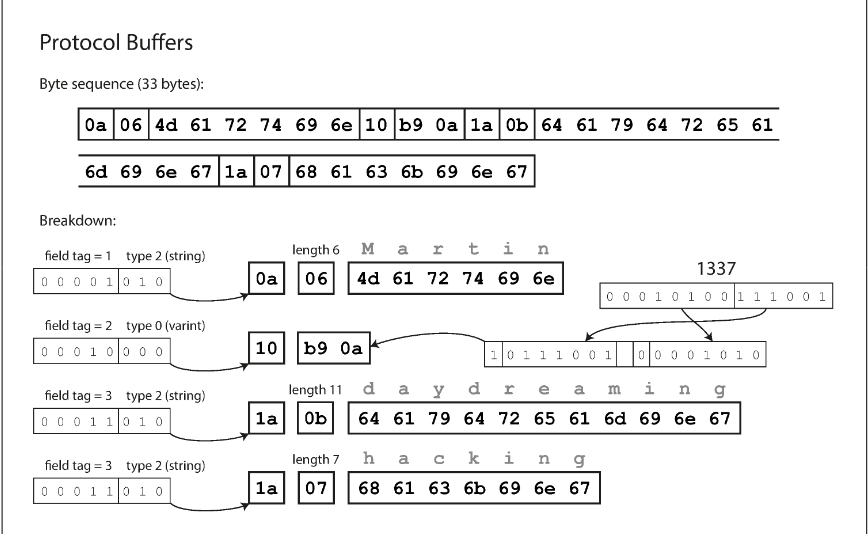
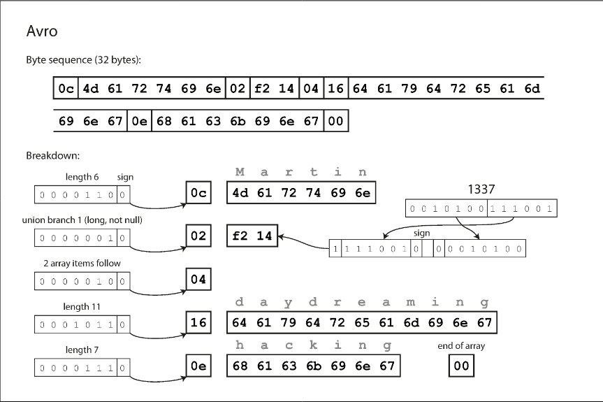
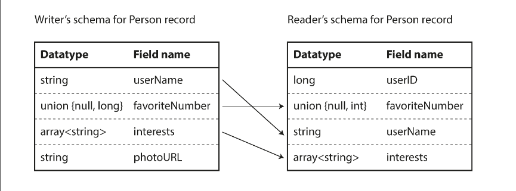

# Chapter 4.1 Encoding and Evolution: Formats for Encoding Data

Programs manage data using two primary representations, necessitating a translation process between them. There are two forms of data representation:

- In-Memory: Data is stored in structures like objects, structs, lists, or trees. These are optimized for CPU efficiency and direct access via pointers.
- Byte Sequence: For storage or network transmission, data must be a self-contained sequence of bytes (e.g., JSON). Pointers are irrelevant here, as they have no meaning outside the local process memory.

The shift between these two states is fundamental to distributed systems:

- Encoding (Serialization/Marshalling): Converting in-memory data structures into a byte sequence.
- Decoding (Deserialization/Unmarshalling): Reconstructing the byte sequence back into in-memory data structures.

<br>

---

<br>

### Language-Specific Formats

Many programming languages include built-in support for encoding objects (e.g., Java's java.io.Serializable, Python’s pickle, Ruby’s Marshal). While convenient for quick implementation, they present several significant drawbacks:

- Language Locking: Encodings are often tied to a specific language, making it difficult to read data in different languages and hindering integration with other systems.
- Security Risks: To restore objects, the decoding process must instantiate arbitrary classes. Attackers can exploit this to execute remote code by providing malicious byte sequences.
- Compatibility Issues: Versioning is often neglected, leading to difficulties with forward and backward compatibility as data schemas evolve.
- Poor Efficiency: These formats frequently prioritize convenience over performance, often resulting in high CPU usage and bloated encoded sizes (e.g., Java serialization).

Built-in language encodings should generally be avoided for anything beyond very transient, short-term purposes.

<br>

---

<br>

### JSON, XML, and Binary Variants

JSON, XML, and CSV are standardized, language-independent formats widely used for data interchange. While popular, they have several technical limitations:

- Textual Format Ambiguity: JSON, XML, and CSV are human-readable but struggle with data types. XML and CSV cannot distinguish between numbers and numeric strings without a schema.
- Number Precision Issues: JSON does not distinguish between integers and floating-point numbers. Large integers (greater than 253) can lose precision in environments like JavaScript (e.g., Twitter provides tweet IDs as both numbers and strings to avoid this).
- Binary Data Constraints: None of these formats natively support binary strings. Developers often use Base64 encoding as a workaround, which increases data size by approximately 33%.
- Schema Complexity: While XML and JSON support schemas, they are complex to implement. Without them, applications must hardcode logic to correctly interpret types.
- CSV Limitations: CSV lacks a formal schema, making it difficult to handle changes in columns or rows. Escaping characters like commas or newlines is inconsistently handled across different parsers.

Despite these flaws, these formats remain the primary choice for data interchange between different organizations, where reaching an agreement on the format is more important than technical efficiency.

For internal data where human-readability is less critical, binary encodings offer a more compact and faster alternative to textual formats.

- Purpose and Impact: While the gains for small datasets are negligible, binary formats significantly reduce storage and latency when processing data at the scale of terabytes.
- Data Model: Most binary encodings for JSON (e.g., MessagePack, BSON, Smile) and XML (e.g., WBXML) maintain the original data model. Because they don't use a strict schema, they must still include all object field names (e.g., "userName") within the encoded data.
- Comparison to Textual JSON:
  - Textual JSON (with whitespace removed) is relatively bulky.
  - Binary variants extend data types (e.g., distinguishing integers from floats) but often provide only modest space savings.

```
{
  "userName": "Martin",
  "favoriteNumber": 1337,
  "interests": ["daydreaming", "hacking"]
}

```

**Example: MessagePack**

MessagePack is a popular binary encoding for JSON. Using a sample document, the encoding process works as follows:

- Type Indicators: The first byte (e.g., `0x83`) identifies the data type (an object) and its size (3 fields).
- Length Prefixes: Instead of using quotes or delimiters, strings are preceded by a byte indicating their length (e.g., `0xa8` for an 8-byte string), followed by the raw ASCII bytes.
- Space Efficiency: In the provided example, the binary version is 66 bytes compared to 81 bytes for textual JSON.


Whether this small reduction in size is worth the loss of human-readability depends on the specific performance requirements of the system.

<br>

---

<br>

### Thrift and Protocol Buffers

Definition: Binary encoding libraries that utilize a schema to encode and decode data.

- Origins: Protocol Buffers (protobuf) was developed at Google; Thrift was developed at Facebook. Both were open-sourced in 2007–08.
- Interface Definition Language (IDL): Both require schemas defined in an IDL to describe data structures.
- Code Generation: Tools take the schema and generate classes in various programming languages, which the application uses to handle encoding/decoding.

Thrift IDL:

```
struct Person {
  1: required string userName,
  2: optional i64 favoriteNumber,
  3: optional list<string> interests
}
```

Protocol Buffers Schema:

```
message Person {
  required string user_name = 1;
  optional int64 favorite_number = 2;
  repeated string interests = 3;
}

```

**Thrift Binary Formats**

Thrift offers two distinct binary encoding methods:

- BinaryProtocol:
  - Encodes records by including type annotations and length indications (for strings/lists).
  - Field Tags: Instead of storing field names (e.g., userName), it uses numeric tags (1, 2, 3) defined in the schema to identify fields compactly.



- CompactProtocol:
  - Semantically identical to BinaryProtocol but more space-efficient (e.g., 34 bytes vs. 59 bytes).
  - Bit Packing: Combines the field type and tag number into a single byte.
  - Variable-length Integers: Uses "Varints" where small numbers use fewer bytes (e.g., two bytes for 1337 instead of eight).



**Protocol Buffers (protobuf)**

- Encoding: Features a single binary format similar to Thrift’s CompactProtocol.
- Efficiency: Uses slightly different bit-packing techniques, often resulting in the smallest footprint (e.g., 33 bytes for the same record).



**Field Modifiers: Required vs. Optional**

- Encoding Impact: There is no difference in the binary data between required and optional fields.
- Function: The distinction is purely for runtime checks. A required field triggers an error if not set, helping catch bugs during development.

**Field Tags and Schema Evolution**

- Core Mechanism: Encoded records are a concatenation of fields identified by tag numbers and datatypes.
- Field Names: Can be changed freely because the binary data only refers to tag numbers.
- Field Tags: Immutable. Changing a tag number invalidates all existing encoded data.
- Missing Fields: If a field value is not set, it is simply omitted from the encoding.

_Adding Fields_

- Forward Compatibility: Old code can read data from new code. If old code encounters an unknown tag, it uses the datatype annotation to calculate how many bytes to skip.
- Backward Compatibility: New code can read data from old code.
- Constraint: New fields must not be required. If new code expects a required field that old data doesn't have, the runtime check will fail. New fields must be optional or have a default value.

_Removing Fields_

- Forward Compatibility: New code can read data from old code (provided the removed field was not required).
- Backward Compatibility: Old code can read data from new code (it simply ignores the removed tag).
- Constraints:
  - You can only remove optional fields.
  - Tag Reuse: A deleted tag number must never be reused. Existing data may still contain the old tag, and new code must know to ignore it rather than misinterpreting it as a different data type.

**Datatypes and Schema Evolution**

- Changing Datatypes: Possible but risky.
  - Upcasting (e.g., 32-bit to 64-bit): New code can read old 32-bit data (missing bits are padded with zeros).
  - Downcasting Risk: If old code reads new 64-bit data, values exceeding 32 bits will be truncated, leading to precision loss.
- Handling Lists/Arrays:
  - Protocol Buffers (repeated marker): Does not have a dedicated list type. Instead, the same field tag appears multiple times in the record.
    - Evolution Advantage: You can change an optional field to repeated.
    - New code reading old data sees a list of 0 or 1 items.
    - Old code reading new data sees only the last element of the list.
  - Thrift (Dedicated list type): Uses a parameterized list datatype.
    - Trade-off: Does not support the optional-to-repeated evolution found in Protobuf, but it does support nested lists

<br>

---

<br>

### Avro

Definition: A binary encoding format started in 2009 as a Hadoop subproject (created because Thrift wasn't ideal for Hadoop use cases).

- Two Schema Languages:
  - Avro IDL: Optimized for human readability/editing.
  - JSON-based: Optimized for machine readability.
- Schema Examples:

Avro IDL:

```
record Person {
  string                userName;
  union { null, long }  favoriteNumber = null;
  array<string>         interests;
}

```

JSON Schema:

```
{
    "type": "record",
    "name": "Person",
    "fields": [
        {"name": "userName",       "type": "string"},
        {"name": "favoriteNumber", "type": ["null", "long"], "default": null},
        {"name": "interests",      "type": {"type": "array", "items": "string"}}
    ]
}

```

**Key Characteristics of Avro Encoding**

- No Field Tags: Unlike Thrift or Protobuf, Avro does not use tag numbers (1, 2, 3) in the schema.
- Maximum Compactness: In the example, it uses only 32 bytes (the smallest footprint so far).
- Values Only: The binary data is simply a concatenation of values.



- No Metadata in Binary: The encoding contains no information about field names or datatypes.
  - Strings: Length prefix + UTF-8 bytes.
  - Integers: Variable-length encoding (similar to Thrift CompactProtocol).

_The Reader's Schema Requirement_

- Strict Mapping: To parse the data, the reader must move through fields in the exact order they appear in the schema.
- Dependency: Correct decoding is only possible if the reader's schema matches the writer's schema. Any mismatch results in completely garbled/incorrectly decoded data because the parser won't know how many bytes to read for each field.

**The Writer’s Schema and the Reader’s Schema**

- Writer’s Schema: The version of the schema used by the application to encode data (e.g., compiled into the app).
- Reader’s Schema: The version of the schema the decoding application expects (e.g., used to generate its own code during build).
- Schema Resolution: The core Avro mechanism where the library compares the writer’s and reader’s schemas side-by-side to translate data between them.



_How Resolution Works_

- Field Order: Fields can be in different orders in the two schemas; Avro matches them by field name.
- Field Mismatching:
  - Extra fields: If the writer’s schema has a field the reader doesn’t recognize, the reader ignores it.
  - Missing fields: If the reader expects a field that the writer’s schema lacks, Avro fills it with a default value defined in the reader's schema

**Schema Evolution Rules in Avro**

- Forward Compatibility: New version as writer, old version as reader.
- Backward Compatibility: New version as reader, old version as writer.
- The Default Value Rule: To maintain compatibility, you may only add or remove fields that have a default value.
  - Adding a field: A new reader (new schema) can read old data by filling the missing field with the default value.
  - Removing a field: An old reader (old schema) can read new data by filling the removed field with the default value.

_Handling Nulls and Unions_

- Nullability: Unlike some languages, Avro fields are not nullable by default.
- Union Types: To allow a field to be null, you must use a union type (e.g., union { null, long, string }).
- Defaults: null can only be a default value if it is explicitly included as a branch in the union. This explicitness prevents bugs associated with unexpected null values

_Type and Name Changes_

- Datatypes: Changes are permitted only if Avro can perform a valid type conversion.
- Field Names:
  - Aliases: The reader’s schema can use aliases to map old field names to new ones.
  - Compatibility: Changing a name is backward compatible (new code reads old names) but not forward compatible (old code won't recognize the new name).
- Unions: Adding a branch to a union type is backward compatible but not forward compatible.

**But What Is the Writer’s Schema?**

The reader must know the exact schema used to encode the data, but including the full schema in every record would waste space. The delivery method depends on the context:

- Large Files (e.g., Hadoop):
  - Used for millions of records with the same schema.
  - Solution: Include the writer’s schema once at the beginning of the file.
  - Avro defines "object container files" specifically for this purpose.
- Databases with Individual Records:
  - Records may be written at different times using different schema versions.
  - Solution: Prefix every record with a version number or schema ID.
  - A central Schema Registry (database of schemas) stores the versions; the reader fetches the schema corresponding to the ID to decode the record.
- Network Connections (RPC):
  - Two processes communicate over a bidirectional link.
  - Solution: They negotiate the schema version during the initial connection setup. That schema is then used for all subsequent data transferred over that specific connection.

**Dynamically Generated Schemas**

- Core Advantage: Avro does not use tag numbers, making it significantly more "dynamic" than Thrift or Protocol Buffers.
- Use Case: Database Dumps:
  - You can automatically generate an Avro schema directly from a relational database schema.
  - Database column names map directly to Avro field names.
  - The export process can simply regenerate a new schema every time the database changes.

_Comparison: Avro vs. Thrift/Protobuf_

- Avro:
  - Automation: Since fields are identified by name, the system handles schema changes (adding/removing columns) without manual intervention.
  - Schema Resolution: The reader's schema is matched to the writer's schema via names, allowing the data export process to remain agnostic of changes.
- Thrift & Protocol Buffers:
  - Manual Management: Require numeric field tags (1, 2, 3) to be assigned and maintained
  - Risk: Automating tag assignment is difficult because the generator must ensure it never reuses a tag number from a deleted column, as this would corrupt data interpretation.
  - Design Intent: Dynamic generation was a primary design goal for Avro, but not for Thrift or Protobuf

**Code Generation and Dynamically Typed Languages**

- Thrift and Protobuf Approach:
  - Heavy Reliance on Code Generation: After defining a schema, you must generate classes in your target language.
  - Benefits (Statically Typed): Enables efficient in-memory structures, IDE autocompletion, and compile-time type checking (Java, C++, C#).
  - Drawbacks (Dynamically Typed): In languages like Python or Ruby, code generation is an unnecessary hurdle that conflicts with the "no explicit compilation" workflow.
- Avro’s Flexible Approach:
  - Optional Code Generation: Provides it for static languages but doesn't require it.
  - Self-Describing Data: Since Avro "object container files" embed the writer's schema, a library can read the data directly without generated classes.
  - Ease of Access: You can inspect an Avro file much like a JSON file; the library uses the embedded metadata to interpret the bits on the fly.
  - Dynamic Suitability: Ideal for scenarios where schemas change frequently (e.g., database dumps), as it avoids the "recompile-on-change" bottleneck

<br>

---

<br>

### The Merits of Schemas

Binary encoding libraries like Protocol Buffers, Thrift, and Avro utilize simple schema languages. Unlike the complex validation rules of XML or JSON Schema (e.g., regex or range constraints), these formats prioritize ease of implementation and cross-language support.

_Historical Context and Proprietary Formats_

- ASN.1 (1984): A precursor to modern formats used in network protocols and SSL certificates (X.509). While it supports schema evolution via tag numbers, its high complexity makes it less ideal for modern applications.
- Proprietary Encodings: Most relational databases use vendor-specific binary protocols. Drivers (ODBC/JDBC) are required to decode these responses into usable in-memory structures.

_Advantages of Schema-Based Binary Encodings_

Binary formats offer several distinct advantages over textual formats (JSON, XML, CSV) and "binary JSON" variants:

- Compactness: Significantly smaller than text-based formats because they omit field names from the encoded data.
- Living Documentation: The schema acts as a mandatory, up-to-date form of documentation. Since it is required for decoding, it cannot diverge from the actual data structure.
- Compatibility Safety: Centralized schema registries allow for automated checks of forward and backward compatibility before code is even deployed.
- Type Safety: For statically typed languages, code generation provides compile-time type checking and IDE support.

**Summary: Schema Evolution vs. Schemaless**

Schema evolution provides the best of both worlds:

- The flexibility of "schema-on-read" (similar to JSON/document databases).
- The rigor and tooling of "schema-on-write" (guarantees about data structure and efficient storage).
