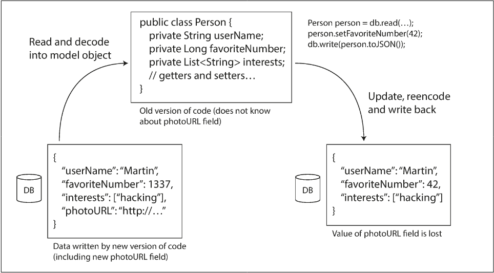

# Chapter 4.2 Encoding and Evolution: Modes of Dataflow

- Encoding Requirement: When sending data to a process that does not share memory (e.g., over a network or writing to a file), data must be encoded as a sequence of bytes.
- Evolvability: Facilitated by compatibility, allowing system components to be upgraded independently without requiring synchronized changes across the entire infrastructure.
- Compatibility Types:
  - Forward Compatibility: Older code can read data written by newer code.
  - Backward Compatibility: Newer code can read data written by older code.
- Dataflow Relationship: Compatibility is defined by the relationship between the process that encodes (producer) and the process that decodes (consumer).

Common Modes of Dataflow:

- Databases: The process writing to the database encodes the data, and the process reading from it decodes it.
- Service Calls (REST/RPC): The client encodes a request and decodes the server's response; the server decodes the request and encodes the response.
- Asynchronous Message Passing: Producers encode messages that are decoded by consumers, typically mediated by a message broker.

 

---

 

### Dataflow Through Databases

- Core Concept: The database acts as a medium for dataflow where the writer encodes data and the reader decodes it.
- Data to the Future: Storing data is essentially sending a message to a "future version" of your application.
- Compatibility Requirements:
  - Backward Compatibility: Necessary so newer code can read data written by older versions.
  - Forward Compatibility: Necessary because in rolling upgrades, older code instances may read data written by newer code instances.

_The "Unknown Field" Preservation_

- The Challenge: If an older version of the code reads a record containing a new field (which it doesn't recognize), modifies it, and writes it back, the new field must not be lost.
- Application-Level Risk: Data mapping (e.g., converting a database row into an application object) can accidentally strip unknown fields during the re-encoding process.
- Solving this is not a hard problem; you just need to be aware of it.

**Key Observation: "Data Outlives Code"**

- Persistence: While code is often replaced entirely during a deployment, database records may remain in their original encoding for years.
- Schema Evolution: Most databases avoid expensive global rewrites (migrations) of large datasets.
  - Relational DBs: Often handle missing columns by filling in null values at read-time.
  - Document DBs (e.g., Espresso/Avro): Use specific evolution rules to manage records written with different schema versions.
  - Result: The database provides a unified view of data despite varying historical encodings on disk.

**Archival Storage and Backups**

- Uniform Encoding: Data dumps or backups for data warehouses are typically encoded using the latest schema version available at the time of the dump.
- Immutability: Since archives are usually written once and remain immutable, they are ideal for formats like Avro object container files.
- Optimization: Dumps are an opportunity to convert data into column-oriented formats (e.g., Parquet) for better analytical performance.

 

---

 

### Dataflow Through Services: REST and RPC

Client-Server Model: The most common network communication pattern. Servers expose an API (service), and clients connect to use it.

- Service vs. Database: While both store/query data, services provide encapsulation by exposing an application-specific API that restricts actions based on business logic.
- Microservices/SOA: Decomposing large apps into smaller, independently deployable services owned by different teams. This requires evolvability: new and old versions of clients/servers must coexist.

**Web Services (REST vs. SOAP)**

- Web Service: Any service using HTTP as the transport protocol. Used for public APIs (OAuth, Stripe), internal middleware, or mobile app backends.
- REST (Representational State Transfer):
  - A design philosophy, not a protocol.
  - Uses HTTP features: URLs for resources, cache control, and content-type negotiation.
  - Favors simple data formats (JSON) and avoids heavy tooling/code generation.
- SOAP (Simple Object Access Protocol):
  - An XML-based protocol designed to be independent of HTTP.
  - Uses WSDL (Web Services Description Language) for API definitions, enabling code generation in static languages.
  - High complexity; relies heavily on IDEs and vendor support.

**Remote Procedure Calls (RPC)**

- The RPC Goal: Location Transparency—making a remote network request look like a local function call in the code.
- The Flaw: Network calls are fundamentally different from local calls:
  - Unpredictability: Networks can drop requests/responses or be slow; local calls are deterministic.
  - Timeouts: If a network call times out, the client doesn't know if the request was actually processed.
  - Retries & Idempotence: Retrying a failed network call can cause duplicate actions unless idempotence is implemented.
  - Latencies: Local calls take constant time; network latency is wildly variable.
  - Data Encoding: Pointers cannot be passed over a network; everything must be serialized into bytes.

**Modern RPC and Evolution**

- Current Frameworks: gRPC (Protocol Buffers), Thrift, and Avro.
- Improvements: Newer frameworks are more explicit about network risks, using Futures/Promises for async actions and Streams for series of requests/responses.
- Compatibility Rules:
  - In internal services, we usually assume servers update first, clients second.
  - Request: Needs backward compatibility (server must understand old clients).
  - Response: Needs forward compatibility (old clients must understand new server responses).
- Versioning: In public APIs (where clients are outside your control), multiple API versions often run indefinitely. Common methods include versioning in the URL or HTTP Headers.

 

---

 

### Message-Passing Dataflow

Hybrid Nature: Message-passing systems sit between RPC and databases.

- Like RPC: Messages are delivered to another process with low latency.
- Like Databases: Messages are sent via an intermediary (message broker) that stores them temporarily.

**Advantages of Message Brokers**

- Reliability: Acts as a buffer if the recipient is unavailable or overloaded.
- Durability: Automatically redelivers messages if a consumer process crashes.
- Decoupling: Senders don't need to know the IP address or port of recipients (vital for cloud environments).
- Fan-out: One message can be broadcast to multiple consumers.
- Asynchronous: The sender is "fire-and-forget"; it doesn't wait for the message to be delivered/processed.

**Message Broker Mechanics**

- Structure: Senders publish to a topic or queue; subscribers/consumers read from them.
- Dataflow: Typically one-way. For request/response patterns, a separate "reply queue" must be used.
- Encoding: Brokers usually treat messages as opaque byte sequences.
- Compatibility: Forward and backward compatibility are essential to allow independent deployment of producers and consumers.
- Preservation: If a consumer modifies and republishes a message, it must preserve unknown fields to avoid data loss for newer versions.

_Distributed Actor Frameworks_

- Actor Model: A concurrency model where logic is encapsulated in actors. Actors have private state and communicate via asynchronous messages (no shared memory).
- Distributed Scaling: The framework transparently handles encoding and network transmission if the recipient actor is on a different node.
- Location Transparency: Works better than in RPC because the model inherently expects message loss and latency.
- Compatibility Challenges:
  - Akka: Default Java serialization is poor for compatibility; Protocol Buffers are recommended for rolling upgrades.
  - Orleans: Default format doesn't support rolling upgrades (requires a new cluster); supports custom plug-ins.
  - Erlang OTP: High availability but schema changes are difficult; rolling upgrades require meticulous planning.
