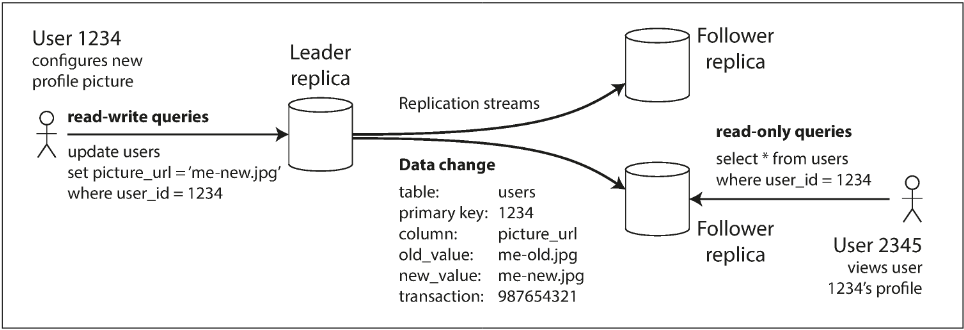
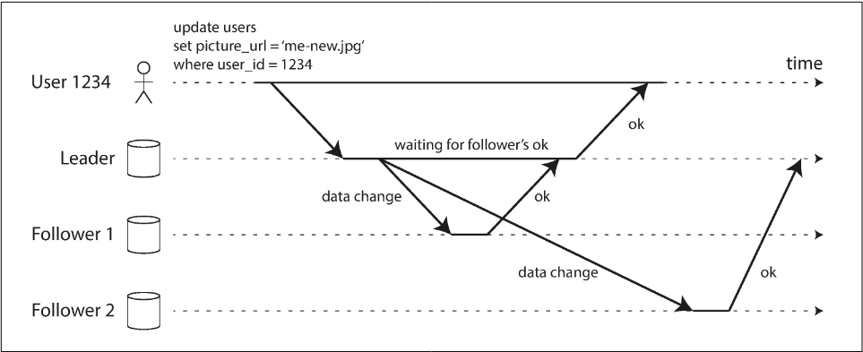

# Chapter 5.1 Replication: Leaders and Followers

A **replica** is an individual node or server that stores a copy of the same dataset. In a distributed system, having multiple replicas ensures that the data remains available if one node fails and allows for increased read capacity by spreading queries across different machines.

To maintain data consistency across multiple replicas, every write must be processed by every node. The most prevalent method for achieving this is **leader-based replication** (also called active/passive or master-slave replication).

Leader-Based Replication Mechanism

In this configuration, nodes are assigned specific roles to manage data flow:

- The Leader: Also known as the primary or master. All write requests from clients must be sent to the leader. The leader writes the data to local storage first and then functions as the source of truth for all changes.
- Followers: Also known as read replicas, secondaries, or hot standbys. Followers are read-only from the client's perspective. They update their local datasets by applying a replication log or change stream sent by the leader, ensuring they process writes in the exact same order.
- Read Operations: Clients can query either the leader or any of the followers, allowing for read-scaling across the cluster.

This pattern is a foundational feature in relational databases like PostgreSQL, MySQL, and SQL Server, as well as non-relational systems like MongoDB. It also extends beyond databases to distributed message brokers like Kafka and RabbitMQ to ensure high availability

 

---

 

### Synchronous Versus Asynchronous Replication

A critical configuration in leader-based systems is the timing of data propagation: whether replication is synchronous or asynchronous.

##### Synchronous Replication

In synchronous replication, the leader waits for the follower to confirm it has received and stored the data before reporting success to the client.

- Pros: Guaranteed consistency; the follower is a perfect "mirror" of the leader. If the leader fails, no data is lost.
- Cons: If the follower or network fails, the leader must block all writes, causing the entire system to halt.
- Semi-synchronous: A common practical compromise where only one follower is synchronous and the rest are asynchronous. If the synchronous follower fails, an asynchronous one is promoted to synchronous.

##### Asynchronous Replication

The leader sends the data change but does not wait for a response from followers before confirming success to the client.

- Pros: The leader can continue processing writes even if all followers fall behind or fail. This is ideal for systems with many followers or nodes across large geographical distances.
- Cons: Durability is weakened. If the leader fails before changes reach the followers, those writes are permanently lost, even if they were confirmed to the user.

| Feature      | Synchronous                     | Asynchronous                |
| ------------ | ------------------------------- | --------------------------- |
| Consistency  | High (Up-to-date)               | Eventual (Lag possible)     |
| Availability | Lower (Blocked by node failure) | High (Leader keeps working) |
| Performance  | Slower (Wait for network/ACK)   | Faster (No waiting)         |

 

---

 

### Setting Up New Followers

Adding a new follower—whether to increase capacity or replace a failed node—must be done without interrupting the leader's ability to process writes. A simple file copy is ineffective because data is in constant flux.
The Zero-Downtime Setup Process

To ensure the new follower is consistent with the leader without locking the database, the following workflow is used:

1. Consistent Snapshot: Take a snapshot of the leader’s database at a specific point in time. This is done using built-in backup tools (or third-party tools like innobackupex) that do not require a global write lock.
2. Snapshot Transfer: Copy the snapshot files to the new follower node.
3. Log Catch-up: The follower connects to the leader and requests all data changes that occurred after the snapshot was taken.
   - This requires an exact log position (e.g., PostgreSQL’s Log Sequence Number or MySQL’s binlog coordinates) associated with the snapshot.
4. Catch-up Completion: Once the follower processes the backlog of changes from the replication log, it is considered "caught up" and can begin streaming new changes in real-time.

While the conceptual steps are universal, the implementation ranges from fully automated processes to manual, multi-step workflows depending on the specific database technology.

 

---

 

### Handling Node Outages

Maintaining high availability requires the system to handle individual node failures—whether due to unexpected faults or planned maintenance—with minimal impact.

**Follower Failure: Catch-up Recovery**

Followers recover easily because they maintain a local log of processed transactions.

- Process: Upon restart or reconnection, the follower identifies the last transaction it processed, connects to the leader, and requests all missing data changes from that point onward.
- Result: Once the backlog is applied, it resumes its role in the real-time replication stream.

**Leader Failure: Failover**

Failover is the process of promoting a follower to be the new leader, reconfiguring clients to send writes to it, and ensuring other followers recognize the new authority.

Automatic Failover Steps:

- Failure Detection: Nodes use heartbeats (periodic messages) to monitor each other. If a leader doesn't respond within a specific timeout (e.g., 30 seconds), it is assumed dead.
- Choosing a New Leader: A new leader is selected via an election (consensus among remaining nodes) or appointed by a controller. The node with the most up-to-date data is preferred to minimize data loss.
- Reconfiguration: The system routes write requests to the new leader. If the old leader returns, it must be forced to step down and become a follower.

**Risks and Challenges of Failover**

Failover is technically complex and prone to several failure modes:

- Data Loss: In asynchronous systems, the new leader may lack the latest writes from the old leader. Discarding these "lost" writes can break durability guarantees.
- Operational Inconsistency: Discarded writes can cause issues in external systems (like Redis or caches) that rely on database IDs. Reusing IDs can lead to data leaks or corruption.
- Split Brain: A dangerous state where two nodes both believe they are the leader. If both accept writes without conflict resolution, data corruption is inevitable.
- Timeout Dilemmas:
  - Too long: Extended downtime during a real failure.
  - Too short: Unnecessary failovers triggered by temporary network glitches or load spikes, which can actually worsen system instability.
- Note: Due to these complexities, some organizations prefer manual failover to ensure a human validates the state of the system before making irreversible changes.

 

---

 

### Implementation of Replication Logs

To implement leader-based replication, the system must choose a method for capturing and transmitting data changes. There are four primary approaches:

**1. Statement-based Replication**

The leader logs every SQL statement (`INSERT`, `UPDATE`, `DELETE`) and sends it to followers to be re-executed.

- Issues: Breaks with nondeterministic functions (e.g., `NOW()`, `RAND()`), autoincrementing columns, or side effects like triggers, which may result in different data on replicas.
- Current Status: Mostly replaced by other methods due to these edge cases, though used in specialized systems like VoltDB.

**2. Write-Ahead Log (WAL) Shipping**

Uses the database’s low-level disk storage log (the same log used for crash recovery) to build replicas.

- Mechanism: The leader sends its append-only sequence of bytes (describing specific disk blocks/bytes changed) to followers.
- Pros: High performance; used by PostgreSQL and Oracle.
- Cons: Closely coupled to the storage engine. If the disk format changes in a new software version, the leader and follower cannot run different versions, making zero-downtime upgrades difficult.

**3. Logical (Row-based) Log Replication**

Uses a "logical log"—a format decoupled from the internal storage engine—to describe writes at the row level.

- Format: Records include the new values of all columns for an INSERT, primary keys for a DELETE, and updated values for an UPDATE.
- Pros:
  - Compatibility: Allows leaders and followers to run different database versions or even different storage engines.
  - Change Data Capture (CDC): Easier for external tools (like data warehouses) to parse.
- Implementation: Used in MySQL's binlog.

**4. Trigger-based Replication**

Moves replication to the application layer using database triggers or stored procedures.

- Mechanism: Custom code executes automatically on data changes, logging the change into a separate table that an external process reads and replicates.
- Pros: Maximum flexibility (e.g., replicating only a subset of data or handling custom conflict resolution).
- Cons: High overhead and more prone to bugs compared to built-in replication.

| Method    | Level            | Flexibility          | Compatibility    |
| --------- | ---------------- | -------------------- | ---------------- |
| Statement | SQL              | Low (Nondeterminism) | Same DB          |
| WAL       | Physical (Bytes) | Low                  | Version-specific |
| Logical   | Row-level        | High                 | Cross-version    |
| Trigger   | Application      | Very High            | Cross-database   |
