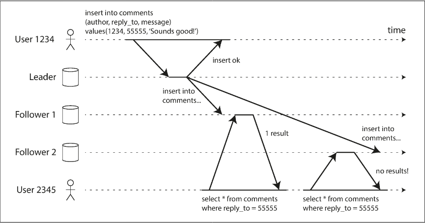
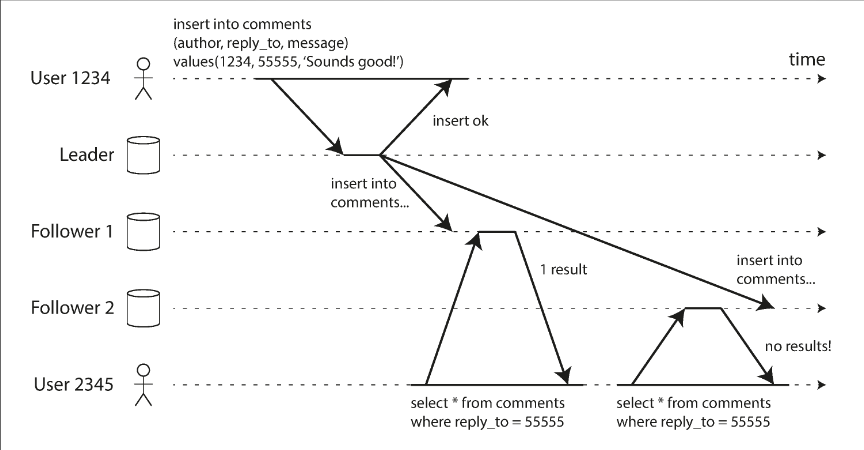
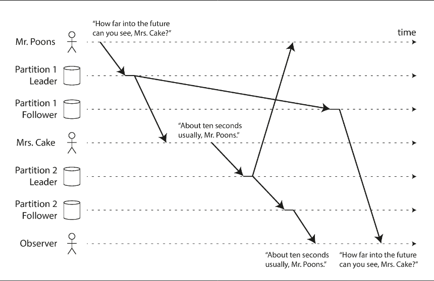

# Chapter 5.2 Replication: Problems with Replication Lag

**Replication** serves three primary purposes: scalability (handling more requests), latency (placing data closer to users), and fault tolerance (node failure protection). In leader-based systems, while writes must flow through a single leader, read-only queries can be distributed across multiple followers.

This **read-scaling architecture** is highly effective for read-heavy workloads typical of web applications. By adding more followers, system capacity increases without overloading the leader. However, this model necessitates asynchronous replication. Synchronous replication across many followers is impractical because a single node failure or network glitch would halt all writes, making the system increasingly fragile as it scales

**Eventual Consistency** occurs when an application reads from an asynchronous follower that has not yet processed the latest writes from the leader. This results in temporary inconsistencies where the same query might yield different results depending on which node is queried. The term implies that while data may be stale momentarily, all replicas will eventually synchronize if writes cease.

**Replication Lag** is the delay between a write occurring on the leader and its reflection on a follower. While typically lasting only fractions of a second, lag can spike to minutes during network congestion or when the system operates near maximum capacity. Significant lag moves inconsistency from a theoretical concern to a functional problem for the application

 

---

 

### Reading Your Own Writes

In systems where users submit data (like comments or profile updates) and immediately view it, a significant issue arises under asynchronous replication. Since writes go to the leader but reads may go to a follower, a user might not see their own update if the follower hasn't caught up yet. This creates the illusion of data loss.

To solve this, we implement Read-after-write consistency (or read-your-writes consistency). This guarantee ensures that a user’s own updates are always visible to them immediately upon a page reload, even if those updates aren't yet visible to other users.

**Implementation Techniques:**

- User-Owned Content Routing: Route reads for data the user can modify (e.g., their own profile) to the leader, while routing other data to followers.
- Time-Based Routing: If most data is editable, track the last update time. Route all reads to the leader for a set duration (e.g., one minute) post-update, or bypass followers whose replication lag exceeds a specific threshold.
- Timestamp Tracking: The client remembers the timestamp of its latest write. The system then ensures reads are only served by replicas updated at least to that timestamp. This can use logical timestamps (sequence numbers) or synchronized system clocks.
- Global Routing: In multi-datacenter setups, any request requiring leader-access must be routed specifically to the datacenter hosting the leader

**Cross-Device Consistency**

Ensuring a user sees an update made on one device (desktop) when they switch to another (mobile) introduces further complexity:

- Centralized Metadata: Timestamps or update logs cannot stay on the device; they must be stored centrally so all user devices can access the latest write status.
- Datacenter Alignment: Since different devices may route to different datacenters via different ISPs, the system must ensure all devices for a specific user are routed to the same datacenter to maintain a consistent view of the leader or up-to-date followers.

 

---

 

### Monotonic Reads

A second anomaly of asynchronous replication occurs when a user observes the system "moving backward in time." This happens when sequential reads are routed to different followers with varying degrees of replication lag. If the first read hits a fast follower and the second hits a lagging one, data that appeared to exist in the first query may seem to have vanished in the second

Monotonic reads is a consistency guarantee that prevents this confusion. It ensures that if a user makes several sequential requests, they will never see older data than what they have already seen. While it does not guarantee the "freshest" data (you might still read a stale value), it ensures the state of the database remains forward-moving from the user's perspective.

The most common way to achieve monotonic reads is through sticky routing:

- Consistent Mapping: Ensure each user always reads from the same replica by hashing the User ID rather than using random load balancing.
- Failover Handling: If the designated replica fails, the system must reroute the user's queries to a new replica, which may require additional logic to ensure the new follower is at least as up-to-date as the previous one

 

---

 

### Consistent Prefix Reads

The third anomaly involves a violation of causality. In a conversation or sequence of events, if an answer arrives before the question, the causal link is broken. This happens in distributed systems when different parts of a conversation are replicated with different lags.

An observer reading from different replicas might see the second part of a sequence (the effect) before the first part (the cause). This is especially prevalent in partitioned (sharded) databases. Because different partitions often operate independently, there is no global ordering of writes. A reader might see a "future" state of one partition while another partition remains in the "past."

Consistent Prefix Reads is a guarantee that if a sequence of writes happens in a specific order, anyone reading those writes will see them appear in that same order.

**Solutions:**

- Write Ordering: If the database applies all writes in a single sequential log, reads will always see a consistent prefix.
- Causal Partitioning: A common solution is to ensure that all causally related writes are sent to the same partition. However, this can be difficult to implement efficiently in complex data models.
- Dependency Tracking: Some advanced algorithms explicitly track causal dependencies to ensure the correct order is maintained during reads. -> [ref](./notes_4.md#detecting-concurrent-writes)

 

---

 

### Solutions for Replication Lag

When designing with eventual consistency, architects must evaluate the impact of replication lag increasing from seconds to minutes or hours. If an increased lag results in a poor user experience, the system must be designed to provide stronger guarantees. Ignoring the reality of asynchronous replication and treating it as synchronous often leads to critical system failures.

While application-level workarounds (like routing specific reads to the leader) can mitigate lag issues, this approach is complex, error-prone, and burdens developers with managing low-level data consistency logic.

Transactions are the primary mechanism for shifting this complexity from the application to the database. They allow the database to "do the right thing," providing stronger guarantees so the application remains simple.

- Single-node transactions: A long-standing, mature technology for local data consistency.
- Distributed transactions: Many scalable, partitioned systems originally abandoned transactions, citing performance and availability costs. However, modern system design is moving toward a more nuanced approach that balances scalability with the reliability of transactional guarantees.
