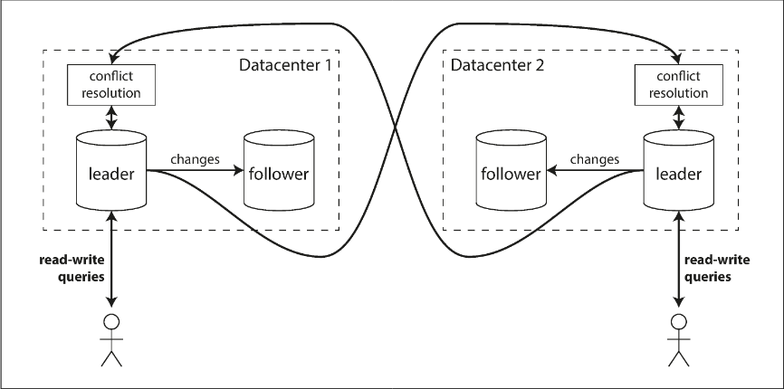
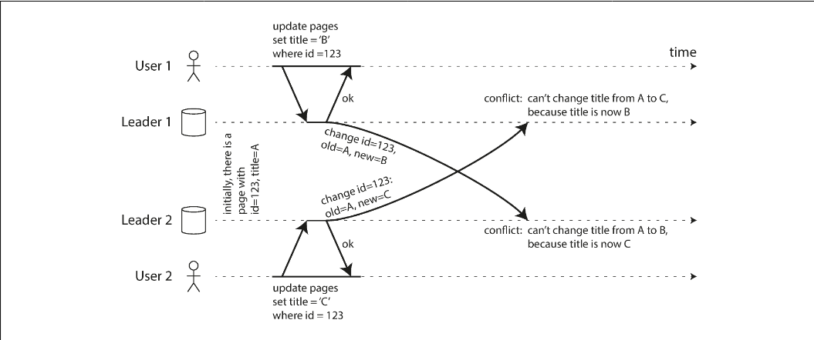
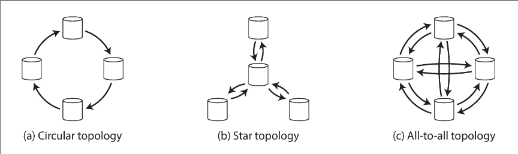
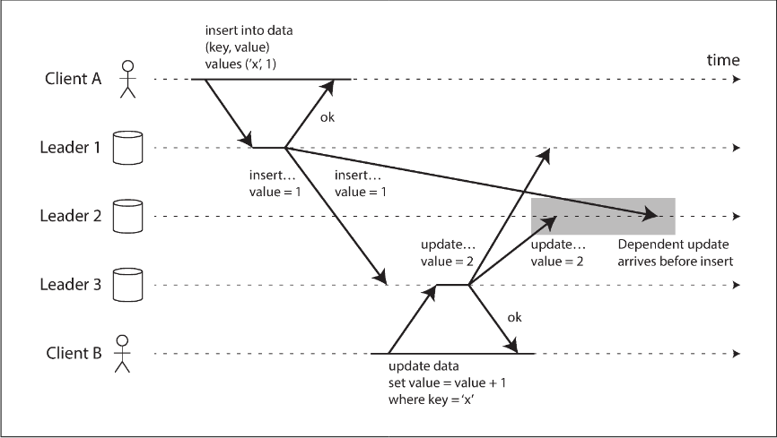

# Chapter 5.2 Replication: Multi-Leader Replication

In a multi-leader configuration (also known as active/active or master–master replication), multiple nodes are permitted to accept write requests. Each node that processes a write forwards that data change to all other nodes in the system. In this architecture, every leader simultaneously functions as a follower to the other leaders.

 

---

 

### Use Cases for Multi-Leader Systems

**Multi-Datacenter Deployment**

While complex to implement within a single datacenter, this setup is highly effective across multiple geographical locations. Each datacenter has its own local leader; writes within that datacenter are processed locally and then replicated asynchronously to leaders in other datacenters.

- Performance: Users experience lower latency because writes are processed at the nearest local datacenter rather than traveling to a single global leader over the internet.
- Outage Tolerance: If one datacenter fails, others continue to operate independently. The failed node catches up on replication once it returns online.
- Network Reliability: Asynchronous replication handles the volatility of the public internet better than single-leader systems, which are highly sensitive to inter-datacenter link interruptions.

**Other cases:**

- Offline Operation: Applications like mobile calendars act as local leaders. Changes made while offline are synced later via asynchronous replication. In this extreme case, every device acts as a miniature "datacenter" with highly unreliable connectivity.
- Collaborative Editing: Real-time tools (e.g., Google Docs) treat each user's local edit as a write to a local replica. To provide a seamless experience without locking the entire document, these systems use multi-leader principles to replicate small changes (keystrokes) asynchronously.

**Drawbacks and Risks**

The primary disadvantage of multi-leader replication is the inevitability of write conflicts, where the same data is modified concurrently in different locations. Resolving these conflicts is technically difficult and can lead to data inconsistencies.

Additionally, multi-leader support is often "retrofitted" into existing databases, leading to unexpected issues with:

- Autoincrementing keys
- Triggers
- Integrity constraints

Because of these complexities and the potential for "surprising interactions," multi-leader replication is generally avoided unless specifically required by the use case.

 

---

 

### Handling Write Conflicts

The primary challenge of multi-leader replication is the occurrence of write conflicts. Unlike single-leader databases—where a second writer is blocked or aborted—multi-leader systems accept both writes, only detecting the discrepancy asynchronously later.

**Conflict Avoidance**

The most effective strategy is to prevent conflicts from happening. By ensuring all writes for a specific record are routed to the same leader (e.g., routing a user's requests to a specific "home" datacenter based on geography), the system functions like a single-leader setup for that data. However, this strategy breaks down if a datacenter fails or a user moves, forcing the system to handle concurrent writes on different leaders.

**Convergent Conflict Resolution**

Because multi-leader systems lack a global ordering of writes, replicas must arrive at a consistent final state through convergence. Common methods include:

- Last Write Wins (LWW): Each write has a unique ID or timestamp; the highest ID wins and others are discarded. While simple, this is prone to data loss.
- Replica ID Ranking: Writes from a higher-numbered replica take precedence.
- Value Merging: Conflicting values are combined (e.g., concatenating "B" and "C" into "B/C").
- Explicit Recording: The conflict is stored in a data structure for later resolution by application code or the user.

**Custom Resolution Logic**

Most tools allow developers to write specific logic to handle conflicts, triggered at different points:

- On Write: A background process (handler) runs as soon as the conflict is detected in the log. It must be fast and cannot interact with the user.
- On Read: Conflicting writes are stored. Upon the next read, the application receives multiple versions of the data to resolve (either automatically or by prompting the user) before writing the result back.

**Automatic Conflict Resolution**

Modern approaches seek to simplify this complexity through specialized data structures:

- CRDTs (Conflict-free Replicated Datatypes): Data structures (sets, maps, counters) that automatically resolve concurrent edits in a predictable way.
- Mergeable Persistent Data Structures: Tracking history explicitly to perform three-way merges, similar to Git.
- Operational Transformation (OT): The algorithm behind tools like Google Docs, specifically designed for concurrent editing of ordered lists (like text characters).

Definition: Conflict A conflict is not always as simple as two users changing the same field. It can be subtle, such as a booking overlap where two leaders accept different meetings for the same room at the same time. These integrity violations often require more complex detection beyond simple row-level versioning

 

---

 

### Multi-Leader Replication Topologies

A replication topology defines the communication paths that writes take to travel from one node to another. While a two-leader setup is straightforward, larger clusters use various configurations to propagate data.

**Common Topology Types**

- Circular Topology: Each node receives writes from one neighbor and forwards them (plus its own) to another. This is the default in MySQL.
- Star Topology: A designated root node receives writes and forwards them to all other nodes. This can be generalized into a Tree structure.
- All-to-All Topology: Every leader sends its writes directly to every other leader. This is the most general and fault-tolerant approach.

_Routing and Reliability_

In circular and star topologies, a write must traverse multiple intermediate nodes. To prevent infinite loops, each write is tagged with the unique identifiers of every node it has passed through. If a node sees its own ID in the tag, it ignores the update.

_Fault Tolerance:_

- Circular/Star: Vulnerable to a single point of failure. If one node fails, it breaks the replication chain for the entire system unless manually reconfigured.
- All-to-All: More resilient, as data can travel along multiple redundant paths.

**Causality and Ordering Issues**

All-to-all topologies are susceptible to causality violations due to varying network speeds. A later update might "overtake" an earlier insert on its way to a specific replica.

The Challenge: In the example above, a replica might receive an update for a row that doesn't yet exist in its local storage because the initial "insert" message is still in transit.

- Timestamps: These are often insufficient for ordering because system clocks are rarely perfectly synchronized.
- Version Vectors: A more robust technique used to track dependencies and ensure causal ordering (discussed in later sections).
- Implementation Gaps: Many current tools (like PostgreSQL BDR or Tungsten Replicator) have limited or no support for automatic causal ordering or conflict detection in these scenarios.
