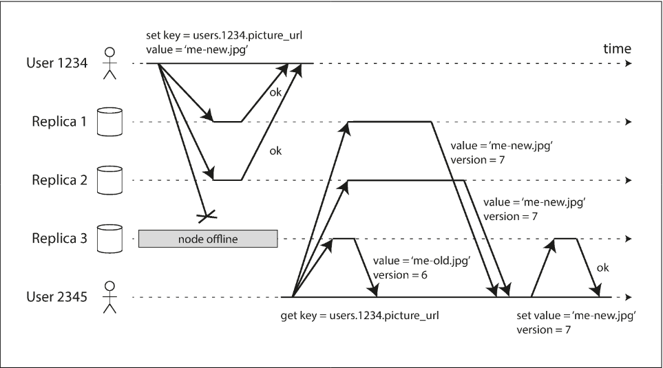
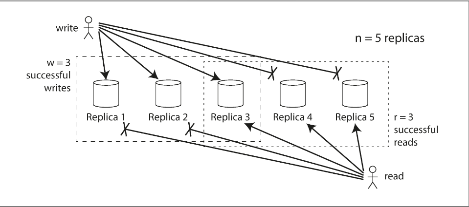
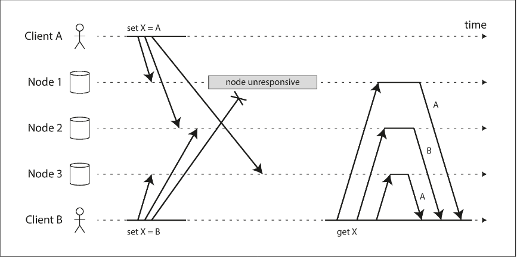
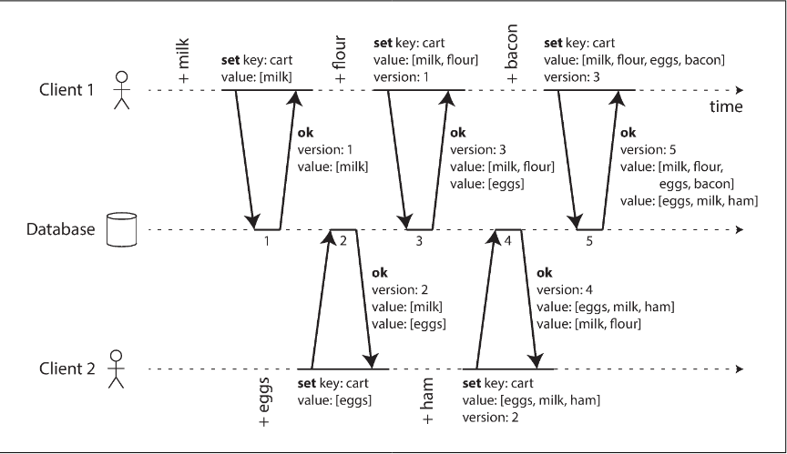
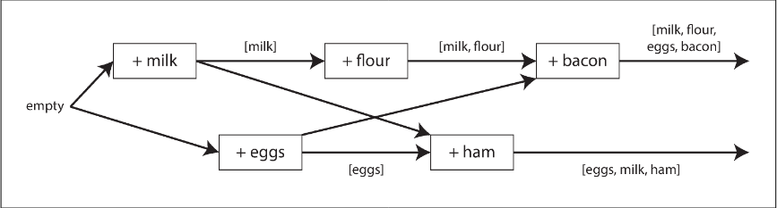

# Chapter 5.4 Replication: Leaderless Replication

In leaderless replication, the traditional concept of a primary node (leader) is abandoned. Instead of routing all writes through a single node that dictates execution order, any replica can directly accept write requests from clients. This architecture, often referred to as Dynamo-style after Amazon’s Dynamo system, is utilized by popular datastores such as Riak, Cassandra, and Voldemort.

Key Characteristics of Leaderless Systems:

- Decentralized Writes: Clients send write requests to multiple replicas simultaneously, or to a coordinator node that forwards them without enforcing a global write order.
- Absence of Ordering: Unlike leader-based systiems, there is no central authority to determine the sequence of operations, which significantly impacts how data consistency is managed.
- Implementation Variants: The responsibility of multi-node communication can lie with the client application itself or a designated proxy/coordinator node.

 

---

 

### Writing to the Database When a Node Is Down

In leaderless systems, availability is maintained during node outages without requiring failover. When a node is offline, it simply misses writes, and the system relies on subsequent mechanisms to restore consistency.

**Handling Outdated Data**

When a failed node returns to service, it contains stale data. To ensure clients receive the most recent information, the system uses two primary recovery strategies:

- Read Repair: When a client reads from multiple replicas in parallel, it detects stale values using version numbers. The client then writes the newer version back to the lagging replica. This is highly effective for frequently accessed data.
- Anti-Entropy Process: A background service that constantly compares replicas for data differences and synchronizes them. Unlike replication logs, this process is unordered and may involve significant propagation delays.

**Quorums for Consistency**

The reliability of a leaderless system is defined by its Quorum configuration, which determines the minimum number of "votes" required for an operation to be valid.

Key Definitions:

- `n`: The number of replicas.
- `w`: The number of nodes that must confirm a write for it to be successful.
- `r`: The minimum number of nodes queried for a read.

To guarantee that a read returns the most recent write, the system must satisfy the Quorum Condition: `w + r > n`

This inequality ensures that the set of nodes written to and the set of nodes read from overlap by at least one node, which will host the latest version.

**Quorum Configuration Trade-offs**

The parameters `n`, `w`, and `r` are typically configurable to balance performance and fault tolerance:

- Common Setup: `n=3`, `w=2`, `r=2` or `n=5`, `w=3`, `r=3`. This allows the system to tolerate the failure of `n / 2` nodes.
- Read-Heavy Workload: Setting w=n and r=1 speeds up reads but means a single node failure will block all writes.
- Availability: If the number of available nodes drops below w or r, the database returns an error for that operation. The system does not distinguish between a crashed node or a network interruption; it only requires a success response

 

---

 

### Limitations of Quorum Consistency

While the quorum condition `w + r > n` theoretically guarantees that at least one node in a read request overlaps with the latest write, it is not an absolute guarantee of consistency. In practice, leaderless systems are typically optimized for eventual consistency.

**Edge Cases for Stale Reads**

Even when the quorum condition is met, several scenarios can result in reading outdated data:

- Sloppy Quorums: If the system uses "sloppy" quorums, writes might be stored on temporary nodes that do not overlap with the nodes designated for reads.
- Concurrent Operations: If a write occurs simultaneously with a read, the read may return either the old or new value. If two writes happen concurrently, conflict resolution (like Last Write Wins) may discard updates due to clock skew.
- Partial Failures: If a write succeeds on some nodes but fails on enough to stay below w, the successful writes are not rolled back. Future reads may still see that "failed" data.
- Durability Issues: If a node with the latest value fails and restores its data from a stale replica, the total count of nodes with the newest version can drop below w.

_Relaxing the Quorum_

If `w + r ≤ n`, the quorum condition is not satisfied.

- Trade-off: This configuration significantly increases the risk of stale reads.
- Benefit: It offers lower latency and higher availability, as the system requires fewer nodes to respond successfully before completing an operation.

**Monitoring Staleness**

Measuring how far a replica has fallen behind is more complex in leaderless systems than in leader-based ones because there is no global ordering of writes.

- Leader-based: Lag is easily measured by comparing the log positions of the leader and followers.
- Leaderless: Without a fixed write order, monitoring is difficult. If a system relies solely on read repair (without anti-entropy), infrequently accessed data can remain stale indefinitely.
- Operational Need: While "eventual consistency" is a vague term, operators should ideally quantify staleness using metrics or predictive research to ensure system health and avoid "ancient" data.

 

---

 

### Sloppy Quorums and Hinted Handoff

In a large cluster, network partitions may prevent a client from connecting to the specific n nodes assigned to a piece of data. Sloppy Quorums and Hinted Handoff are mechanisms designed to prioritize write availability over strict consistency in these scenarios.

_Sloppy Quorums_

A Sloppy Quorum occurs when the system accepts writes even if the designated "home" nodes are unreachable. Instead of failing, the system writes the data to reachable nodes that are not among the original n replicas.

- Benefit: Increases write availability; as long as any w nodes are reachable, the write succeeds.
- Trade-off: It breaks the quorum guarantee (w+r>n). Since the data is stored on "temporary" nodes, a subsequent read of the r "home" nodes will not see the latest value until it is transferred back.
- Purpose: It is an assurance of durability (the data is safely stored somewhere) rather than a guarantee of immediate consistency.

_Hinted Handoff_

Once the network interruption is resolved or the "home" nodes return online, the temporary nodes deliver the missed writes to the correct locations. This process is called Hinted Handoff.

**Multi-Datacenter Operation**

Leaderless replication is well-suited for multi-datacenter setups because it naturally handles high latency and network interruptions.

- Local Quorums: To maintain low latency, clients usually send writes to all replicas across all datacenters but only wait for a quorum of acknowledgments (w) from their local datacenter.
- Asynchronous Cross-DC Replication: Writes to remote datacenters typically happen asynchronously. This ensures that a failure in the cross-datacenter link does not block local operations.

 

---

 

### Detecting Concurrent Writes

In leaderless replication, concurrent writes occur when multiple clients write to the same key simultaneously. Because nodes may receive these writes in different orders due to network latency or partial failures, the replicas must have a mechanism to converge toward the same value to achieve eventual consistency.

**Last Write Wins (LWW)**

One method for achieving convergence is Last Write Wins, where the system attaches a timestamp to every write and keeps only the most "recent" one, discarding others.

- Pros: Simple and ensures all replicas eventually store the same value.
- Cons: High risk of data loss, as concurrent (and sometimes non-concurrent) writes are silently dropped.
- Best Practice: LWW is only truly safe if keys are immutable (e.g., using a UUID for every write) so that concurrent updates to the same key never occur.

**The "Happens-Before" Relationship**

To manage conflicts without losing data, we must define Concurrency: two operations are concurrent if neither "knows" about the other. If one operation builds upon another, we say the first happens before the second (a causal dependency).

The versioning algorithm for capturing dependencies works as follows:

1. The server maintains a version number for every key, incrementing it with each write.
2. Clients must read a key before writing to obtain the current version number and values.
3. When writing, the client sends the new value along with the version number from the prior read.
4. The server overwrites all values with that version number or lower (as they have been merged) but keeps any values with higher version numbers, as those represent concurrent writes.

**Merging Siblings and Deletions**

When the server detects concurrent writes, it stores them as siblings. It is then the client's responsibility to merge these values (e.g., taking a union of items in a shopping cart).

- Tombstones: To support deletions during a merge, the system cannot simply remove an item; it must leave a "tombstone" (a deletion marker) to ensure the item doesn't reappear when merging with a sibling that hasn't seen the deletion.
- CRDTs: Conflict-free Replicated Data Types are specialized data structures (like those used in Riak) that can automatically merge siblings and handle deletions correctly without complex application-level logic.

**Version Vectors**

In a multi-replica leaderless cluster, a single version number is insufficient. Instead, the system uses a Version Vector: a collection of version numbers, one for every replica.

- Function: Each replica increments its own version during a write and tracks the versions it has seen from others.
- Goal: This allows the database to distinguish between causal overwrites and true concurrent writes across different nodes, ensuring that no data is lost even if a client reads from one replica and writes back to another
