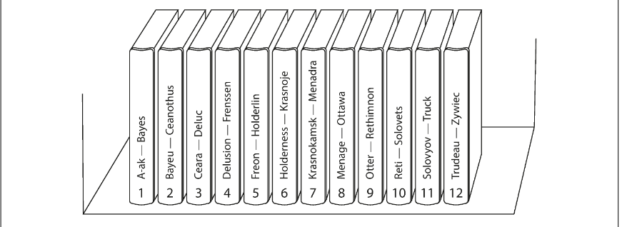
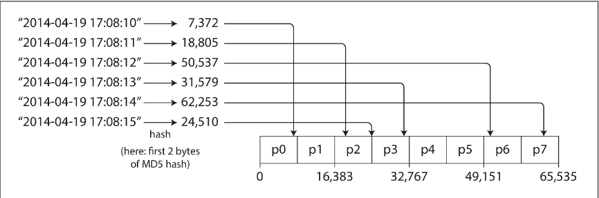

# Chapter 6.1 Partitioning: Partitioning of Key-Value Data

Partitioning (sharding) aims to distribute data and query load evenly across nodes to achieve linear scalability. In an ideal setup, 10 nodes should provide 10 times the storage and throughput of a single node.

- Skew: Unfair partitioning where some nodes carry significantly more data or query volume than others, neutralizing the benefits of a multi-node system.
- Hot Spot: A specific partition under disproportionately high load that becomes the system's performance bottleneck.

While assigning records randomly avoids hot spots and ensures even distribution, it is inefficient for reads because the system cannot know which node holds a specific record, requiring all nodes to be queried. A more effective approach uses a Key-Value model, where records are mapped to nodes via their primary key—similar to how an encyclopedia is sorted alphabetically—enabling fast, targeted lookups

 

---

 

### Partitioning by Key Range

Key Range Partitioning assigns a continuous range of keys (from a minimum to a maximum) to each partition. By knowing the boundaries between these ranges, the system can determine which partition holds a specific key and route requests directly to the correct node.

- Boundary Adaptation: Boundaries are rarely spaced evenly (e.g., every two letters of the alphabet) because data density varies. To ensure an even distribution of data, partition boundaries must adapt to the data's actual spread, either manually or automatically.
- Efficiency: Because keys are kept in sorted order within partitions, this method is highly optimized for range scans. This allows for fetching multiple related records—such as sensor data within a specific time window—in a single query.
- Hot Spots: The primary downside occurs when keys are sequential (like timestamps). If measurements are written as they happen, all writes hit the "current" partition simultaneously, creating a hot spot while other nodes remain idle.
- Mitigation: To avoid write bottlenecks, you can use a composite key. For example, prefixing a timestamp with a sensor name spreads writes across different partitions, though it requires performing separate range queries for each prefix when retrieving data

 

---

 

### Partitioning by Hash of Key

Partitioning by Hash of Key uses a hash function (such as MD5 or FNV) to map keys to partitions, transforming skewed input data into a uniform distribution. Each partition is assigned a range of hashes, and any key whose hash falls within that range is stored on the corresponding node.

- Uniformity: Hashing ensures that keys are spread fairly across nodes, even if the original keys are very similar. This approach can use evenly spaced boundaries or consistent hashing to assign partitions.
- Range Query Trade-off: The main disadvantage is the loss of efficient range scans. Since adjacent keys are scattered across different partitions, a range query may need to be sent to all nodes in the cluster.
- Stability: Partitioning requires a hash function that is consistent across different processes. Many built-in language functions (like Java’s `hashCode()`) are unsuitable because they may return different values for the same key in different environments.

Concatenated Indexes (The Cassandra Hybrid): Cassandra provides a middle ground by using compound primary keys. Only the first column is hashed to determine the partition, while subsequent columns are used to sort the data within that partition. This allows the system to perform efficient range scans as long as a fixed value is provided for the hashed column—for example, retrieving all sensor readings for a specific `sensor_id` across a range of timestamps

 

---

 

### Skewed Workloads and Relieving Hot Spots

Even with hash partitioning, hot spots can occur when a single key receives extreme traffic (e.g., a celebrity user on social media). Since identical keys always hash to the same value, all requests for that key hit a single node, creating a bottleneck that distributed hashing cannot fix.

- Key Salting: A manual technique where a random number (e.g., two decimal digits) is appended to the key. This splits a single hot key into 100 distinct keys, spreading the write load across multiple partitions.
- The Trade-off: While salting relieves write pressure, it complicates reads. A client must read all 100 variations of the key and merge the results. This approach also requires "bookkeeping" to track which specific keys are being salted, as applying it to every key would create unnecessary overhead.

**Modern Techniques (2026 Context)**

Since the original text was written, several automated solutions have emerged to handle skewed workloads more gracefully:

- Automatic Split-for-Heat: Modern databases like AWS DynamoDB and CockroachDB monitor per-key or per-range traffic. If a partition becomes "hot," the system automatically splits that range or reallocates throughput (Adaptive Capacity) without manual intervention or key salting.
- Load-Based Rebalancing: Systems like TiDB or Bigtable detect read/write spikes and move hot ranges to less-utilized nodes in real-time to balance the CPU and I/O load across the cluster.
- Write-Through Caching & Request Collapsing: Using an in-memory layer (like Redis) can absorb massive read spikes. Techniques like "request collapsing" ensure that multiple concurrent reads for the same hot key result in only a single query to the underlying database.
- Adaptive Query Execution (AQE): In big data processing (e.g., Apache Spark), engines can now detect skew during "shuffle" operations and automatically split large partitions into smaller sub-partitions to prevent straggler nodes from slowing down the entire job
