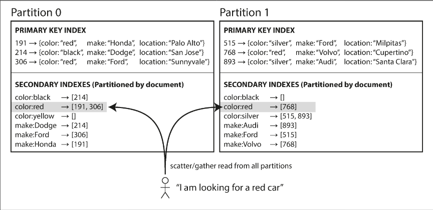
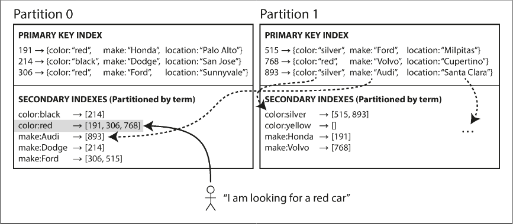

# Chapter 6.2 Partitioning: Partitioning and Secondary Indexes

Partitioning and Secondary Indexes

While partitioning by primary key is straightforward, secondary indexes—which allow searching by non-unique attributes like color or owner—do not map neatly to partitions. These indexes are essential for most data models but introduce significant architectural complexity. There are two primary strategies for handling them: document-based and term-based partitioning.

**Partitioning Secondary Indexes by Document**

In a document-partitioned index (also known as a local index), each partition maintains its own secondary index covering only the documents stored within that specific partition.

- Writes: Highly efficient. When a document is added or updated, the database only needs to update the partition containing that document's ID.
- Reads: Requires a scatter/gather approach. Since a specific value (e.g., "red cars") could exist in any partition, the query must be sent to every partition. The results are then merged before being returned to the user.
- Trade-offs: This method is prone to "tail latency amplification" because the overall response time is limited by the slowest partition. However, it is the standard approach for systems like MongoDB, Cassandra, and Elasticsearch.

**Partitioning Secondary Indexes by Term**

A term-partitioned index (or global index) covers data across all partitions but is itself partitioned independently of the primary keys. The "term" (the value being indexed, such as color:red) determines which index partition the entry resides in.

- Reads: Much more efficient than local indexes. A client only needs to request data from the specific partition responsible for the term being searched, avoiding the scatter/gather overhead.
- Writes: Slower and more complex. A single document update might involve multiple index partitions located on different nodes (e.g., one partition for color and another for make).
- Consistency: To maintain performance, updates to global indexes are usually asynchronous. This means there may be a brief delay before a write is reflected in the search results, as seen in systems like Amazon DynamoDB or Riak
