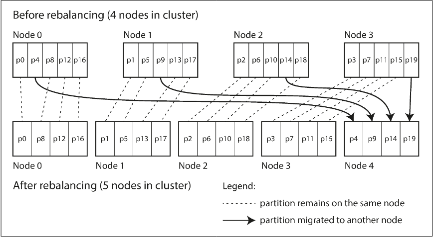

# Chapter 6.3 Partitioning: Rebalancing Partitions

Rebalancing is the process of moving data and requests from one node to another to accommodate changes in the cluster, such as increased query throughput, growing dataset sizes, or node failures. A successful rebalancing strategy must share the load fairly, maintain database availability during the process, and minimize unnecessary data movement to reduce network and disk I/O.

**Strategies for Rebalancing**

Standard "hash mod _N_" approaches (where _N_ is the number of nodes) are ineffective because adding or removing a single node causes the majority of keys to move, making rebalancing prohibitively expensive. Instead, modern systems use the following strategies:

- Fixed number of partitions: The database is divided into many more partitions than nodes (e.g., 1,000 partitions for 10 nodes). When a new node joins, it "steals" existing partitions from other nodes until the load is balanced. The number of partitions remains constant; only their assignment to nodes changes.
- Dynamic partitioning: Used primarily in key-range partitioned databases like HBase. When a partition exceeds a configured size, it is automatically split into two; if it shrinks significantly, it may be merged with a neighbor. This ensures the number of partitions adapts to the total data volume, though an empty database may suffer from a "single-node bottleneck" unless it is pre-split.
- Partitioning proportional to nodes: Systems like Cassandra maintain a fixed number of partitions per node. As the cluster grows by adding nodes, the partitions become smaller. This keeps the size of each individual partition relatively stable regardless of total data volume.

**Operations: Automatic or Manual Rebalancing**

While fully automatic rebalancing is convenient, it can be unpredictable and dangerous. If a node is merely slow or overloaded, automatic failure detection might mistakenly assume it has failed and trigger a massive data migration. This additional load can lead to cascading failures across the remaining nodes.

For this reason, many systems opt for manual or human-in-the-loop rebalancing. In this model, the database suggests a new partition assignment, but an administrator must explicitly approve or commit the change. This prevents "operational surprises" and ensures rebalancing happens during appropriate maintenance windows
