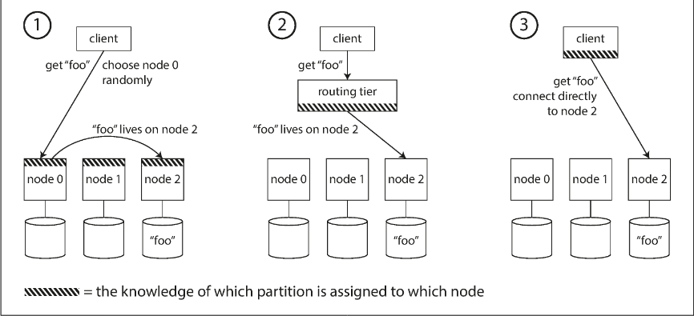
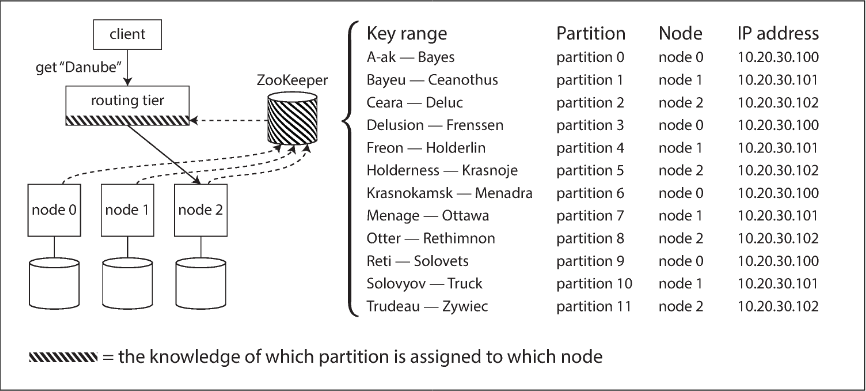

# Chapter 6.4 Partitioning: Request Routing

Once a dataset is partitioned across multiple nodes, the system must solve the service discovery problem: determining which specific node (IP address and port) should handle a request for a particular key. As partitions are rebalanced and moved, these mappings change, requiring a reliable mechanism to keep routing information up to date across the cluster.

**High-Level Routing Strategies**

There are three primary architectural approaches to directing client requests:

- Request Forwarding: The client contacts any node (often via a simple round-robin load balancer). If that node doesn't own the requested partition, it forwards the request to the correct node and returns the response.
- Routing Tier: All requests first hit a dedicated, partition-aware load balancer (routing tier). This tier identifies the correct node and forwards the request but does not process data itself.
- Client-Side Awareness: The client is "partition-aware" and maintains the mapping of partitions to nodes, allowing it to connect directly to the correct destination without intermediaries.

**Tracking Partition Changes**

Keeping all components in agreement about partition assignments is difficult and often relies on one of two coordination models:

- Coordination Services: Many systems (Kafka, HBase, SolrCloud) use an external service like ZooKeeper to maintain the authoritative metadata. The routing tier or clients subscribe to ZooKeeper for updates; when a partition moves, ZooKeeper notifies subscribers to update their routing tables.
- Gossip Protocols: Used by Cassandra and Riak, this decentralized approach allows nodes to share cluster state changes directly with each other. This eliminates the need for an external coordination service but increases the internal complexity of the database nodes.

In many implementations, even when using a routing tier or request forwarding, clients still use DNS to find the initial IP addresses of the entry points (the nodes or the routing tier), as these addresses change less frequently than the partition assignments themselves.

