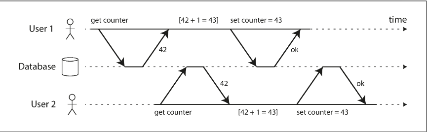
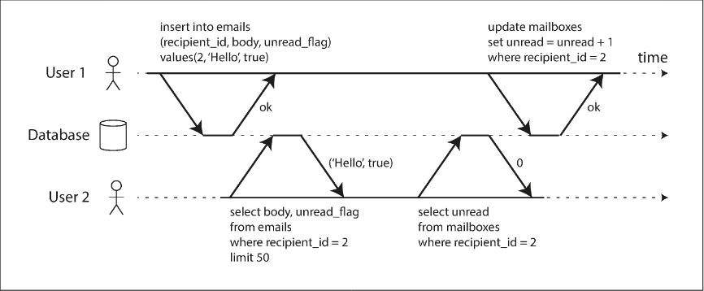
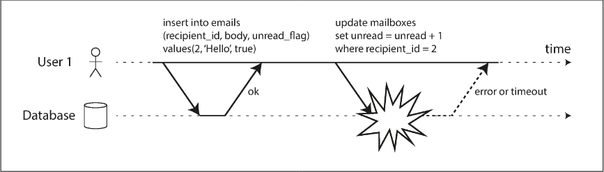

# Chapter 7.1 Transactions: The Slippery Concept of a Transaction

Transactions provide safety guarantees that allow applications to treat several writes as a single unit of work. While the NoSQL movement initially abandoned transactions for better scalability and availability, modern system design views them as a technical trade-off rather than a performance binary.

 

---

 

### The Meaning of ACID

ACID is a set of fault-tolerance mechanisms used to establish precise database terminology, though its implementation varies significantly between vendors. Its counterpart, BASE (Basically Available, Soft state, Eventual consistency), is much more vague and generally serves as a definition for systems that are "not ACID."

- Atomicity: Refers to _abortability_. If a fault occurs (process crash, network failure, etc.) before a transaction completes, all writes made so far are discarded. This "all-or-nothing" guarantee simplifies error handling by allowing the application to safely retry a transaction without risking duplicate or partial data.
- Consistency: A requirement that the database remains in a "good state" according to application-specific invariants (e.g., balanced credits and debits). Unlike other ACID properties, consistency is primarily the application's responsibility, as the database can only check limited constraints (like uniqueness or foreign keys).
- Isolation: Ensures that concurrently executing transactions are isolated from one another to prevent race conditions. Serializability is the strongest form of isolation, where the result of concurrent transactions is the same as if they had run one after another. However, many databases use weaker isolation levels (like snapshot isolation) to avoid performance penalties

- Durability: A promise that once a transaction is successfully committed, the data will not be lost even in the event of a hardware failure or crash. In single-node systems, this usually involves writing to non-volatile storage and using a write-ahead log; in distributed systems, it involves replication to multiple nodes.

_The Reality of Durability:_ No technique provides absolute durability. Risks such as correlated power outages, SSD firmware bugs, disk corruption, and loss of power to disconnected SSDs mean that durability is a matter of risk reduction. Effective systems combine multiple strategies, including disk writes, remote replication, and historical backups.

 

---

 

### Single-Object and Multi-Object Operations

In ACID, atomicity (abortability) and isolation (concurrency protection) are primarily designed for multi-object transactions, where several rows or records must be kept in sync. Without these, anomalies occur—for example, an email application might show a new unread message in the inbox while the unread counter remains at zero because the two updates weren't coordinated.

While relational databases group operations via a connection-based BEGIN and COMMIT block, many non-relational databases lack this grouping, meaning a multi-key update might succeed for some items and fail for others.
Single-Object Writes

Most storage engines provide atomicity and isolation at the single-object level (e.g., a single JSON document or key-value pair). This prevents issues like reading a half-written document or experiencing data corruption during a power failure. Databases often provide "lightweight" atomic operations like increments or compare-and-set (CAS) to prevent lost updates on a single record. However, these are not transactions in the traditional sense because they cannot coordinate changes across multiple distinct objects.

True multi-object transactions remain essential even for NoSQL stores:

- Foreign Keys/Graphs: Maintaining valid references between related records.
- Denormalization: Keeping redundant data (like summary counters) in sync with primary records.
- Secondary Indexes: Ensuring that an update to a value is reflected in all associated indexes simultaneously.

Handling Errors and Aborts

A defining feature of ACID is the ability to abort and safely retry. If the database cannot fulfill its guarantees, it abandons the transaction entirely rather than leaving it half-finished. This "all-or-nothing" approach simplifies application logic, though retrying is not without challenges:

- Idempotence: If a commit succeeds but the network fails before the client receives the acknowledgment, retrying can result in duplicate data unless deduplication is used.
- Overload: Constant retries during high load can create a "retry storm," worsening system congestion.
- Side Effects: Transactions involving external actions (like sending an email) cannot be easily undone by a database abort.
- Transient vs. Permanent Errors: Retries only help with transient issues (deadlocks, network glitches); permanent errors (constraint violations) will fail regardless of how many times they are retried
