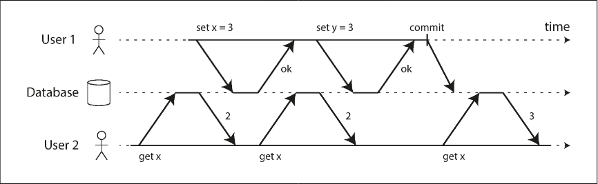
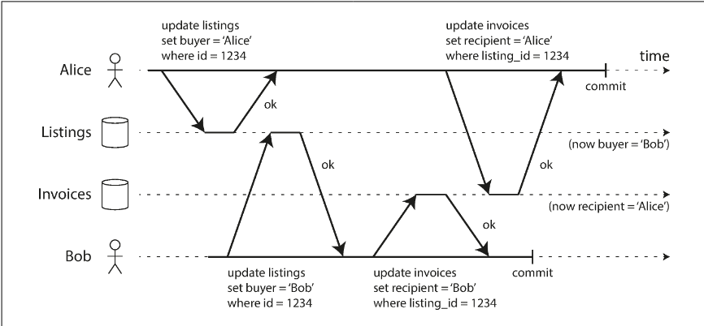
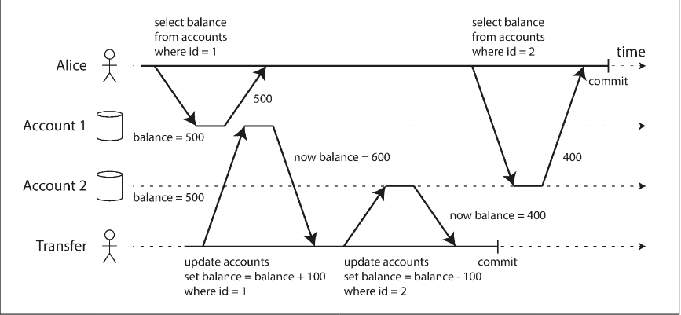
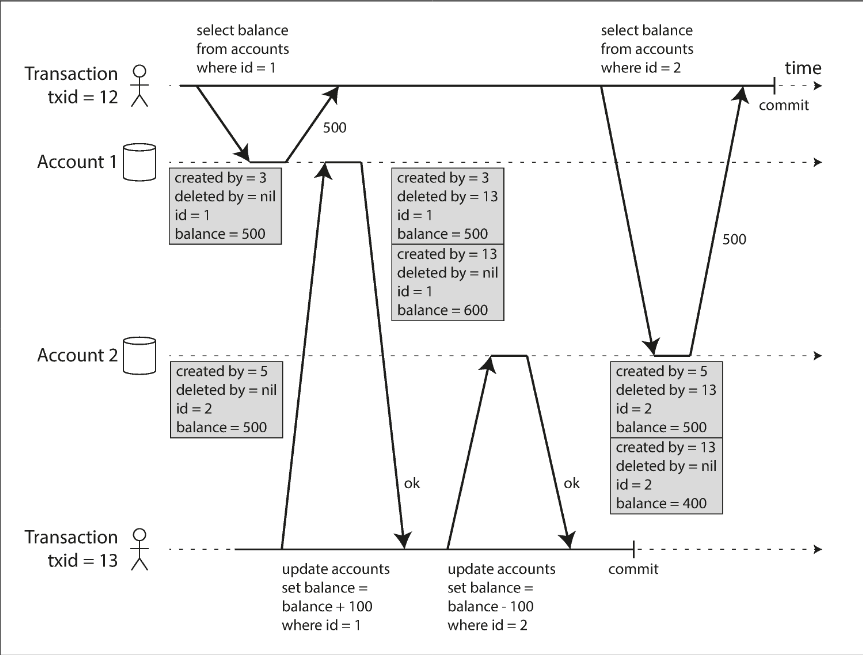
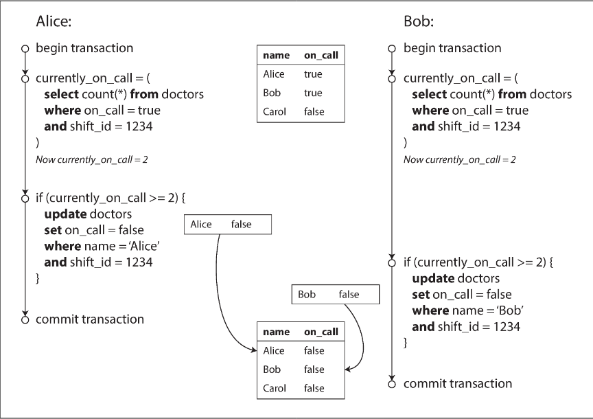

# Chapter 7.2 Transactions: Weak Isolation Levels

Concurrency issues, or race conditions, arise when multiple transactions attempt to access or modify the same data simultaneously. These bugs are notoriously difficult to find because they are timing-dependent and often impossible to reproduce in testing. While serializable isolation theoretically eliminates these issues by making transactions appear to run one at a time, it carries a heavy performance penalty.

In practice, many databases use weak isolation levels. These provide a balance between performance and correctness by protecting against some, but not all, concurrency issues. Even systems labeled as ACID often default to these weaker levels, meaning developers must understand specific race conditions to prevent data corruption or financial loss.

<br>

---

<br>

### Read Committed

Read Committed is the most basic isolation level and is the default for many popular databases like PostgreSQL, Oracle, and SQL Server. It provides two primary guarantees:

- No Dirty Reads: A transaction will only see data that has been successfully committed.
- No Dirty Writes: A transaction will only overwrite data that has been successfully committed.

**Dirty Reads**

A dirty read occurs when a transaction sees uncommitted data from another ongoing transaction. Preventing this is crucial for two reasons:

- Inconsistency: A transaction might see a "partial" update where some objects are changed but others are not, leading to incorrect logic or user confusion.
- Rollbacks: If a transaction aborts, any data it wrote is discarded. Allowing dirty reads would mean a transaction could act on data that technically "never existed."



**Dirty Writes**

A dirty write occurs when a later write overwrites a value that has not yet been committed by an earlier transaction. By delaying the second write until the first transaction finishes, the database prevents mishaps where multiple related objects end up in an inconsistent state (e.g., one buyer is listed on the car entry, but another buyer is listed on the invoice).



- Note: Read committed does not prevent all race conditions, such as the "lost update" problem where two transactions concurrently increment the same counter.

**Implementation**

Most databases implement Read Committed using a combination of locking and versioning:

- Row-level locks: To prevent dirty writes, a transaction must acquire a lock on a specific object before modifying it. It holds this lock until it commits or aborts.
- Value Versioning: To prevent dirty reads without slowing down performance, databases typically avoid using read locks. Instead, they remember both the old committed value and the new value currently being written. Any concurrent readers are simply given the old committed value until the new one is officially committed.

<br>

---

<br>

### Snapshot Isolation and Repeatable Read

While Read Committed prevents dirty reads and writes, it remains vulnerable to read skew (also known as a nonrepeatable read). This occurs when a transaction reads different parts of the database at different times and sees inconsistent states because another transaction committed a change in between those reads.



For example, if Alice transfers money between two accounts while she is viewing her balances, she might see one account before the transfer and the other after, making it appear as if money has vanished. While often temporary for a user, read skew is fatal for:

- Backups: A large backup takes hours; if the data is inconsistent, the restored database will be permanently corrupted.
- Analytics and Integrity Checks: Long-running queries that scan the database will return nonsensical results if the data changes mid-execution.

**Multi-Version Concurrency Control (MVCC)**

Snapshot Isolation solves read skew by ensuring each transaction sees a consistent snapshot of the database—frozen at the moment the transaction started. The guiding principle is that readers never block writers, and writers never block readers. This is implemented using Multi-Version Concurrency Control (MVCC), where the database maintains several committed versions of an object simultaneously.

In an MVCC system (like PostgreSQL):

- Transaction IDs (txid): Each transaction is assigned a unique, increasing ID.
- Version Tracking: Each row has a created_by field (the txid of the inserter) and a deleted_by field (initially empty).
- Immutable Updates: An update is treated as a deletion of the old version and an insertion of a new version.
- Garbage Collection: A background process eventually deletes rows marked for deletion once no active transactions can see them.



**Visibility Rules**

To maintain the snapshot, the database applies strict visibility rules. A transaction can see an object only if:

- The transaction that created the object had already committed when the current transaction started.
- The object is not marked for deletion, or the transaction that deleted it had not yet committed when the current transaction started.

Everything else—including writes from transactions with a later ID or currently in-progress transactions—is ignored.

_Naming and the SQL Standard_

There is significant industry confusion regarding the name of this level. The SQL standard, defined in 1975, does not include "Snapshot Isolation." Consequently, many databases (PostgreSQL and MySQL) call their implementation of snapshot isolation Repeatable Read to claim standard compliance.

However, because the standard’s definition is famously ambiguous, "Repeatable Read" means different things in different databases. For instance, in Oracle, snapshot isolation is called "Serializable," while in DB2, "Repeatable Read" actually refers to true Serializability.

<br>

---

<br>

### Preventing Lost Updates

The Lost Update problem is a specific type of write-write conflict that occurs during a read-modify-write cycle. If two transactions concurrently read the same data, modify it, and write it back, the second write may overwrite ("clobber") the first modification because it was based on the original, unmodified value. This is common in scenarios like incrementing counters or two users editing the same wiki page.

There are several strategies to prevent this:

**Atomic Write Operations**

This is usually the best solution if the logic can be expressed as a single database operation. It removes the need for an application-side read-modify-write cycle. Atomic operations are typically implemented by the database acquiring an exclusive lock on the object when it is read.

`UPDATE counters SET value = value + 1 WHERE key = 'foo';`

**Explicit Locking**

If the application logic is too complex for an atomic operation (e.g., validating a move in a multiplayer game), the application can explicitly lock the objects it intends to update. This forces other transactions to wait until the current read-modify-write cycle is complete.

```
BEGIN TRANSACTION;

SELECT * FROM figures
  WHERE name = 'robot' AND game_id = 222
  FOR UPDATE;

-- Check whether move is valid, then update the position
-- of the piece that was returned by the previous SELECT.
UPDATE figures SET position = 'c4' WHERE id = 1234;

COMMIT;

```

The `FOR UPDATE` clause ensures the database locks all returned rows. However, this relies on developers remembering to add locks, making it prone to human error.

**Automatically Detecting Lost Updates**

Instead of forcing sequential execution, some databases allow parallel execution but abort a transaction if a lost update is detected. An advantage of this approach is that databases can perform this check efficiently in conjunction with snapshot isolation.

- Supported by: PostgreSQL (Repeatable Read), Oracle (Serializable), SQL Server (Snapshot Isolation).
- Not Supported by: MySQL/InnoDB (Repeatable Read).

**Compare-and-Set**

In systems without transactions (or with weak guarantees), you can use a compare-and-set approach. The update is only applied if the value in the database has not changed since it was last read.

```
-- Update only if the content matches what we previously read
UPDATE wiki_pages SET content = 'new content'
  WHERE id = 1234 AND content = 'old content';

```

_Note: This may fail if the `WHERE` clause reads from an old snapshot rather than the current state._

**Conflict Resolution and Replication**

In replicated databases (multi-leader or leaderless), locks and compare-and-set operations often do not apply because there is no single up-to-date copy of the data.

- Siblings/Merging: A common approach is to allow concurrent writes to create conflicting versions ("siblings") which are resolved and merged later by application code or special data structures (e.g., Riak datatypes).
- Last Write Wins (LWW): Many replicated databases default to LWW, which simply discards concurrent writes, making it prone to lost updates.

<br>

---

<br>

### Write Skew and Phantoms

Race conditions are not limited to dirty writes or lost updates. A subtler anomaly called Write Skew occurs when two transactions read the same objects but update different objects.

The Doctor On-Call Example Imagine a hospital system requiring at least one doctor to be on-call. Alice and Bob are currently on-call. Both decide to leave, and their transactions run concurrently:

- Both query the database and see that two doctors are currently on-call.
- The application logic confirms that 2−1=1, so it is safe for one to leave.
- Alice updates her record to go off-call. Bob updates his record to go off-call.
- Both transactions commit.

Because of Snapshot Isolation, both saw a valid state when they checked. However, the final state violates the requirement (zero doctors left).



**Characterizing Write Skew**

Write skew is a generalization of the lost update problem.

- Lost Update: Multiple transactions update the same object.
- Write Skew: Multiple transactions read the same objects but update different objects (e.g., Alice updates her own row, Bob updates his).

Standard solutions for lost updates often fail here:

- Atomic single-object operations cannot handle multi-object constraints.
- Most implementations of Snapshot Isolation or Repeatable Read do not automatically detect write skew.

Prevention:

- Serializable Isolation: The most effective automatic solution.
- Database Constraints: Triggers or materialized views can sometimes enforce multi-object constraints.
- Explicit Locking: If the rows exist, you can lock them using `FOR UPDATE`. In the doctor example, locking the rows of the currently on-call doctors would force the second transaction to wait

**Phantoms**

Many write skew scenarios follow a specific pattern:

- Select: A query checks for the presence or absence of rows matching a condition (e.g., "are there any bookings for this room at 12:00?").
- Decision: Application logic proceeds based on the result.
- Write: The application inserts, updates, or deletes a row.

A Phantom occurs when a write in one transaction changes the result of a search query in another transaction.

The danger arises when the initial query checks for the absence of rows. If no rows are returned, there is nothing for `SELECT FOR UPDATE` to lock. The phantom (the new row being inserted by a concurrent transaction) slips through because it didn't exist when the lock was attempted.

**Materializing Conflicts**

If you cannot use Serializable isolation and have no rows to lock (due to phantoms), you can use a strategy called Materializing Conflicts.

This involves artificially introducing rows into the database solely for locking purposes.

- Example: For a meeting room system, create a table with rows for every possible time slot (e.g., 15-minute increments).
- Mechanism: To book a room, a transaction must first lock the relevant "time slot" rows. This turns a phantom problem into a concrete lock conflict.

This approach is widely considered a last resort because it leaks concurrency control details into the application's data model and is error-prone to maintain.
