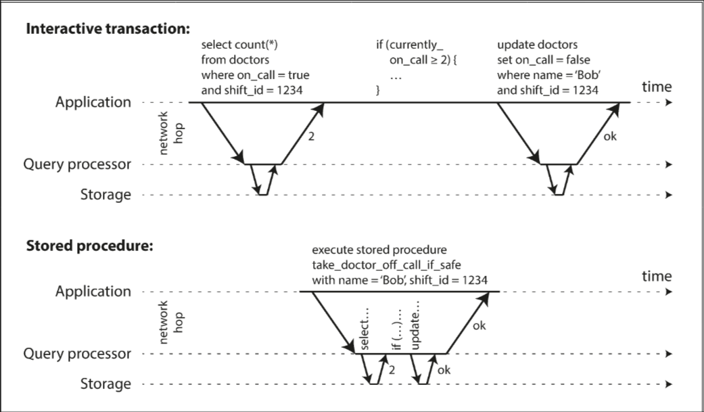
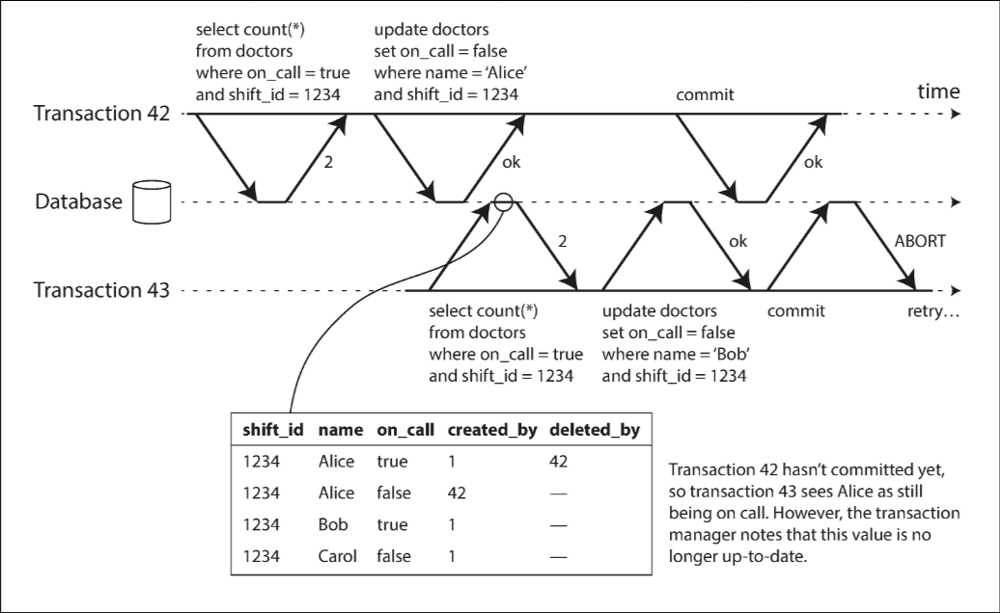
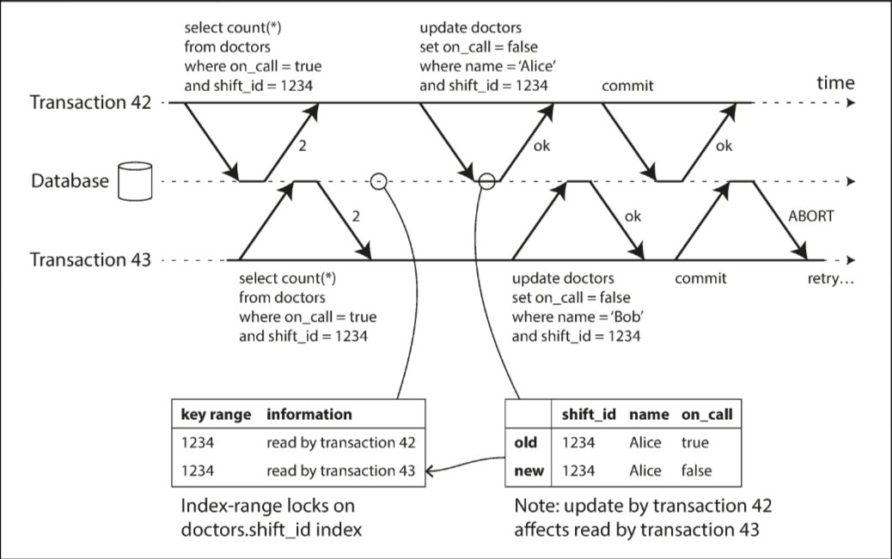

# Chapter 7.3 Transactions: Serializability

Weak isolation levels (like Read Committed and Snapshot Isolation) are prone to race conditions (e.g., write skew, phantoms) that are hard to detect and test. Serializable Isolation is the strongest isolation level. It guarantees that parallel transaction execution produces the same result as if transactions ran serially (one at a time), preventing all possible race conditions.

Most databases implement serializability using one of three techniques: Actual Serial Execution, Two-Phase Locking (2PL), or Serializable Snapshot Isolation (SSI).

 

---

 

### Actual Serial Execution

This approach removes concurrency entirely by executing transactions one by one on a single thread. While this limits throughput to a single CPU core, it avoids the overhead of locking and conflict detection.

This single-threaded model became feasible around 2007 due to two factors:

- RAM Availability: Active datasets can often fit entirely in memory, eliminating slow disk I/O.
- OLTP Nature: Most write transactions are short and fast. (Long-running read-only queries can run separately on a consistent snapshot).

*Encapsulating Transactions in Stored Procedures*

Traditional interactive transactions (where an application sends queries one by one and waits for responses) are inefficient for single-threaded execution due to network latency. The database would spend most of its time idle, waiting for the next query.

To solve this, applications must submit the entire transaction code to the database ahead of time as a Stored Procedure. This allows the database to execute the code in memory immediately without network or disk I/O waits.

While stored procedures historically had a bad reputation (ugly proprietary languages, difficult debugging/versioning), modern implementations (e.g., Redis using Lua, VoltDB using Java) use general-purpose languages.

Replication: Systems like VoltDB execute the same stored procedure on every replica rather than copying write data. This requires stored procedures to be deterministic (producing the exact same result on every node).

*PartitioningI

To scale beyond a single CPU core, data can be partitioned. If a transaction only reads/writes data within a single partition, it can run on that partition's specific thread independently. This allows throughput to scale linearly with the number of CPU cores.

However, Cross-Partition Transactions are significantly slower because they require coordination across all touched partitions to ensure serializability. Performance drops drastically if the data structure requires frequent cross-partition access (e.g., multiple secondary indexes).

*Summary of Constraints*

Serial execution is a viable implementation of serializability only under specific conditions:

- Memory Resident: The active dataset must fit in RAM.
- Short Transactions: Execution must be fast; one slow transaction blocks all others.
- Write Throughput: Limited to a single CPU core unless the data can be partitioned to avoid cross-partition coordination.

 

---

 

### Two-Phase Locking (2PL)

Two-Phase Locking (2PL) is a "pessimistic" concurrency control mechanism used to implement serializable isolation (e.g., in MySQL InnoDB and SQL Server). While snapshot isolation ensures "readers never block writers," 2PL enforces a stricter rule: writers block both other writers and readers, and vice versa. This effectively prevents all race conditions, including lost updates and write skew.

Locking Mechanism The database places a lock on every object accessed:

- Shared Mode (Read): Multiple transactions can hold a shared lock concurrently. If an exclusive lock exists, new readers must wait.
- Exclusive Mode (Write): Required for modification. No other transaction may hold any lock (shared or exclusive) simultaneously.
- Two Phases: Locks are acquired during execution (phase 1) and must be held until the transaction finishes (phase 2).

Performance 2PL often suffers from poor performance compared to weak isolation. The overhead of acquiring locks and the reduced concurrency (due to blocking) lead to significantly lower throughput.

- Instability: Latency can be unpredictable. One slow transaction can force a queue of others to wait.
- Deadlocks: Because transactions hold locks for their duration, deadlocks occur frequently. The database resolves these by aborting one transaction, which must then be retried by the application.

Predicate and Index-Range Locks To ensure serializability, the database must prevent phantoms (where one transaction changes the results of another's search query).

- Predicate Locks: Conceptually, this locks all objects—existing or future—that match a search condition (e.g., `WHERE room_id = 123`). This restricts other transactions from inserting data that would alter the search result.
- Index-Range Locks: Because predicate locks are computationally expensive, databases typically use index-range locking (or "next-key locking"). This approximates predicate locking by attaching a shared lock to a range of values in an index (e.g., a time range). It is less precise but has much lower overhead.

 

---

 

### Serializable Snapshot Isolation (SSI)

Serializable Snapshot Isolation (SSI) is an "optimistic" concurrency control technique (used in PostgreSQL and FoundationDB). It provides full serializability with only a small performance penalty compared to snapshot isolation.

Optimistic vs. Pessimistic Unlike 2PL (which waits if a conflict might occur) or Serial Execution (which locks the database), SSI assumes transactions will complete successfully. It allows them to proceed without blocking. At commit time, the database checks for conflicts; if isolation was violated, the transaction aborts and retries. This approach performs well when contention is low but struggles if many transactions attempt to modify the same objects.

Detecting Outdated Premises SSI is built on top of snapshot isolation. To ensure serializability, it must detect when a transaction acts on a "premise" (data read at the start) that is no longer true by the time it commits.

**Detecting Stale MVCC Reads**

The database tracks when a transaction reads data that ignores concurrent, uncommitted writes (due to snapshot visibility). If those writes commit before the reading transaction finishes, the read is deemed stale, and the transaction must abort.

**Detecting Writes Affecting Prior Reads**

The database tracks which data has been read (often using index entries). If another transaction modifies this data, it triggers a notification. This acts as a "tripwire" rather than a lock, notifying the reader that its data is outdated.

Performance

- Non-Blocking: Readers and writers do not block each other, making query latency predictable and fast, especially for read-heavy workloads.
- Scalability: Unlike serial execution, SSI is not limited to a single CPU core and can scale across multiple nodes.
- Limitations: It requires read-write transactions to be short to minimize the risk of aborts. Long-running read-only transactions generally perform well.
