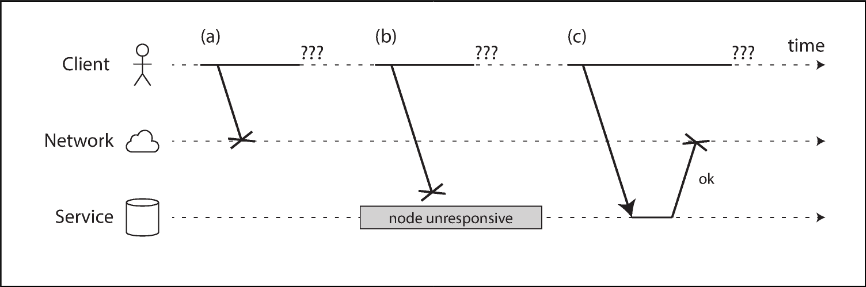
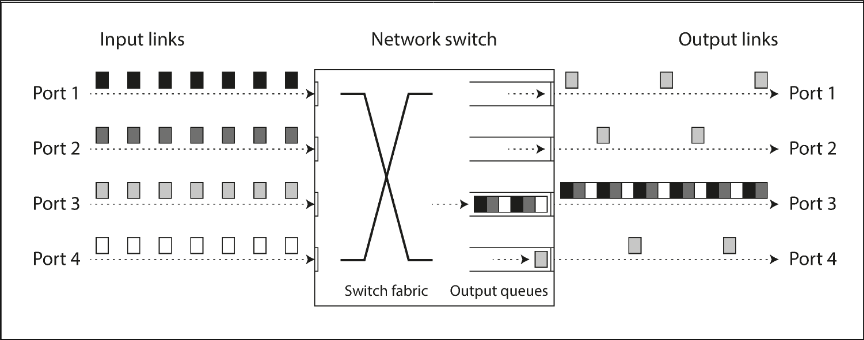

# Chapter 8.2 The Trouble with Distributed Systems: Unreliable Networks

The dominant approach for building internet services is the "shared-nothing" architecture—machines connected by a network, sharing no memory or disk. While not the only way to build systems, it is favored because it is cost-effective, leverages commoditized cloud services, and achieves high reliability through redundancy across geographically distributed datacenters.

Internet and datacenter networks are typically asynchronous packet networks. In this model, a node sends a message (packet) but receives no guarantees about when, or if, it will arrive. When a request is sent and a response is expected, many things can go wrong:

- Potential Failures: The request might be lost, queued indefinitely, or the remote node might have failed or paused (e.g., for garbage collection). Alternatively, the remote node may have processed the request, but the response was lost or delayed on the way back.
- Indistinguishability: From the sender's perspective, these issues are indistinguishable. The only available information is that a response has not yet been received. It is impossible to know if the request was processed or lost.
- Timeouts: The standard solution is to use a timeout: giving up after a certain period. However, a timeout does not confirm the state of the request; the recipient may still process the request even after the sender has given up.

 

---

 

### Network Faults in Practice

Despite decades of development, networks remain unreliable. Studies and anecdotal evidence confirm that network faults are common, even in controlled environments like single-company datacenters.

- Frequency and Causes: Research indicates frequent faults, such as disconnected machines or entire racks going offline. While redundant gear helps, it does not prevent human error (e.g., misconfigured switches), which is a major cause of outages.
- Environment Variability: Public clouds (like EC2) are known for transient glitches. Private datacenters are generally more stable but are not immune to issues like faulty software upgrades, physical damage (e.g., sharks biting undersea cables lol), or "one-way" link failures where packets pass successfully in only one direction.
- Software Responsibility: Software must be designed to handle network faults because communication failures are inevitable. If error handling is not defined and tested, the system may exhibit arbitrary behaviors, such as deadlocks or data deletion. Handling faults does not always require tolerating them seamlessly; showing an error message is a valid response, provided the system can recover.

 

---

 

### Detecting Faults

Systems often need to automatically detect faulty nodes to take actions like removing a dead node from a load balancer or promoting a new leader in a database. However, network uncertainty makes accurate detection difficult.

- Limited Feedback Signals: In specific cases, some feedback is available. The operating system might send a TCP RST or FIN packet if the process is closed, or a router might return an ICMP Destination Unreachable error. Management interfaces on switches can sometimes report hardware link failures.
- Unreliability of Feedback: These signals are not guaranteed. For instance, a node might crash while processing a request, leaving the sender unsure of how much data was processed. Furthermore, switch management interfaces may be inaccessible during network problems.
- Reliance on Timeouts: Rapid feedback is useful but cannot be counted on. Even a TCP acknowledgement only confirms packet delivery, not that the application handled it. Ultimately, the only way to be sure a request succeeded is receiving a positive response from the application. If no response arrives, the system must eventually rely on timeouts to declare a node dead.

 

---

 

### Timeouts and Unbounded Delays

The Difficulty of Setting Timeouts. There is no simple answer for how long a timeout should be. A long timeout results in slow failure detection, forcing users to wait during outages. A short timeout detects faults quickly but carries the risk of incorrectly declaring a node dead when it is merely experiencing a temporary slowdown (e.g., a load spike).

Prematurely declaring a node dead is dangerous. If the node is actually alive and processing an action, transferring its responsibilities to another node can result in the action being performed twice. Furthermore, if a node is slow because it is overloaded, shifting its load to other nodes can overwhelm them, potentially causing a cascading failure where the entire system collapses.

Unbounded Network Delays. In an idealized system where the network guarantees a maximum packet delay (`d`) and the node guarantees a maximum processing time (`r`), a timeout of `2d + r` would be perfect. However, asynchronous networks have unbounded delays: there is no upper limit on how long a packet might take to arrive. Most server implementations also cannot guarantee a maximum processing time.

Causes of Variable Delays The variability in packet delays is primarily caused by queueing at various points in the path:

- Network Switches: If multiple nodes send packets to the same destination simultaneously, the switch must queue them. If the queue fills up (network congestion), packets are dropped and must be resent.
- Operating Systems: If all CPU cores are busy, the OS queues incoming network requests until the application is ready to handle them.
- Virtualization: In virtualized environments, a VM may be paused for tens of milliseconds while another VM uses the physical CPU. Incoming data is buffered (queued) by the monitor during this time.
- TCP Flow Control: A node limits its own sending rate to avoid overloading the network or receiver (backpressure), which causes queueing at the sender before data even enters the network.
- TCP Retransmission: When TCP detects a lost packet (via its own internal timeout), it retransmits it. The application sees the resulting wait as a significant delay.

TCP vs. UDP. Latency-sensitive applications (like VoIP or videoconferencing) often use UDP instead of TCP. This is a trade-off between reliability and variability. UDP avoids TCP's flow control and retransmission mechanisms, reducing delay variability. In these contexts, delayed data is worthless (e.g., a silence in a conversation is better than playing old audio), so dropped packets are preferable to the delays caused by retransmission.

Measuring and Adjusting Timeouts. In public clouds and multi-tenant datacenters, resources (network links, switches, CPUs) are shared. "Noisy neighbors" can saturate these resources, leading to highly variable delays over which you have no control.

To handle this, timeouts are often chosen experimentally by measuring the distribution of network round-trip times over an extended period. A more sophisticated approach is to use systems that continually measure response times and their variability (jitter), automatically adjusting timeouts dynamically based on the current environment (e.g., the Phi Accrual failure detector used in Akka and Cassandra).

 

---

 

### Synchronous Versus Asynchronous Networks

Circuit-Switched Networks (The Telephone Model). Traditional fixed-line telephone networks are extremely reliable because they rely on circuit switching. When a call is made, a dedicated circuit is established with a fixed amount of guaranteed bandwidth allocated along the entire route for the duration of the call (e.g., ISDN). Because this bandwidth is reserved specifically for the call, data packets do not have to wait in queues. This results in a synchronous network with a fixed, bounded delay.

Packet-Switched Networks (The Internet Model). In contrast, datacenter networks and the internet use packet switching (Ethernet, IP), which is designed for "bursty" traffic. Unlike a phone call that requires a constant stream of data, computer tasks like requesting a web page or sending an email vary wildly in their bandwidth needs. Protocols like TCP do not reserve bandwidth; instead, they opportunistically use whatever capacity is available at the moment to transfer data as quickly as possible.

Why Not Use Circuits for Data? Using circuits for general data transfer would be inefficient. You would have to guess how much bandwidth to allocate for a file transfer: guess too low, and the transfer is slow while leaving network capacity unused; guess too high, and the network cannot establish the circuit. Packet switching solves this by dynamically adapting to network conditions, but the trade-off is that packets must share the network. This leads to queueing when traffic is heavy, causing the unbounded delays characteristic of asynchronous networks.

The Reality of Latency Guarantees. While technologies like ATM and InfiniBand have attempted to bridge this gap, and Quality of Service (QoS) mechanisms can theoretically emulate circuit-like guarantees, these features are rarely enabled in multi-tenant datacenters or over the public internet. Consequently, currently deployed technology offers no guarantees about delays or reliability. Software must assume that congestion and queueing will occur, meaning there is no "correct" timeout value—it must always be determined experimentally.
