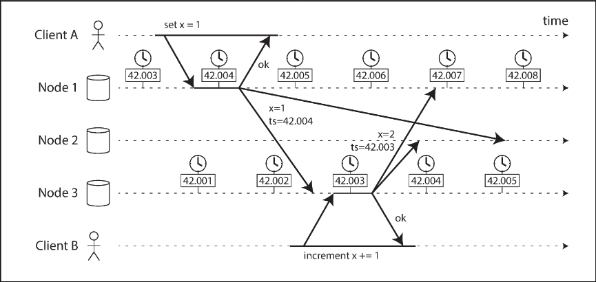

# Chapter 8.3 The Trouble with Distributed Systems: Unreliable Clocks

Applications rely on clocks to measure durations (e.g., request timeouts, response times) and to identify points in time (e.g., log timestamps, scheduled events). However, in distributed systems, time is problematic because network communication involves variable delays, making it difficult to determine the strict order of events across multiple machines. Additionally, each machine operates on its own hardware clock (usually a quartz crystal oscillator) which is not perfectly accurate and drifts independently. The Network Time Protocol (NTP) is commonly used to synchronize these clocks with external, more accurate sources like GPS.

 

---

 

### Monotonic Versus Time-of-Day Clocks

Modern computers utilize two distinct types of clocks, serving different purposes:

- Time-of-Day Clocks return the current wall-clock time, typically expressed as time since the epoch. While these are synchronized via NTP, they are unsuitable for measuring elapsed time because they can jump backward if the local clock is forcibly reset to align with an NTP server. They may also ignore leap seconds and historically had coarse resolutions.
- Monotonic Clocks are designed specifically for measuring durations, such as timeouts. They are guaranteed to always move forward, making them reliable for measuring intervals locally. The absolute value of a monotonic clock is arbitrary and meaningless for comparison between different computers. NTP synchronizes these clocks by "slewing" (adjusting the frequency slightly) rather than jumping the time, ensuring continuity.

 

---

 

### Clock Synchronization and Accuracy

Hardware clocks and NTP are prone to significant inaccuracies. Quartz clocks drift depending on machine temperature, and if a clock deviates too far from the NTP server, it may be forcibly reset, causing sudden jumps in time. Network congestion and variable packet delays further limit synchronization accuracy.

Several factors complicate timekeeping:

- Leap Seconds: These can crash systems not designed for 61-second minutes. Some servers handle this via "smearing" (gradual adjustment over a day).
- Virtualization: When a virtual machine is paused, its virtualized clock stops, appearing as a sudden time jump to applications when execution resumes.
- User Devices: Clocks on devices controlled by users (e.g., mobile phones) are untrustworthy as they may be deliberately set to incorrect times.

High-precision synchronization is possible using tools like GPS receivers and the Precision Time Protocol (PTP), often required for financial regulations (e.g., MiFID II), but achieving this requires significant engineering effort and monitoring

 

---

 

### Relying on Synchronized Clocks

While clocks appear simple, they harbor pitfalls such as variable second lengths or backward jumps. Robust software must be designed to handle incorrect clocks just as it handles network faults. Unlike network failures which often result in immediate errors, clock issues frequently cause silent data loss. Therefore, reliable systems must monitor clock offsets between nodes; any node with significant drift should be removed to prevent data corruption.

**Timestamps for ordering events**

It is dangerous to rely on time-of-day clocks for ordering events across multiple nodes. Consider a database with multi-leader replication: Client A writes to Node 1, and subsequently, Client B increments that value on Node 3.

Even with minimal clock skew, the later write by Client B might receive an earlier timestamp than Client A's write. When these updates replicate to Node 2, the system might incorrectly discard the newer value because its timestamp is "older." This conflict resolution strategy, known as Last Write Wins (LWW), is used in databases like Cassandra and Riak.

LWW suffers from fundamental flaws: it causes silent data loss (writes disappear without error) and cannot distinguish between sequential writes and truly concurrent ones. Logical clocks, which use incrementing counters rather than physical time, are a safer alternative for ordering events as they track relative ordering rather than elapsed time.

**Clock readings have a confidence interval**

High-resolution timestamps (e.g., microseconds) do not equate to high accuracy. Due to quartz drift and network variance, a clock reading is effectively a confidence interval—a range of possible times—rather than a precise point. If the uncertainty is ±100 ms, microsecond precision is meaningless.

Most system APIs do not expose this uncertainty. An exception is Google's TrueTime API in Spanner, which returns a time range `[earliest, latest]`. The system knows the actual time lies somewhere within this interval, the width of which depends on the time since the last sync with a precise source like a GPS receiver.

Synchronized clocks for global snapshots

Snapshot isolation requires monotonically increasing transaction IDs. Generating these globally across a distributed system is difficult without a coordination bottleneck. Spanner utilizes TrueTime's confidence intervals to address this. If the intervals of two transactions do not overlap (i.e., `A earliest < A latest < B earliest < B latest`), the ordering is unambiguous.

To ensure transaction timestamps reflect causality, Spanner deliberately waits for the length of the confidence interval before committing a read-write transaction. This wait ensures that the transaction's timestamp has definitely passed, preventing overlap with future reads. Minimizing this wait time requires highly accurate hardware, such as atomic clocks or GPS receivers in every datacenter.

 

---

 

### Process Pauses

A significant danger in distributed systems arises when nodes rely on wall-clock time for leadership leases. A common pattern involves a leader obtaining a lease (a lock with a timeout) and periodically renewing it. The node processes requests only if the lease is valid.

However, code execution can pause unexpectedly. Consider a scenario where a thread checks the time, confirms the lease is valid, but then pauses for 15 seconds before processing the request. During that pause, the lease expires, and another node may take over as leader. When the original thread resumes, it has no awareness of the pause and proceeds to process the write, potentially corrupting data because it is no longer the valid leader.

Reasons for Process Pauses:

- Garbage Collection (GC): Runtimes like the JVM perform "stop-the-world" GC, which can pause all threads for minutes.
- Virtualization: VMs can be suspended and resumed (e.g., for live migration), pausing execution for arbitrary durations.
- Context Switching: Under heavy load, the OS or hypervisor (steal time) may pause a thread to run others.
- Synchronous Disk I/O: Unexpected disk access (e.g., Java classloading) can block threads, especially if relying on slow network filesystems.
- Swapping (Paging): Memory pressure can cause the OS to thrash, spending cycles swapping pages to disk rather than executing code.
- Signals: A process can be paused via SIGSTOP (e.g., Ctrl-Z) and resumed later.

Because a node cannot distinguish a pause from normal execution, distributed systems must handle these interruptions without shared memory tools (mutexes, semaphores) which do not apply across the network.

Response Time Guarantees
Hard real-time systems (e.g., aircraft controls, airbags) utilize specialized Real-Time Operating Systems (RTOS), restricted libraries, and rigorous testing to guarantee strict response deadlines. However, this approach is too restrictive and expensive for most server-side data systems, which must instead be designed to tolerate pauses and clock instability.

Limiting the Impact of Garbage Collection
While full real-time guarantees are impractical, GC pauses can be mitigated. Some systems treat GC pauses as planned outages: the runtime warns the application of an impending GC, allowing the node to shift traffic to other peers before pausing. Alternatively, processes can be restarted periodically to clear memory before long-lived objects trigger a full GC.
