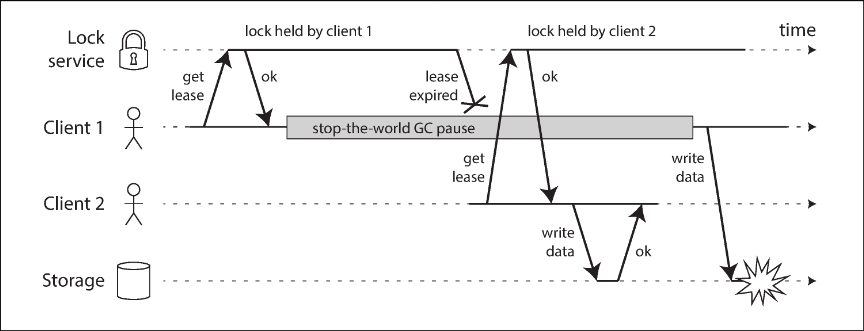
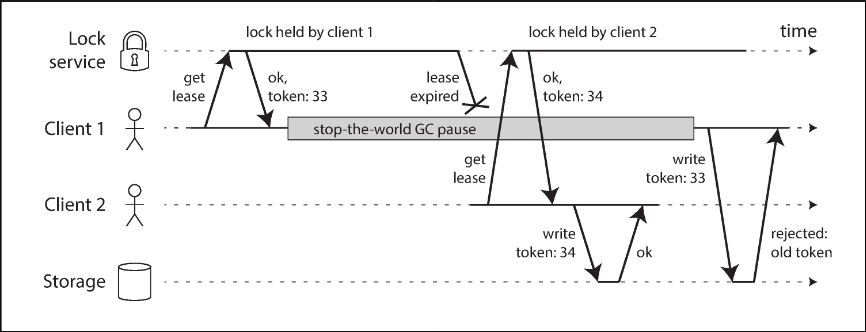

# Chapter 8.4 The Trouble with Distributed Systems: Knowledge, Truth, and Lies

Distributed systems differ fundamentally from programs running on a single computer due to the lack of shared memory and reliance on message passing via unreliable networks. A node cannot know the state of another node with certainty; it can only guess based on the messages it receives or fails to receive. Because network problems are often indistinguishable from node failures, discussions of system state border on the philosophical. To manage this, we state assumptions about behavior—the system model—and design algorithms that function correctly within those constraints. Reliable behavior is achievable even on unreliable foundations

 

---

 

### The Truth Is Defined by the Majority

Nodes may experience partial failures, such as asymmetric network faults (receiving but not sending) or long execution pauses (e.g., stop-the-world garbage collection). In these scenarios, a node may be functioning perfectly from its own perspective but is unresponsive to others. Consequently, other nodes may incorrectly declare it dead.

Because a node cannot trust its own judgment of a situation, distributed systems rely on a quorum—a voting mechanism among nodes—to establish truth. If a quorum (typically an absolute majority) declares a node dead, that decision is final, even if the node itself is still running. Relying on a majority ensures that the system can tolerate individual failures while preventing conflicting decisions, as there can be only one majority in the system at a time.

**The Leader and the Lock**

Systems often require a single acting authority to prevent data corruption, such as one leader for a database partition or one client holding a lock. However, a node may believe it is the "chosen one" even after the rest of the system has declared it dead and elected a successor. This often happens if the original leader experiences a pause (like a GC pause) that causes its lease to expire.

If a demoted node unknowingly continues to act as the leader, it may send valid-looking write requests that corrupt the system.

**Fencing Tokens**

To prevent a node with a false belief of authority from disrupting the system, we use a technique called fencing. When a lock service grants a lease or lock, it also issues a fencing token, which is a number that strictly increases with every grant (e.g., a monotonic counter).

Clients must include this token with every write request. The storage resource itself validates the token: if a client attempts to write using a token older than one already processed, the resource rejects the request. This ensures that a node attempting to write after a long pause (using an expired token) is fenced off, protecting the system from corruption. This mechanism requires the resource to actively enforce token validity rather than relying on clients to check their own status.

 

---

 

### Byzantine Faults

While fencing tokens handle inadvertent errors, distributed systems face a harder challenge if nodes deliberately subvert guarantees by sending fake tokens or false messages. This behavior, where nodes may "lie" or send arbitrary corrupted responses, is known as a Byzantine fault. The challenge of reaching consensus in such an environment is the Byzantine Generals Problem.

Byzantine fault tolerance is critical in specific high-risk environments, such as aerospace (where radiation may corrupt memory) or peer-to-peer networks like Bitcoin (where participants do not trust each other). However, for typical server-side data systems in a datacenter, assuming Byzantine faults is usually too expensive and complex. We generally assume nodes are unreliable but honest: they may pause or crash, but they play by the protocol rules.

Standard web applications handle malicious behavior via input validation and sanitization rather than Byzantine fault-tolerant protocols, treating the server as the authoritative decision-maker. Furthermore, Byzantine algorithms cannot protect against software bugs or security vulnerabilities if all nodes run the same code, as a bug would likely manifest across the supermajority required for consensus.

**Weak Forms of Lying**

Even when assuming honest nodes, systems benefit from mechanisms that guard against weak forms of "lying," such as hardware corruption or misconfiguration. Simple measures like checksums (to detect corrupted network packets), rigorous input sanitization, and using multiple NTP servers (to detect and exclude outliers) provide pragmatic reliability improvements without the cost of full Byzantine fault tolerance.

 

---

 

### System Model and Reality

To design useful algorithms, we must formalize the types of faults we expect by defining a system model. This abstraction allows us to prove algorithm correctness under specific assumptions.

**Timing and Node Faults Models**

Three timing models are commonly used:

- Synchronous: Assumes bounded network delay, process pauses, and clock error. This is rarely realistic for practical systems.
- Partially Synchronous: The system usually behaves synchronously but occasionally exceeds bounds. This is a realistic model for most systems.
- Asynchronous: Makes no timing assumptions (no clocks or timeouts), which is very restrictive.

Regarding node failures, we typically model them as:

- Crash-stop: node fails and never returns.
- Crash-recovery: node loses memory but preserves stable storage and restarts
- Byzantine: arbitrary behavior.

The most useful model for real systems is generally the partially synchronous model with crash-recovery faults.

**Correctness, Safety, and Liveness**

We define an algorithm's correctness by its properties. These are distinguished into two categories:

- Safety properties ("nothing bad happens"): If violated, the violation occurs at a specific point in time and cannot be undone (e.g., uniqueness of a fencing token). Safety must hold in all possible situations, even during failures.
- Liveness properties ("something good eventually happens"): These definitions often include the word "eventually" (e.g., availability or eventual consistency). Liveness may effectively be paused during failures but is expected to hold once the system recovers

**Mapping to Reality**

While system models are essential for reasoning about complexity, they are simplified abstractions. Real implementations must handle "impossible" scenarios, such as stable storage corruption or firmware bugs. Theoretical proofs are a vital first step for uncovering problems, but they must be complemented by empirical testing to handle the messy reality of physical hardware and software.
