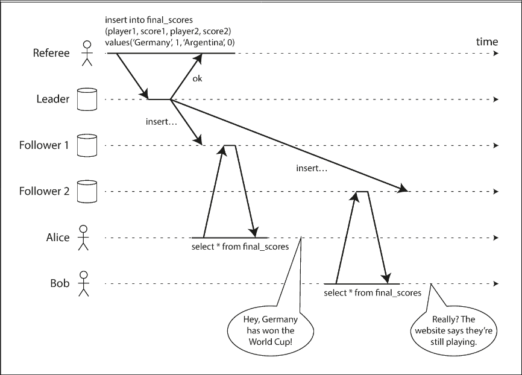
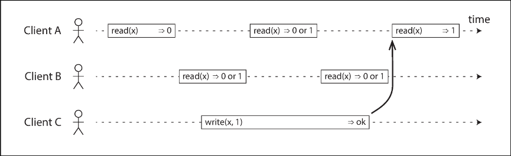
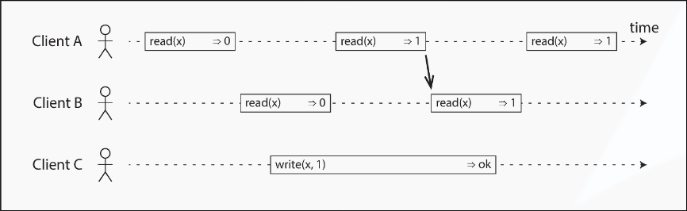
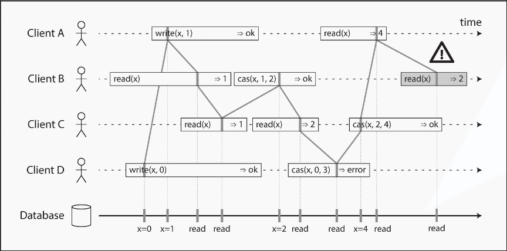

# Chapter 9.1 Consistency and Consensus: Linearizability

In eventually consistent databases, querying different replicas simultaneously can yield conflicting answers. Linearizability (also known as atomic, strong, immediate, or external consistency) solves this by providing the illusion of a single, atomic copy of the data. It is fundamentally a recency guarantee: once a write successfully completes, all subsequent reads must see the new value

This illustrates a violation of this guarantee. Alice reads a newly updated sports score, but Bob, refreshing his phone immediately after hearing her, receives a stale result from a lagging replica. Because Bob's query began strictly after Alice's completed, his receipt of older data violates linearizability.

 

---

 

### What Makes a System Linearizable?

Defining the "single copy" illusion requires precision.

This shows three clients concurrently reading and writing a single register `x` (which could be a key, row, or document). Each bar represents a request from the client's perspective, starting when the request is sent and ending when the response is received. Due to variable network delays, the database processes the request at an unknown time within this window.

With x initially at `0`, client C executes a write operation: `write(x, 1)`. Meanwhile, clients A and B poll the database with `read(x)`. A read completing before the write begins will definitely return 0. A read beginning after the write has completed must definitely return 1. However, reads that overlap in time with the write are concurrent, meaning they could initially return either 0 or 1 because the exact moment the write takes effect is unknown.

If concurrent reads could arbitrarily flip back and forth between the old and new values, the system would fail to emulate a "single copy." To enforce linearizability, an additional timing constraint is required, as shown in next picture.

There must be a specific, atomic point in time during the write operation when the value of `x` flips from 0 to 1. Crucially, if one client's read returns the new value 1, all subsequent reads must also return 1, even if the originating write operation has not yet officially completed.

This is visualized further in next picture.

Here we introduce an atomic compare-and-set operation: `cas(x, vold, vnew)`. Every operation is marked with a vertical line representing the exact moment it was executed. For a system to be linearizable, the sequential line joining these execution markers must always move forward in time (from left to right). This ensures that once a new value is written or read, all subsequent reads see that value until it is overwritten.

Several important nuances emerge from it:

- Client B reads 1 (written by A) even though B sent its read request before A sent its write request. This is valid because the requests are concurrent; B's read was simply delayed in the network and processed after the writes.
- Client B reads 1 before Client A receives its `ok` response from the database. The write had already taken effect; the network merely delayed the success response to A.
- This model assumes no transaction isolation. Client C reads 1 and then 2 because Client B changed the value in between. Atomic `cas` operations check for concurrent changes (e.g., Client D's `cas` fails because `x` is no longer 0 by the time it is processed).
- The final read by Client B (the shaded bar) is not linearizable. It is concurrent with C's `cas` update to 4. While returning 2 might normally be acceptable during a concurrent write, Client A has already read the new value 4 before B's read started. Therefore, B is strictly forbidden from reading the older value.

Finally, it is vital to distinguish linearizability from serializability, as they are often confused. Serializability is an isolation property ensuring that transactions (which may involve multiple objects) behave as if executed in some serial order, but it does not guarantee real-time recency. Linearizability is strictly a recency guarantee for reads and writes on an individual object (a register); it does not group operations into transactions or prevent issues like write skew. A database providing both guarantees offers strict serializability (or strong-1SR). Implementations using two-phase locking or actual serial execution are typically linearizable, whereas serializable snapshot isolation is deliberately not linearizable because it reads from older, consistent snapshots.
