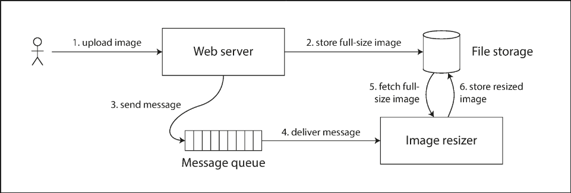
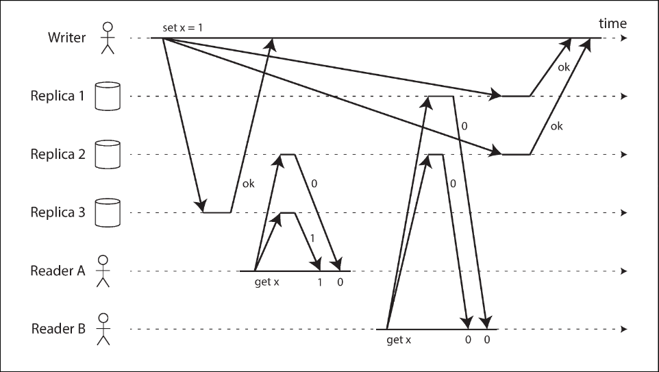

# Chapter 9.1 Consistency and Consensus: Linearizability

In eventually consistent databases, querying different replicas simultaneously can yield conflicting answers. Linearizability (also known as atomic, strong, immediate, or external consistency) solves this by providing the illusion of a single, atomic copy of the data. It is fundamentally a recency guarantee: once a write successfully completes, all subsequent reads must see the new value

This illustrates a violation of this guarantee. Alice reads a newly updated sports score, but Bob, refreshing his phone immediately after hearing her, receives a stale result from a lagging replica. Because Bob's query began strictly after Alice's completed, his receipt of older data violates linearizability.

 

---

 

### What Makes a System Linearizable?

Defining the "single copy" illusion requires precision.

This shows three clients concurrently reading and writing a single register `x` (which could be a key, row, or document). Each bar represents a request from the client's perspective, starting when the request is sent and ending when the response is received. Due to variable network delays, the database processes the request at an unknown time within this window.

With x initially at `0`, client C executes a write operation: `write(x, 1)`. Meanwhile, clients A and B poll the database with `read(x)`. A read completing before the write begins will definitely return 0. A read beginning after the write has completed must definitely return 1. However, reads that overlap in time with the write are concurrent, meaning they could initially return either 0 or 1 because the exact moment the write takes effect is unknown.

If concurrent reads could arbitrarily flip back and forth between the old and new values, the system would fail to emulate a "single copy." To enforce linearizability, an additional timing constraint is required, as shown in next picture.

There must be a specific, atomic point in time during the write operation when the value of `x` flips from 0 to 1. Crucially, if one client's read returns the new value 1, all subsequent reads must also return 1, even if the originating write operation has not yet officially completed.

This is visualized further in next picture.

Here we introduce an atomic compare-and-set operation: `cas(x, vold, vnew)`. Every operation is marked with a vertical line representing the exact moment it was executed. For a system to be linearizable, the sequential line joining these execution markers must always move forward in time (from left to right). This ensures that once a new value is written or read, all subsequent reads see that value until it is overwritten.

Several important nuances emerge from it:

- Client B reads 1 (written by A) even though B sent its read request before A sent its write request. This is valid because the requests are concurrent; B's read was simply delayed in the network and processed after the writes.
- Client B reads 1 before Client A receives its `ok` response from the database. The write had already taken effect; the network merely delayed the success response to A.
- This model assumes no transaction isolation. Client C reads 1 and then 2 because Client B changed the value in between. Atomic `cas` operations check for concurrent changes (e.g., Client D's `cas` fails because `x` is no longer 0 by the time it is processed).
- The final read by Client B (the shaded bar) is not linearizable. It is concurrent with C's `cas` update to 4. While returning 2 might normally be acceptable during a concurrent write, Client A has already read the new value 4 before B's read started. Therefore, B is strictly forbidden from reading the older value.

Finally, it is vital to distinguish linearizability from serializability, as they are often confused. Serializability is an isolation property ensuring that transactions (which may involve multiple objects) behave as if executed in some serial order, but it does not guarantee real-time recency. Linearizability is strictly a recency guarantee for reads and writes on an individual object (a register); it does not group operations into transactions or prevent issues like write skew. A database providing both guarantees offers strict serializability (or strong-1SR). Implementations using two-phase locking or actual serial execution are typically linearizable, whereas serializable snapshot isolation is deliberately not linearizable because it reads from older, consistent snapshots.

 

---

 

### Relying on Linearizability

In what circumstances is linearizability useful? While viewing a slightly outdated sports score might be harmless, several critical areas require linearizability to function correctly:

**Locking and leader election**

Single-leader replication needs to ensure there is only one leader to avoid a split brain. One election method uses a lock where every starting node tries to acquire it. No matter the implementation, this lock must be linearizable: all nodes must agree on who owns it. Coordination services like Apache ZooKeeper and etcd use consensus algorithms to implement linearizable operations fault-tolerantly for this exact purpose. Granular distributed locking, such as Oracle RAC using a linearizable lock per disk page, also relies on this foundation.

**Constraints and uniqueness guarantees**

Hard uniqueness constraints—such as ensuring a username, email address, or file path uniquely identifies a single entity—require linearizability. If two people concurrently try to create a user with the same name, one must receive an error. This is similar to acquiring a lock or performing an atomic compare-and-set. Other hard constraints, like preventing negative bank balances, overselling warehouse stock, or double-booking seats, all require a single up-to-date value that all nodes agree on. (Note that foreign key or attribute constraints, or loosely interpreted constraints like overbooked flights, can often be implemented without linearizability).

**Cross-channel timing dependencies**

Linearizability prevents race conditions when multiple communication channels are involved. Last picture illustrates an architecture where a web server writes a high-resolution photo to a file storage service and then sends a resize instruction to an image resizer via a message queue. If the file storage is not linearizable, the message queue might be faster than the storage's internal replication. When the resizer fetches the image, it might see an old version or nothing at all, causing permanent inconsistency. The recency guarantee of linearizability avoids this race condition between the file storage and the message queue.

 

---

 

### Implementing Linearizable Systems

Since linearizability means behaving as though there is only a single, atomic copy of the data, the simplest implementation is literally using a single copy. However, this lacks fault tolerance. To tolerate faults, we use replication. Here is how different replication methods fare:

- Single-leader replication (potentially linearizable): Reads from the leader, or from synchronously updated followers, have the potential to be linearizable. However, not all single-leader databases are linearizable due to snapshot isolation or concurrency bugs. Furthermore, relying on the leader assumes you know who the leader is; a "delusional" node that incorrectly believes it is the leader can easily violate linearizability if it continues serving requests.
- Consensus algorithms (linearizable): These protocols contain strict measures to prevent split brain and stale replicas. Thanks to these safeguards, algorithms like those used by ZooKeeper and etcd can safely implement linearizable storage.
- Multi-leader replication (not linearizable): Because these systems concurrently process writes on multiple nodes and asynchronously replicate them, they produce conflicting writes. These conflicts are a direct artifact of lacking a single copy of the data.
- Leaderless replication (probably not linearizable): People sometimes claim Dynamo-style systems offer "strong consistency" via strict quorum reads and writes (`w + r > n`). This is often false. "Last write wins" conflict resolution based on time-of-day clocks ruins linearizability due to clock skew, as do sloppy quorums. Even with strict quorums, variable network delays cause race conditions

In this example, client A reads a new value from a quorum, but client B concurrently reads from a different quorum and gets the old value, even though B's request begins after A's completes.

While Dynamo-style quorums can theoretically be made linearizable with severe performance penalties (requiring synchronous read repair and forcing writers to read the latest state before writing), linearizable compare-and-set operations are still impossible without a true consensus algorithm. Ultimately, it is safest to assume leaderless systems do not provide linearizability.

 

---

 

### The Cost of Linearizability

As some replication methods provide linearizability and others do not, it is important to explore its pros and cons, particularly regarding how systems behave during network interruptions.

Consider a multi-datacenter deployment where the network connection between datacenters fails, but the internal networks within each datacenter remain functional:

- Multi-leader databases continue operating normally. Writes in each disconnected datacenter are simply queued up and asynchronously exchanged once connectivity is restored.
- Single-leader databases suffer partial outages. The leader resides in only one datacenter. Clients connected to follower datacenters cannot contact the leader, meaning they cannot perform any writes or linearizable reads (they can only perform stale reads) until the network link is repaired.

**The CAP theorem**

This fundamental issue is not limited to multi-datacenter setups; it applies to any linearizable database on any unreliable network. The trade-off is as follows:

- If your application requires linearizability, and replicas become disconnected due to a network fault, those replicas cannot process requests safely. They must wait for the network to recover or return an error, thereby becoming unavailable.
- If your application does not require linearizability, replicas can process requests independently even when disconnected. The system remains available, but its behavior is no longer linearizable.

This insight—that relaxing linearizability allows a system to better tolerate network problems—is popularized as the CAP theorem.

The Unhelpful CAP Theorem
CAP is often misleadingly presented as "Consistency, Availability, Partition tolerance: pick 2 out of 3." This is conceptually flawed because network partitions are inevitable faults, not optional features you can simply choose to avoid.

When the network is functioning correctly, a system can provide both linearizability and total availability. It is only when a network fault occurs that you are forced to choose between the two. Therefore, a better phrasing is Consistent or Available when Partitioned.

Furthermore, the CAP theorem's formal definition of "availability" contradicts how the term is typically used in the industry. Because CAP narrowly focuses on only one consistency model (linearizability) and one specific type of fault (network partitions)—while ignoring network delays, dead nodes, and other critical trade-offs—it causes significant confusion. Today, CAP is mostly of historical interest and has little practical value for designing systems, having been superseded by more precise models.

**Linearizability and network delays**

Surprisingly few systems are linearizable in practice. For example, even RAM on a modern multi-core CPU is not linearizable. Every CPU core relies on its own memory cache and store buffer, asynchronously writing changes back to main memory. This breaks the single-copy illusion (linearizability), but it is absolutely essential for hardware performance.

This highlights a crucial point: many distributed databases drop linearizability primarily to increase performance, not just for fault tolerance. Linearizability is inherently slow at all times, not just during network faults.

Mathematical proofs demonstrate that the response time for linearizable read and write operations is at least proportional to the uncertainty of delays in the network. Because computer networks have highly variable delays, linearizable operations will inevitably experience high latency. A faster algorithm for linearizability simply does not exist. For latency-sensitive systems, trading linearizability for weaker, much faster consistency models is often a necessary choice.
