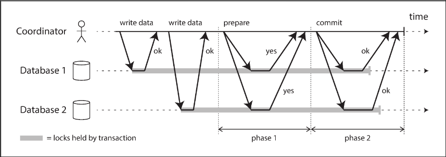
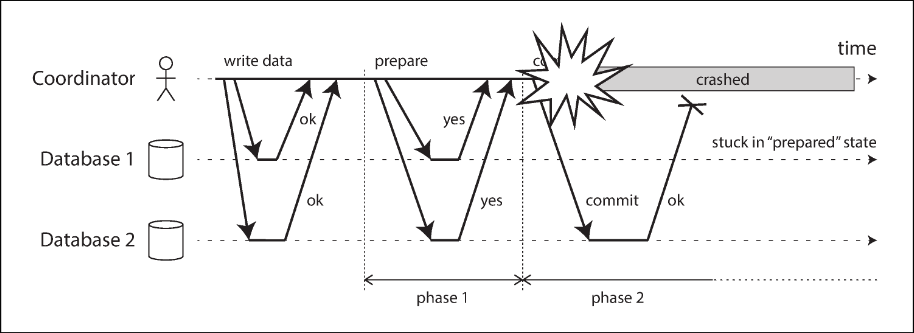

# Chapter 9.3 Consistency and Consensus: Distributed Transactions and Consensus

Consensus is one of the most important and fundamental problems in distributed computing. Informally, the goal is simply to get several nodes to agree on something. Although it seems simple, many broken systems have been built in the mistaken belief that this problem is easy to solve.

There are a number of situations in which it is strictly necessary for nodes to agree:

- Leader election: In a database with single-leader replication, all nodes must agree on the leader. If a network fault causes a split-brain situation where two nodes accept writes, their data will diverge, leading to inconsistency and data loss.
- Atomic commit: In transactions spanning several nodes, all nodes must agree on the outcome: either they all abort/roll back or they all commit.

 

---

 

### Atomic Commit and Two-Phase Commit (2PC)

The outcome of a transaction is either a successful commit, making writes durable, or an abort, discarding the writes. Atomicity prevents failed transactions from littering the database with half-updated state.

On a single node, transaction commitment crucially depends on the order in which data is durably written to disk: first the data, then the commit record. The key deciding moment is when the disk finishes writing the commit record. Thus, a single device makes the commit atomic.

However, if multiple nodes are involved, simply sending independent commit requests is not sufficient. Doing so violates atomicity because:

- Some nodes may detect a constraint violation and abort, while others commit.
- Some commit requests might get lost in the network.
- Some nodes may crash before the commit record is fully written.

A transaction commit must be irrevocable because committed data immediately becomes visible to other transactions. Therefore, a node must only commit once it is certain that all other nodes are also going to commit.

**Introduction to two-phase commit**

Two-phase commit (2PC) is an algorithm for achieving atomic transaction commit across multiple nodes. (Note: 2PC is entirely separate from Two-Phase Locking, or 2PL, which provides serializable isolation rather than atomic commit).

2PC uses a new component: a coordinator (or transaction manager). Instead of a single commit request, the process is split into two phases:

- Phase 1 (Prepare): The coordinator sends a prepare request to each participant node. The node ensures it can definitely commit (writing data to disk and checking conflicts). By replying "yes," the node promises to commit without error if requested later, effectively surrendering its right to unilaterally abort.
- Phase 2 (Commit/Abort): If all participants reply "yes," the coordinator makes a definitive decision and writes it to its own disk log (the commit point). It then sends a commit request to all participants. If any participant replies "no" or times out, the coordinator sends an abort request instead.

These two points of no return—participants promising they can commit, and the coordinator's irrevocable decision—ensure the atomicity of 2PC.

**Coordinator failure**

If a participant or the network fails, the coordinator can abort the transaction or retry requests indefinitely. However, if the coordinator crashes after sending prepare requests, a participant who voted "yes" cannot abort unilaterally.

Without hearing from the coordinator, the participant has no way of knowing whether to commit or abort. A participant in this state is called in doubt or uncertain. The only way 2PC can complete is by waiting for the coordinator to recover and read its own transaction log to determine the status of the in-doubt transactions.

Because 2PC can become stuck waiting for the coordinator to recover, it is called a blocking atomic commit protocol. An alternative, three-phase commit (3PC), is nonblocking but assumes a network with bounded delay and perfect failure detectors. Because a timeout is not a reliable failure detector in real-world networks with unbounded delays, 2PC continues to be used despite the risk of coordinator failure.

 

---

 

### Distributed Transactions in Practice

Distributed transactions, especially those implemented with two-phase commit, have a mixed reputation. While they provide important safety guarantees, they are criticized for causing operational problems and severe performance penalties. Much of this cost is due to the additional disk forcing (`fsync`) required for crash recovery and the extra network round-trips.

To understand them better, we must distinguish between two quite different types of distributed transactions:

- Database-internal distributed transactions: All participating nodes run the same database software. Because they do not need to be compatible with other systems, they can use technology-specific protocols and optimizations, and therefore often work quite well.
- Heterogeneous distributed transactions: The participants involve two or more different technologies (e.g., databases from different vendors or non-database systems like message brokers). Ensuring atomic commit across these fundamentally different systems is much more challenging.

**Exactly-once message processing**

Heterogeneous transactions allow diverse systems to be integrated powerfully. For example, by atomically committing a message acknowledgment and the resulting database writes in a single transaction, we can ensure a message is effectively processed exactly once. If either the delivery or the database transaction fails, both are aborted, discarding any side effects and allowing the message broker to safely redeliver the message later. This is only possible, however, if all affected systems support the same atomic commit protocol.

**XA transactions**

X/Open XA is a standard introduced in 1991 for implementing two-phase commit across heterogeneous technologies. XA is not a network protocol; it is merely a C API for interfacing with a transaction coordinator.

The transaction coordinator implements the XA API and is often simply a library loaded into the same application process requesting the transaction. It tracks participants and uses a log on the local disk to record commit/abort decisions. If the application process crashes, the coordinator goes down with it. Any participants with prepared but uncommitted transactions are left stuck in doubt until the application server is restarted and the coordinator library reads the log to recover the outcomes.

**Holding locks while in doubt**

Being stuck in doubt is a severe problem because of database locking. To prevent dirty writes or ensure serializability, database transactions take row-level exclusive or shared locks.

A database cannot release these locks until the transaction definitively commits or aborts. Therefore, a transaction must hold onto these locks for the entire time it is in doubt. If the coordinator crashes and takes minutes to recover—or forever, if the logs are lost—those locks remain held. This blocks other transactions from modifying or reading that data, which can cause large parts of the application to become unavailable.

**Recovering from coordinator failure**

While a restarted coordinator should cleanly recover its state from the log, in practice, orphaned in-doubt transactions occur (e.g., due to lost or corrupted logs). These cannot be resolved automatically. Even rebooting the database servers will not fix it, as a correct 2PC implementation must preserve the locks of an in-doubt transaction even across restarts.

The only resolution is manual intervention by an administrator to decide the outcome. Many XA implementations offer an emergency escape hatch called heuristic decisions, which allows a participant to unilaterally decide to abort or commit without the coordinator. This is essentially a euphemism for probably breaking atomicity and is intended only for catastrophic situations.

**Limitations of distributed transactions**

XA transactions solve the problem of keeping several participant data systems consistent, but they introduce major operational problems. Because the transaction coordinator is itself a kind of database storing transaction outcomes, it comes with strict limitations:

- Single Point of Failure: If the coordinator runs only on a single machine, its failure causes other servers to block on locks held by in-doubt transactions.
- Breaks Statelessness: Server-side applications are traditionally stateless, but embedding a coordinator makes its local disk logs a crucial part of the durable system state.
- Lowest Common Denominator: Because XA must be compatible with wide-ranging systems, it cannot detect cross-system deadlocks or work with advanced protocols like Serializable Snapshot Isolation (SSI).
- Amplifying Failures: Because 2PC requires every participant to respond, if any single part of the system is broken, the entire transaction fails.

 

---

 

###
